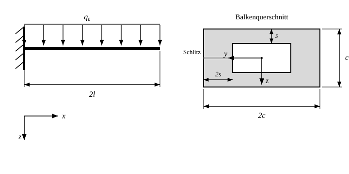

# Beispielaufgabe zu 3.2 — Geschlitztes Kastenprofil unter Streckenlast

Ein masseloser Kragbalken der Länge `2l` ist am linken Ende eingespannt und über die gesamte Länge mit der konstanten Streckenlast `q₀` in `+z`-Richtung (nach unten) belastet. Der Querschnitt ist ein geschlitztes Kastenprofil im Querformat: Außenrechteck `2c` breit (`y`-Richtung) und `c` hoch (`z`-Richtung); oberer und unterer Gurt haben die Dicke `s`, linker und rechter Steg die Dicke `2s`. Der Schlitz vernachlässigbarer Breite sitzt im **linken** Steg auf halber Höhe. Die Koordinaten sind wie in Aufgabe 3.2 gewählt: `x` nach rechts, `z` nach unten, im Querschnitt `y` nach links, mit dem Ursprung in der Mitte des Querschnitts.

**Gegeben:** `q₀`, `l`, `c = 4s`.
**Hinweis 1:** Die Breite des Schlitzes ist vernachlässigbar klein.
**Hinweis 2:** Es gilt `s ≪ c` **nicht**.

Teilaufgaben:

a) Bestimmen Sie das Flächenträgheitsmoment `I_y` bezogen auf das gegebene `yz`-System sowie das Biegemoment `M_y` und die Biegespannung `σ(z)` an der Einspannstelle.

b) Bestimmen und skizzieren Sie den Schubspannungsverlauf infolge der Querkraft an der Einspannstelle und geben Sie die Rand- und Extremwerte an. Beziehen Sie die Werte auf die Wandmittellinien.

c) Bestimmen Sie die Lage des Schubmittelpunktes.
