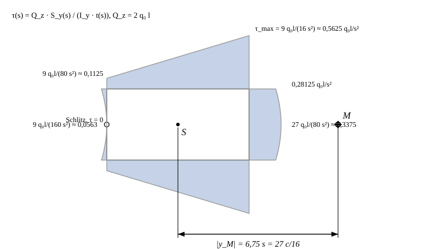

# Loesung zur Beispielaufgabe 3.2

## Geometrie
Mit `c = 4s`: Außenrechteck `8s × 4s` (`y ∈ [−4s; 4s]`, `z ∈ [−2s; 2s]`), Loch `4s × 2s` (`y ∈ [−2s; 2s]`, `z ∈ [−s; s]`), Fläche `A = 32s² − 8s² = 24s²`, Schwerpunkt im Ursprung. Mittellinien: Stege `y = ±3s` (Dicke `2s`), Gurte `z = ±1,5s` (Dicke `s`); Mittellinienrechteck `6s × 3s`, Schlitz bei `y = +3s`, `z = 0`.

## Schnittgroessen
An der Einspannstelle (`x = 0`): `Q_z = 2q₀l`, `M_y = −q₀(2l)²/2 = −2q₀l²`.

## a) Flaechentraegheitsmoment und Biegespannung
`I_y = [8s(4s)³ − 4s(2s)³]/12 = (512 − 32)s⁴/12 = 40 s⁴ = 5c⁴/32`.

`σ(z) = M_y z/I_y = −2q₀l² z/(40 s⁴) = −q₀ l² z/(20 s⁴)`.

Oberkante `z = −2s`: `σ = +q₀l²/(10 s³) = +6,4 q₀l²/c³` (Zug). Unterkante `z = +2s`: `σ = −q₀l²/(10 s³)` (Druck).

## b) Schubspannungsverlauf
`Q_z/I_y = 2q₀l/(40 s⁴) = q₀l/(20 s⁴)`, `T = Q_z S/I_y`, `τ = T/t(s)`. Umlauf ab dem Schlitzufer im linken Steg.

| Wand | `S_y` | Stützwerte `S` | `t(s)` | `τ` |
|---|---|---|---|---|
| linker Steg (Schlitz) | `S = s z²` | `z=0: 0`; `z=±1,5s: 2,25s³` | `2s` | `0` bzw. `9q₀l/(160 s²) ≈ 0,0563 q₀l/s²` |
| Gurte | `S = 6,75s³ − 1,5s² η` | `η=+3s: 2,25s³`; `η=0: 6,75s³`; `η=−3s: 11,25s³` | `s` | `9q₀l/(80s²) ≈ 0,1125`; `0,3375`; `9q₀l/(16s²) ≈ 0,5625 q₀l/s²` |
| rechter Steg | `S = 13,5s³ − s z²` | `z=±1,5s: 11,25s³`; `z=0: 13,5s³` | `2s` | `0,28125`; `27q₀l/(80s²) ≈ 0,3375 q₀l/s²` |

$$\boxed{\;\tau_{max}=\frac{9\,q_0 l}{16\,s^{2}}\approx 0{,}5625\,\frac{q_0 l}{s^{2}}\ \text{im Gurt am rechten Steg}\;}$$

Anders als in Aufgabe 3.2 liegt das Maximum hier **im Gurt**, weil der Gurt (`s`) dünner ist als der Steg (`2s`).

## c) Schubmittelpunkt
Resultierende (`∫S ds`): linker Steg `2,25s⁴`, rechter Steg `38,25s⁴`, jeder Gurt `40,5s⁴`. Hebelarme: Stege `3s`, Gurte `1,5s`.

`y_M = [3s(2,25 + 38,25)s⁴ + 1,5s·2·40,5s⁴] / [(38,25 − 2,25)s⁴] = (121,5 + 121,5)s⁵/36s⁴`

$$\boxed{\;|y_M|=\frac{27}{4}\,s=6{,}75\,s=\frac{27}{16}\,c,\ \text{auf der dem Schlitz abgewandten Seite (}-y\text{)},\qquad z_M=0\;}$$

Damit liegt `M` um `2,75 s` außerhalb der rechten Außenkante.

## Probe
Numerischer Gegencheck mit demselben unabhängigen Skript wie in Aufgabe 3.2:

| Größe | numerisch | analytisch |
|---|---|---|
| `A` | `24,00000 s²` | `24 s²` |
| `z̄` | `−6,9·10⁻¹⁸ s` | `0` |
| `I_y` | `40,00000 s⁴` | `40 s⁴` |
| `y_M` | `−6,75000 s` | `−27s/4` |
| vert. Resultierende | `0,90000 Q` | `36/40 · Q` |

Schubfluss an den Ecken stetig: Gurt `0,5625·s = 0,5625 q₀l/s` = rechter Steg `0,28125·2s = 0,5625 q₀l/s`. Am Schlitzufer `τ = 0`. Der Rest von 10 % in der vertikalen Resultierenden ist wie in Aufgabe 3.2 der Modellrest des Mittellinienansatzes bei exaktem `I_y`; `y_M` ist davon unabhängig, weil sich `I_y` herauskürzt.

## Endergebnisse
| Größe | Ergebnis |
|---|---|
| `A` | `24s²` |
| `I_y` | `40s⁴ = 5c⁴/32` |
| `Q_z` | `2q₀l` |
| `M_y` | `−2q₀l²` |
| `σ(z)` | `−q₀l²z/(20s⁴)` |
| `σ` Oberkante | `+q₀l²/(10s³)` |
| `σ` Unterkante | `−q₀l²/(10s³)` |
| `τ_max` | `9q₀l/(16s²)` |
| `|y_M|` | `27s/4 = 6,75s` |
| `z_M` | `0` |
