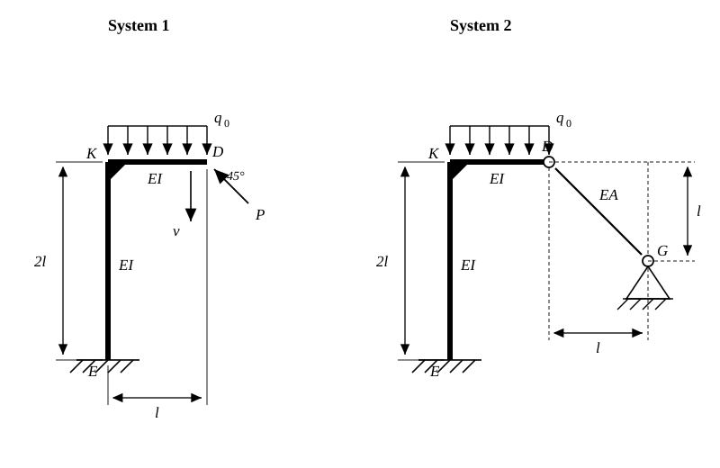

# Beispielaufgabe (analog zu Aufgabe 4.4) — Eingespannter Winkelrahmen, Prinzip der virtuellen Kraefte

Gegeben ist ein abgewinkelter Kragtraeger mit der Biegesteifigkeit $EI$. Die Dehnsteifigkeit des Balkens kann vernachlaessigt werden. Loesen Sie die Aufgaben mit dem **Prinzip der virtuellen Kraefte**.

Der Stiel $EK$ steht senkrecht und ist im Fusspunkt $E$ fest eingespannt; seine Laenge betraegt $2l$. Am oberen Ende $K$ schliesst rechtwinklig der waagerechte Riegel $KD$ mit der Laenge $l$ an. Ueber die gesamte Riegellaenge wirkt die konstante Streckenlast $q_0$ senkrecht nach unten.

**Gegeben:** $l,\; E,\; I,\; q_0$

**System 1:** Im freien Endpunkt $D$ greift zusaetzlich die Einzelkraft $P$ unter $45^\circ$ an; sie zeigt nach links oben.

**System 2:** Anstelle der Kraft $P$ ist der Punkt $D$ gelenkig an einen Pendelstab mit der Dehnsteifigkeit $EA$ angeschlossen. Dessen anderes Ende ist im Festlager $G$ gelagert. $G$ liegt um $l$ rechts und um $l$ unterhalb von $D$.

---

**a)** Berechnen Sie im System 1 die Kraft $P$ so, dass die senkrechte Verschiebung $v$ des Punktes $D$ gleich Null wird.

**b)** Berechnen Sie im System 2 die im Pendelstab uebertragene Kraft $S$.

**c)** Berechnen Sie die Querschnittsflaeche $A$ des Pendelstabs so, dass die Stabkraft den Wert $S = -\dfrac{\sqrt2}{8}\,q_0\,l$ annimmt.
