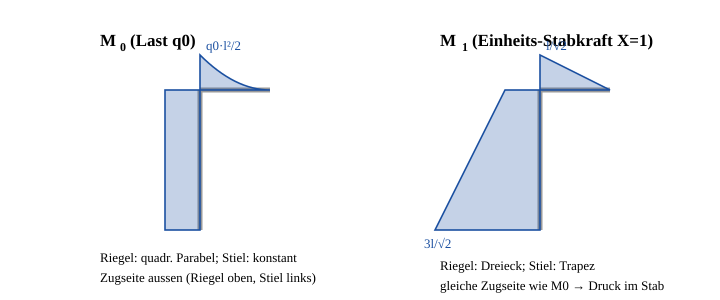

# Loesung zur Beispielaufgabe (analog Aufgabe 4.4)

## Geometrie und Vorbemerkung

Globale Koordinaten: $x$ nach rechts, $y$ nach oben, Ursprung in $E$.

| Punkt | Koordinaten |
|---|---|
| $E$ (Einspannung) | $(0,\;0)$ |
| $K$ (Ecke) | $(0,\;2l)$ |
| $D$ (freies Ende) | $(l,\;2l)$ |
| $G$ (Festlager) | $(2l,\;l)$ |

Pendelstab $DG$: Richtung $\tfrac{1}{\sqrt2}(+1,-1)$, Laenge $\ell_S = l\sqrt2$.

Laufvariablen: $s$ im Riegel **vom freien Ende $D$ aus** ($0\le s\le l$), $y$ im Stiel von der Einspannung $E$ aus ($0\le y\le 2l$).

Arbeitssatz: $\displaystyle \delta = \int \frac{M_0\bar M_1}{EI}\,\mathrm{d}s + \int\frac{N_0\bar N_1}{EA}\,\mathrm{d}s$. Momentenbilder werden auf der Zugseite aufgetragen; gleiche Seite $\Rightarrow$ positiver Koppelbeitrag.

## Schnittgroessen

**$M_0$ (nur $q_0$):**

- Riegel: $|M_0| = \dfrac{q_0 s^2}{2}$ — quadratische Parabel, Scheitel in $D$, Randwert in $K$: $\dfrac{q_0 l^2}{2}$
- Stiel: Resultierende $q_0 l$ senkrecht nach unten, konstanter Hebelarm $l/2$ zur Stielachse $\Rightarrow$ $|M_0| = \dfrac{q_0 l^2}{2}$ **konstant** (stetig in $K$ ✓)
- Zugseite: **aussen** (Riegel oben, Stiel links)

**$\bar M_1^{(v)}$ (Einheitslast in $D$, senkrecht nach unten — fuer $v$):**

- Riegel: $\bar M_1 = s$, in $K$: $l$
- Stiel: konstant $l$
- Zugseite: aussen (wie $M_0$)

**$M_P$ (Kraft $P$ in $D$, $45^\circ$ nach links oben; Komponenten $-\tfrac{P}{\sqrt2}$ waagerecht, $+\tfrac{P}{\sqrt2}$ senkrecht):**

- Riegel: $|M_P| = \dfrac{P\,s}{\sqrt2}$ — Dreieck, in $K$: $\dfrac{P\,l}{\sqrt2}$
- Stiel: $|M_P| = \dfrac{P\,(3l-y)}{\sqrt2}$ — Trapez, in $K$: $\dfrac{Pl}{\sqrt2}$, in $E$: $\dfrac{3Pl}{\sqrt2}$
- Zugseite: **innen**, also entgegengesetzt zu $M_0$ $\Rightarrow$ negativer Koppelbeitrag

**$\bar M_1^{(S)}$ (Einheits-Stabkraft $X=1$, Zug; zieht $D$ nach rechts unten):** betragsgleich zu $M_P/P$, aber Zugseite **aussen**, also gleichsinnig zu $M_0$. Im Stab selbst $\bar N_1 = 1$.

## a) Kraft $P$ fuer $v = 0$

**Anteil aus $q_0$** (Koppeltafel: Parabel mit Scheitel am freien Ende $\times$ Dreieck $\to \tfrac14$; Rechteck$\times$Rechteck $\to 1$):

$$v_q = \frac{1}{EI}\left[\underbrace{\frac14\cdot l\cdot\frac{q_0l^2}{2}\cdot l}_{\text{Riegel}} + \underbrace{2l\cdot\frac{q_0l^2}{2}\cdot l}_{\text{Stiel}}\right]
= \frac{1}{EI}\left[\frac{q_0l^4}{8} + q_0l^4\right] = \frac{9\,q_0l^4}{8\,EI}$$

**Anteil aus $P$** (Dreieck$\times$Dreieck $\to \tfrac13$; Trapez$\times$Rechteck $\to$ Laenge $\cdot$ Mittelwert $\cdot k$), negatives Vorzeichen wegen entgegengesetzter Zugseite:

$$v_P = -\frac{1}{EI}\left[\frac13\cdot l\cdot\frac{Pl}{\sqrt2}\cdot l + 2l\cdot\frac{1}{2}\left(\frac{Pl}{\sqrt2}+\frac{3Pl}{\sqrt2}\right)\cdot l\right]
= -\frac{1}{EI}\left[\frac{Pl^3}{3\sqrt2} + \frac{4Pl^3}{\sqrt2}\right] = -\frac{13\,P l^3}{3\sqrt2\,EI}$$

**Bedingung $v = v_q + v_P = 0$:**

$$\frac{9\,q_0l^4}{8} = \frac{13\,Pl^3}{3\sqrt2}
\quad\Longrightarrow\quad
P = \frac{9\,q_0 l}{8}\cdot\frac{3\sqrt2}{13}$$

$$\boxed{\;P = \frac{27\sqrt2}{104}\,q_0\,l \approx 0{,}367\,q_0\,l\;}$$

## b) Stabkraft $S$ im System 2

System 2 ist einfach statisch unbestimmt. Statisch Unbestimmte: $X = S$ (Zug positiv). Vertraeglichkeit: $\delta_{10} + X\,\delta_{11} = 0$.

$$\delta_{10} = \frac{1}{EI}\left[\underbrace{\frac14\cdot l\cdot\frac{q_0l^2}{2}\cdot\frac{l}{\sqrt2}}_{\text{Riegel}} + \underbrace{2l\cdot\frac{q_0l^2}{2}\cdot\frac12\left(\frac{l}{\sqrt2}+\frac{3l}{\sqrt2}\right)}_{\text{Stiel}}\right]
= \frac{1}{EI}\left[\frac{q_0l^4}{8\sqrt2} + \sqrt2\,q_0l^4\right] = \frac{17\sqrt2\,q_0l^4}{16\,EI}$$

$$\delta_{11} = \frac{1}{EI}\left[\underbrace{\frac13\cdot l\cdot\left(\frac{l}{\sqrt2}\right)^2}_{\text{Riegel}} + \underbrace{\int_0^{2l}\frac{(3l-y)^2}{2}\,\mathrm{d}y}_{\text{Stiel}}\right] + \underbrace{\frac{1^2\cdot l\sqrt2}{EA}}_{\text{Stab}}
= \frac{1}{EI}\left[\frac{l^3}{6} + \frac{13\,l^3}{3}\right] + \frac{\sqrt2\,l}{EA}
= \frac{9\,l^3}{2\,EI} + \frac{\sqrt2\,l}{EA}$$

$$S = -\frac{\delta_{10}}{\delta_{11}} = -\frac{\dfrac{17\sqrt2\,q_0l^4}{16\,EI}}{\dfrac{9l^3}{2\,EI}+\dfrac{\sqrt2\,l}{EA}}$$

Erweitern mit $\dfrac{16\,EI}{l^3}$:

$$\boxed{\;S = -\frac{17\sqrt2\,q_0\,l}{\;72 + 16\sqrt2\,\dfrac{EI}{EA\,l^2}\;}\;}$$

Das Minuszeichen bedeutet **Druck**. Grenzfall starrer Stab ($EA\to\infty$): $S \to -\dfrac{17\sqrt2}{72}q_0l \approx -0{,}334\,q_0l$ — das ist der betragsmaessig groesstmoegliche Wert.

## c) Querschnittsflaeche $A$ fuer $S = -\dfrac{\sqrt2}{8}q_0 l$

Der Zielwert $0{,}177\,q_0l$ liegt unter dem Starrstab-Grenzwert $0{,}334\,q_0l$, ist also mit endlichem $A>0$ erreichbar.

Aus $\delta_{10} = -X\,\delta_{11}$ mit $X = -\dfrac{\sqrt2}{8}q_0l$:

$$\frac{17\sqrt2\,q_0l^4}{16\,EI} = \frac{\sqrt2\,q_0l}{8}\left(\frac{9l^3}{2EI}+\frac{\sqrt2\,l}{EA}\right)$$

Division durch $\dfrac{\sqrt2\,q_0 l}{8}$:

$$\frac{17\,l^3}{2\,EI} = \frac{9\,l^3}{2\,EI} + \frac{\sqrt2\,l}{EA}
\quad\Longrightarrow\quad
\frac{\sqrt2\,l}{EA} = \frac{8\,l^3}{2\,EI} = \frac{4\,l^3}{EI}$$

$$EA = \frac{\sqrt2\,l\,EI}{4\,l^3} = \frac{\sqrt2\,EI}{4\,l^2}$$

$$\boxed{\;A = \frac{\sqrt2}{4}\cdot\frac{I}{l^2} \approx 0{,}354\,\frac{I}{l^2}\;}$$

## Probe

**Zu a):**

$$v_P = -\frac{13\,l^3}{3\sqrt2\,EI}\cdot\frac{27\sqrt2}{104}q_0l = -\frac{13\cdot 27\cdot 2}{3\cdot 104\cdot 2}\cdot\frac{q_0l^4}{EI}\cdot\frac{2}{2} = -\frac{9\,q_0l^4}{8\,EI} = -v_q \quad\Rightarrow\quad v = 0\;\checkmark$$

**Zu c):** Mit $EA = \dfrac{\sqrt2\,EI}{4l^2}$ wird $\dfrac{\sqrt2\,l}{EA} = \dfrac{4l^3}{EI}$, also

$$\delta_{11} = \frac{9l^3}{2EI} + \frac{8l^3}{2EI} = \frac{17\,l^3}{2\,EI},
\qquad
S = -\frac{17\sqrt2\,q_0l^4/(16EI)}{17l^3/(2EI)} = -\frac{\sqrt2}{8}\,q_0 l \quad\checkmark$$

Ueber die kompakte b)-Formel: $16\sqrt2\dfrac{EI}{EAl^2} = 16\sqrt2\cdot\dfrac{4l^2}{\sqrt2\,l^2} = 64$, also $S = -\dfrac{17\sqrt2\,q_0l}{72+64} = -\dfrac{17\sqrt2\,q_0l}{136} = -\dfrac{\sqrt2}{8}q_0l$ ✓

## Endergebnisse

| Teil | Ergebnis |
|---|---|
| **a)** | $P = \dfrac{27\sqrt2}{104}\,q_0 l \approx 0{,}367\,q_0l$ |
| **b)** | $S = -\dfrac{17\sqrt2\,q_0 l}{72 + 16\sqrt2\,\frac{EI}{EA\,l^2}}$ (Druck) |
| **c)** | $A = \dfrac{\sqrt2}{4}\cdot\dfrac{I}{l^2} \approx 0{,}354\,\dfrac{I}{l^2}$ |
