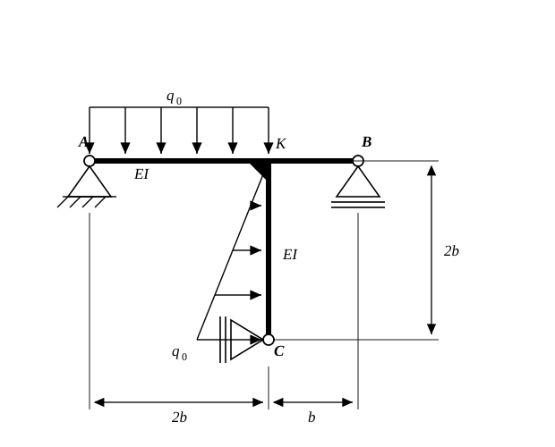

# Beispielaufgabe (analog zu Aufgabe 4.5) — Statisch unbestimmter Rahmen

Gegeben ist eine Rahmenkonstruktion mit durchgehend konstanter Biegesteifigkeit $EI$, gelagert in den Punkten $A$, $B$ und $C$. Gesucht ist die Auflagerreaktion in Punkt $C$ mit dem **Prinzip der virtuellen Kraefte**.

Ein durchgehender waagerechter Riegel laeuft von $A$ nach $B$. Im Abstand $2b$ von $A$ sitzt die biegesteife Ecke $K$; von dort bis $B$ sind es noch einmal $b$. In $K$ schliesst der senkrechte Stiel an, der $2b$ nach unten bis $C$ reicht.

**Lagerung:** $A$ ist Festlager. $B$ ist ein Rollenlager auf waagerechter Flaeche. $C$ ist ein Rollenlager an einer senkrechten Flaeche.

**Belastung:** Auf dem Riegelabschnitt $A\!-\!K$ wirkt die Gleichstreckenlast $q_0$ senkrecht nach unten. Auf dem Stiel wirkt eine Dreieckslast waagerecht nach rechts, die in $K$ bei null beginnt und bis $C$ linear auf $q_0$ anwaechst.

**Gegeben:** $b,\; EI,\; q_0$

---

**a)** Zeichnen Sie den Momentenverlauf im „0“-System.

**b)** Zeichnen Sie den Momentenverlauf im „1“-System.

**c)** Berechnen Sie die Auflagerkraft in Punkt $C$.
