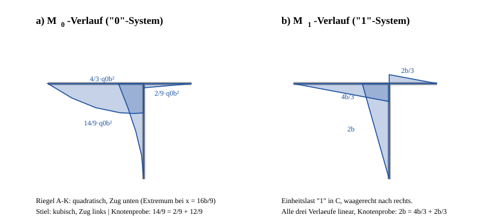

# Loesung zur Beispielaufgabe (analog Aufgabe 4.5)

## Geometrie, Lager, Lasten

Globale Koordinaten: $x$ nach rechts, $y$ nach oben, Ursprung in $A$.

| Punkt | Koordinaten | Lager |
|---|---|---|
| $A$ | $(0,\;0)$ | Festlager (2 Reaktionen) |
| $K$ | $(2b,\;0)$ | biegesteife Ecke |
| $B$ | $(3b,\;0)$ | Rollenlager, sperrt senkrecht (1) |
| $C$ | $(2b,\;-2b)$ | Rollenlager, sperrt waagerecht (1) |

$n = r - 3 = 4 - 3 = 1$ — **einfach statisch unbestimmt**.

**Lastresultierende:**

- Riegel $A\!-\!K$: $Q_1 = 2b\,q_0$ nach unten, in $(b,\;0)$.
- Stiel: Dreieckslast, Hoechstwert $q_0$ bei $C$, null in $K$. $Q_2 = \tfrac12 q_0\cdot 2b = q_0 b$ nach rechts, Schwerpunkt $\tfrac{2}{3}\cdot 2b = \tfrac{4b}{3}$ unter $K$, also in $\left(2b,\;-\tfrac{4b}{3}\right)$.

**Grundsystem:** Lager $C$ entfernen, $X = C$ positiv nach rechts. Es bleiben $A$ (2) und $B$ (1) — statisch bestimmt und stabil ($B$ verhindert die Drehung um $A$).

**Laufvariablen und Schnittufer** (pro Stab fest, wegen des T-Knotens in $K$):

| Stab | gerechnet von | Variable |
|---|---|---|
| Riegel $A \to K$ | $A$ | $x$, $0\le x\le 2b$ |
| Riegel $B \to K$ | $B$ | $w$, $0\le w\le b$ |
| Stiel $C \to K$ | $C$ | $\xi$, $0\le\xi\le 2b$ |

## a) „0“-System

**Auflagerreaktionen:**

$$\sum F_x = 0:\ A_x^{(0)} = -q_0 b
\qquad
\sum M_A = 0:\ 3b\,B_y^{(0)} - 2q_0b^2 + \tfrac43 q_0b^2 = 0 \ \Rightarrow\ B_y^{(0)} = \frac{2\,q_0b}{9}$$

$$\sum F_y = 0:\ A_y^{(0)} = 2q_0b - \frac{2q_0b}{9} = \frac{16\,q_0b}{9}$$

**Momentenverlaeufe:**

$$M_0^{A\to K}(x) = -\frac{16\,q_0b\,x}{9} + \frac{q_0x^2}{2}
\qquad
M_0^{B\to K}(w) = \frac{2\,q_0b\,w}{9}
\qquad
M_0^{C\to K}(\xi) = \frac{q_0\xi^2}{2} - \frac{q_0\xi^3}{12\,b}$$

| Stab | Wert in $K$ | Form | Zugseite |
|---|---|---|---|
| Riegel $A\!-\!K$ | $-\tfrac{14}{9}q_0b^2$ | quadratisch, Extremum $-1{,}580\,q_0b^2$ bei $x=\tfrac{16b}{9}$ | unten |
| Riegel $K\!-\!B$ | $+\tfrac{2}{9}q_0b^2$ | linear | unten |
| Stiel | $+\tfrac{4}{3}q_0b^2 = \tfrac{12}{9}q_0b^2$ | kubisch | links |

**Knotenprobe in $K$:** $-\tfrac{14}{9} + \tfrac{2}{9} + \tfrac{12}{9} = 0$ ✓

## b) „1“-System

Einheitslast $1$ in $C$, waagerecht nach rechts.

$$\sum F_x:\ \bar A_x = -1
\qquad
\sum M_A:\ 3b\,\bar B_y + 2b = 0 \ \Rightarrow\ \bar B_y = -\frac{2}{3}
\qquad
\sum F_y:\ \bar A_y = +\frac{2}{3}$$

$$\bar M_1^{A\to K}(x) = -\frac{2x}{3}
\qquad
\bar M_1^{B\to K}(w) = -\frac{2w}{3}
\qquad
\bar M_1^{C\to K}(\xi) = +\xi$$

| Stab | Wert in $K$ | Zugseite |
|---|---|---|
| Riegel $A\!-\!K$ | $-\tfrac{4b}{3}$ | unten |
| Riegel $K\!-\!B$ | $-\tfrac{2b}{3}$ | oben |
| Stiel | $+2b$ | links |

**Knotenprobe:** $-\tfrac{4b}{3} - \tfrac{2b}{3} + 2b = 0$ ✓

## c) Auflagerkraft in $C$

**$\delta_{10}$** (der kubische Stielverlauf und der quadratische Riegelverlauf stammen aus Dreiecks- bzw. Gleichstreckenlast; der Stiel wird direkt integriert, die Koppeltafel greift dort nicht):

$$\int_0^{2b}\left(-\frac{16q_0bx}{9}+\frac{q_0x^2}{2}\right)\left(-\frac{2x}{3}\right)\mathrm{d}x
= \frac{256\,q_0b^4}{81} - \frac{4\,q_0b^4}{3} = \frac{148\,q_0b^4}{81}$$

$$\int_0^{b}\frac{2q_0bw}{9}\left(-\frac{2w}{3}\right)\mathrm{d}w = -\frac{4\,q_0b^4}{81}$$

$$\int_0^{2b}\left(\frac{q_0\xi^2}{2}-\frac{q_0\xi^3}{12b}\right)\xi\,\mathrm{d}\xi
= q_0\left(2b^4 - \frac{8b^4}{15}\right) = \frac{22\,q_0b^4}{15}$$

$$\delta_{10} = \frac{q_0b^4}{EI}\left(\frac{148}{81}-\frac{4}{81}+\frac{22}{15}\right)
= \frac{q_0b^4}{EI}\left(\frac{16}{9}+\frac{22}{15}\right)
= \frac{146\,q_0b^4}{45\,EI}$$

**$\delta_{11}$** — drei Dreiecke, $\int \bar M_1^2 \mathrm{d}s = \tfrac13 s k^2$:

$$\delta_{11} = \frac{1}{EI}\left[\frac{1}{3}\cdot 2b\left(\frac{4b}{3}\right)^2 + \frac{1}{3}\cdot b\left(\frac{2b}{3}\right)^2 + \frac{1}{3}\cdot 2b\,(2b)^2\right]
= \frac{b^3}{EI}\left(\frac{32}{27}+\frac{4}{27}+\frac{72}{27}\right) = \frac{4\,b^3}{EI}$$

**Bedingungsgleichung** $\delta_{10} + X\delta_{11} = 0$:

$$C = X = -\frac{\delta_{10}}{\delta_{11}} = -\frac{146\,q_0b^4/(45\,EI)}{4\,b^3/EI} = -\frac{146}{180}\,q_0b$$

$$\boxed{\;C = -\frac{73}{90}\,q_0\,b \approx -0{,}811\,q_0\,b\;}$$

Das Minuszeichen bezieht sich auf die angesetzte Richtung: die Lagerkraft wirkt **nach links**, also entgegen der Dreieckslast. Genau das ist zu erwarten, denn das Rollenlager in $C$ muss den Stiel gegen die nach rechts drueckende Last abstuetzen.

## Uebrige Auflagerreaktionen (Superposition)

$$A_x = -q_0b + \left(-\frac{73}{90}q_0b\right)(-1) = -\frac{17\,q_0b}{90}
\qquad
A_y = \frac{16q_0b}{9} - \frac{73q_0b}{90}\cdot\frac{2}{3} = \frac{167\,q_0b}{135}$$

$$B_y = \frac{2q_0b}{9} + \frac{73q_0b}{90}\cdot\frac{2}{3} = \frac{103\,q_0b}{135}$$

## Probe

$$\sum F_y:\quad \frac{167}{135}q_0b + \frac{103}{135}q_0b = \frac{270}{135}q_0b = 2q_0b \quad\checkmark\ \text{(= Riegellast)}$$

$$\sum F_x:\quad -\frac{17}{90}q_0b + \underbrace{q_0b}_{\text{Stiellast}} - \frac{73}{90}q_0b = \frac{-17+90-73}{90}q_0b = 0 \quad\checkmark$$

$\delta_{11} > 0$ als Integral ueber ein Quadrat ✓, $\delta_{10} > 0$ ⇒ $X < 0$ ✓, alle Randmomente an $A$, $B$ und (im Grundsystem) $C$ sind null ✓.

## Endergebnisse

| Groesse | Ergebnis |
|---|---|
| **$C$** | $-\dfrac{73}{90}q_0b \approx 0{,}811\,q_0b$ nach links |
| $A_x$ | $-\dfrac{17}{90}q_0b \approx 0{,}189\,q_0b$ nach links |
| $A_y$ | $\dfrac{167}{135}q_0b \approx 1{,}237\,q_0b$ nach oben |
| $B_y$ | $\dfrac{103}{135}q_0b \approx 0{,}763\,q_0b$ nach oben |
| $\delta_{10}$ | $\dfrac{146\,q_0b^4}{45\,EI}$ |
| $\delta_{11}$ | $\dfrac{4\,b^3}{EI}$ |
