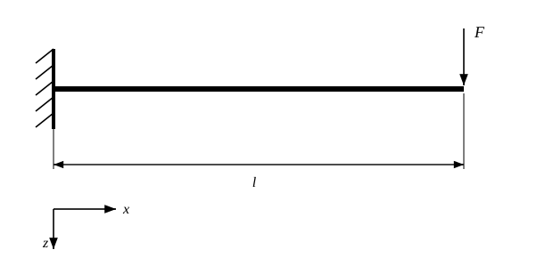
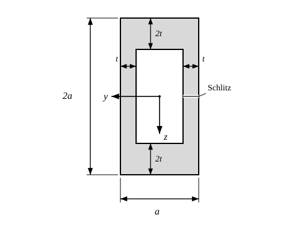
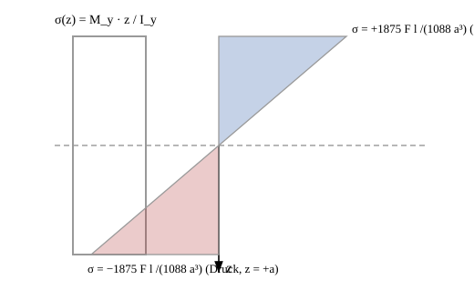
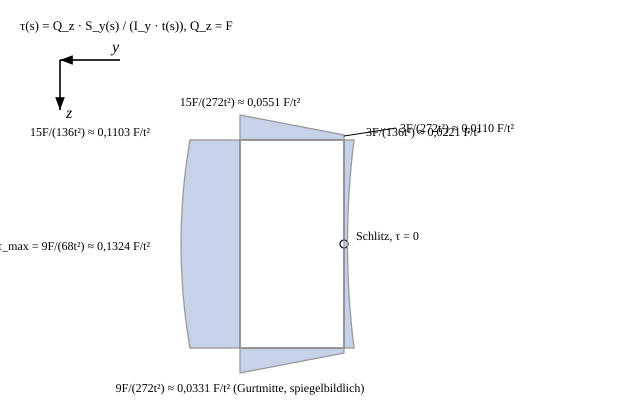
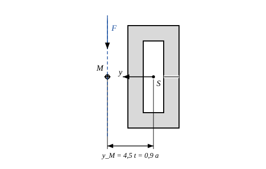

# Aufgabe 3.2 — Geschlitztes Kastenprofil: Biegespannung, Schubspannungsverlauf und Schubmittelpunkt

## Problemstellung
Ein masseloser Kragbalken der Länge `l` ist am linken Ende eingespannt und am freien rechten Ende mit einer Einzelkraft `F` in `+z`-Richtung (nach unten) belastet. Die Koordinaten sind so gewählt, dass `x` nach rechts und `z` nach unten zeigt; im Querschnitt zeigt `y` nach links und `z` nach unten, mit dem Ursprung im Schwerpunkt bzw. Mittelpunkt des Querschnitts.

Der Querschnitt ist ein geschlitztes Kastenprofil:
- Außenrechteck: Breite (`y`-Richtung) `a`, Höhe (`z`-Richtung) `2a`
- Wanddicken: oberer und unterer Gurt je `2t`, linker und rechter Steg je `t`
- Daraus ergibt sich eine rechteckige, mittig liegende Aussparung (Loch) mit Breite `a − 2t = 3a/5 = 3t` und Höhe `2a − 4t = 6a/5 = 6t`
- Im **rechten** Steg befindet sich auf halber Höhe (`z = 0`) ein Schlitz vernachlässigbarer Breite; er entfernt keine Fläche, macht das Profil aber **offen**
- Gegeben ist `a = 5t`, und die Näherung `t ≪ a` gilt hier **nicht**

### Hinweis zur Auslegung der Skizze
Die Wanddicken und die Lochgröße stehen nicht im Aufgabentext, sondern nur in der Zeichnung. Aus der Zeichnung gelesen und durch Pixelvermessung des PDF-Bildes bestätigt (Verhältnisse jeweils auf die Außenbreite `a` bezogen):
- linker Steg 0,195 a, rechter Steg 0,192 a → je `t = 0,2 a`
- oberer Gurt 0,385 a, unterer Gurt 0,405 a → je `2t = 0,4 a`
- Lochbreite 0,613 a → `a − 2t = 0,6 a`
- Lochhöhe = Gesamthöhe − 2·(2t), in der Zeichnung intern konsistent
- Die vier Maßpfeile zu den Beschriftungen `2t`, `2t`, `t`, `t` bilden jeweils ein Maßpaar (ein Pfeil an der Außenkante, ein Pfeil an der Lochkante) und bemaßen damit die Wanddicke.
- Die rechte Maßlinie `a` reicht von der Oberkante bis zur Schlitzhöhe, ist also die halbe Gesamthöhe und legt fest, dass der Schlitz **auf halber Höhe** liegt.

Die gezeichnete Gesamthöhe ist ca. 1,785 a statt 2a (nicht maßstäblich), alle Wanddicken und die Lochbreite sind dagegen maßstäblich.

## Zielsetzung
a) `I_y`, `M_y` und `σ(z)` an der Einspannstelle; b) Schubspannungsverlauf infolge Querkraft mit Rand- und Extremwerten; c) Lage des Schubmittelpunktes.

## Gegeben
`F`, `l`, `a = 5t`, `t ≪ a` gilt nicht; Schlitzbreite vernachlässigbar.

## Definitionen und Formeln
Für ein Rechteck der Breite `b` und Höhe `h` gilt für das Flächenträgheitsmoment um die durch den Schwerpunkt gehende `y`-Achse `I_y = b h³/12`. Da Außenrechteck und Loch hier beide mittig liegen und damit denselben Schwerpunkt besitzen, kann das `I_y` des Profils durch einfache Subtraktion gebildet werden — ein Steiner-Anteil entfällt.

Die Biegespannung folgt aus `σ(z) = M_y · z / I_y`.

Für die Schubspannung im dünnwandigen offenen Profil gilt nach Jourawski (Skript Kap. 13.6 / Abschn. 4.6.1): `τ(s) = Q_z · S_y(s) / (I_y · t(s))`, mit `S_y(s) = ∫_{A*} z dA` als statischem Moment der bereits abgeschnittenen Teilfläche `A*` entlang der Laufkoordinate `s`.

Der Schubfluss `T(s) = τ(s) · t(s)` hat die Dimension Kraft/Länge und wirkt in Richtung der Profilmittellinie. `T` ist an Ecken **stetig**, während `τ` dort springt, wo sich die Wanddicke ändert.

Am freien Rand — hier an beiden Schlitzufern — ist `S_y = 0`, also `τ = 0`. Das offene Profil wird deshalb **vom Schlitz aus** durchlaufen.

Der Schubmittelpunkt `M` ist der Punkt, durch den die Querkraft gehen muss, damit keine Torsion entsteht. Die Bedingung dafür lautet: das Moment der Querkraft um den Schwerpunkt `S` ist gleich dem Moment der verteilten Schubspannungen.

Gemäß dem Hinweis zur Zeichnung werden alle Schubgrößen auf die **Wandmittellinien** bezogen.

## Schritt-fuer-Schritt-Loesung

### Schritt 1 — Querschnittsgeometrie in Zahlen
Mit `a = 5t` ergibt sich:
- Außenrechteck `5t × 10t`, `y ∈ [−2,5t; 2,5t]`, `z ∈ [−5t; 5t]`
- Loch `3t × 6t`, `y ∈ [−1,5t; 1,5t]`, `z ∈ [−3t; 3t]`
- Fläche `A = 5t·10t − 3t·6t = 50t² − 18t² = 32t² = 1,28 a²`
- Beide Rechtecke liegen mittig, daher liegt der Schwerpunkt im Ursprung, `z̄ = 0`

### Schritt 2 — Flaechentraegheitsmoment I_y
Subtraktion der beiden Rechteck-Trägheitsmomente:
`I_y = [5t·(10t)³ − 3t·(6t)³]/12 = (5000 − 648) t⁴/12 = 4352 t⁴/12`

$$\boxed{\;I_y=\frac{1088}{3}\,t^4=\frac{1088}{1875}\,a^4\approx 362{,}67\,t^4\approx 0{,}5803\,a^4\;}$$

Das Widerstandsmoment ergibt sich zu `W_y = I_y/z_max = (1088t⁴/3)/(5t) = 1088t³/15 = 1088a³/1875 ≈ 0,5803 a³`.

Zum Vergleich: die dünnwandige Näherung (Gurte nur als Flächen im Abstand 4t, Eigenträgheit der Gurte vernachlässigt) liefert `1024t⁴/3 ≈ 341,3 t⁴`, also 5,9 % zu wenig — genau deshalb steht in der Aufgabe „`t ≪ a` gilt nicht".

### Schritt 3 — Schnittgroessen an der Einspannstelle
Für den Kragbalken mit Endlast gilt `Q_z(x) = F` (konstant über die gesamte Länge) und `M_y(x) = −F(l − x)`. An der Einspannstelle `x = 0`:

$$\boxed{\;Q_z=F,\qquad M_y=-F\,l\;}$$

Das negative `M_y` bedeutet Zug an der **Oberseite** (`z < 0`).

### Schritt 4 — Biegespannung sigma(z)
Einsetzen in `σ(z) = M_y z/I_y` ergibt `σ(z) = −F l z · 3/(1088 t⁴) = −1875 F l z/(1088 a⁴)`, also einen linearen Verlauf über `z` mit Nulldurchgang in der Schwerachse.

Randwerte:
- Oberkante `z = −a = −5t`: `σ = +1875 F l/(1088 a³) = +15 F l/(1088 t³) ≈ +1,7233 F l/a³` (Zug)
- Unterkante `z = +a = +5t`: `σ = −1875 F l/(1088 a³) ≈ −1,7233 F l/a³` (Druck)

$$\boxed{\;\sigma(z)=-\frac{1875\,F\,l}{1088\,a^{4}}\,z,\qquad |\sigma|_{max}=\frac{1875\,F\,l}{1088\,a^{3}}\approx 1{,}7233\,\frac{F\,l}{a^{3}}\;}$$

### Schritt 5 — Profilmittellinie und Schnittfuehrung fuer den Schub
Die Mittellinien liegen bei den Stegen `y = ±2t` (Dicke `t`) und bei den Gurten `z = ±4t` (Dicke `2t`). Die Mittellinie bildet also ein Rechteck von `4t` Breite und `8t` Höhe, mit dem Schlitz in der Mitte des rechten Stegs (`y = −2t`, `z = 0`).

Wegen des Schlitzes ist das Profil **offen**: der Umlauf beginnt am oberen Schlitzufer, geht im rechten Steg nach oben, über den oberen Gurt nach links, im linken Steg nach unten, über den unteren Gurt nach rechts und endet am unteren Schlitzufer.

Der Querschnitt ist samt Schlitzlage symmetrisch zur `y`-Achse (`z = 0`), aber **nicht** zur `z`-Achse. Deshalb ist die Schubspannungsverteilung oben/unten spiegelbildlich, links/rechts dagegen stark unsymmetrisch.

### Schritt 6 — Statische Momente S_y(s) laengs der Profilmittellinie
Mit Laufkoordinaten wie folgt, wobei `A*` immer der vom Schlitzufer aus bereits durchlaufene Teil ist:

| Wand | Koordinate | `S_y` |
|---|---|---|
| rechter Steg (Schlitzsteg), Dicke `t` | `z` vom Schlitz aus, `|z| ≤ 4t` | `S = t z²/2` |
| Gurt (oben und unten), Dicke `2t` | `η` von `−2t` (rechts) bis `+2t` (links) | `S = 24t³ + 8t² η` |
| linker Steg, Dicke `t` | `z`, `|z| ≤ 4t` | `S = 40t³ + t(16t² − z²)/2` |

Stützwerte: `S(rechter Steg, z=±4t) = 8t³`; `S(Gurt, η=−2t) = 8t³`; `S(Gurt, η=0) = 24t³`; `S(Gurt, η=+2t) = 40t³`; `S(linker Steg, z=±4t) = 40t³`; `S(linker Steg, z=0) = 48t³`.

### Schritt 7 — Schubfluss und Schubspannungen
Mit `Q_z/I_y = 3F/(1088 t⁴)` folgt `T = Q_z S/I_y` und `τ = T/t(s)`.

| Stelle | `S_y` | `t(s)` | `T` | `τ` |
|---|---|---|---|---|
| Schlitzufer (rechter Steg, `z=0`) | `0` | `t` | `0` | `0` |
| rechter Steg, `z = ±4t` (Ecke) | `8t³` | `t` | `3F/(136 t)` ≈ `0,0221 F/t` | `3F/(136 t²)` ≈ `0,0221 F/t²` |
| Gurt am rechten Ende, `η = −2t` | `8t³` | `2t` | `3F/(136 t)` | `3F/(272 t²)` ≈ `0,0110 F/t²` |
| Gurtmitte, `η = 0` | `24t³` | `2t` | `9F/(136 t)` | `9F/(272 t²)` ≈ `0,0331 F/t²` |
| Gurt am linken Ende, `η = +2t` | `40t³` | `2t` | `15F/(136 t)` | `15F/(272 t²)` ≈ `0,0551 F/t²` |
| linker Steg, `z = ±4t` (Ecke) | `40t³` | `t` | `15F/(136 t)` | `15F/(136 t²)` ≈ `0,1103 F/t²` |
| linker Steg, `z = 0` | `48t³` | `t` | `9F/(68 t)` | `9F/(68 t²)` ≈ `0,1324 F/t²` |

Extremwert:

$$\boxed{\;\tau_{max}=\frac{9F}{68\,t^{2}}=\frac{225\,F}{68\,a^{2}}\approx 3{,}309\,\frac{F}{a^{2}}\quad\text{im linken Steg bei } z=0\;}$$

Verlaufsform: in beiden Stegen quadratische Parabel über `z`, in den Gurten linear über `η`. Im rechten (geschlitzten) Steg beginnt der Verlauf bei Null und bleibt klein; der linke Steg trägt fast die gesamte Querkraft. Der Schubfluss `T` ist an allen vier Ecken stetig, `τ` springt dort im Verhältnis der Wanddicken `2t : t`.

### Schritt 8 — Resultierende der Schubspannungen
Integration von `T` über jede Wand (`Q_z = F`, `I_y = 1088t⁴/3`):

| Wand | `∫S ds` | Resultierende | Richtung | Hebelarm zum Schwerpunkt |
|---|---|---|---|---|
| linker Steg | `1088t⁴/3` | `P_L = F` | nach unten (`+z`) | `2t` |
| rechter Steg | `64t⁴/3` | `P_R = F/17 ≈ 0,0588 F` | nach oben (`−z`) | `2t` |
| oberer Gurt | `96t⁴` | `P_G = 9F/34 ≈ 0,2647 F` | nach links (`+y`) | `4t` |
| unterer Gurt | `96t⁴` | `P_G = 9F/34 ≈ 0,2647 F` | nach rechts (`−y`) | `4t` |

Die beiden Stegkräfte bilden ein Kräftepaar, die beiden Gurtkräfte ebenfalls; beide Paare drehen im gleichen Sinn.

Vertikale Resultierende: `P_L − P_R = 16F/17 ≈ 0,941 F`.

Moment um den Schwerpunkt: `M_x = 2t(P_L + P_R) + 4t·2P_G = 36tF/17 + 36tF/17 = 72tF/17 ≈ 4,235 t F`.

### Schritt 9 — Lage des Schubmittelpunktes
Der Schubmittelpunkt liegt auf der Wirkungslinie der Resultierenden der Schubspannungen:
`y_M = M_x/(P_L − P_R) = (72tF/17)/(16F/17) = 9t/2`

$$\boxed{\;y_M=\frac{9}{2}\,t=0{,}9\,a\ \text{(in }+y\text{, also auf der dem Schlitz abgewandten Seite)},\qquad z_M=0\;}$$

`I_y` kürzt sich in diesem Quotienten vollständig heraus — `y_M` ist daher unabhängig davon, ob man `I_y` exakt oder dünnwandig ansetzt. Das ist die belastbare Form der Auswertung.

Wegen der Symmetrie zur `y`-Achse liegt `M` auf `z = 0`. Mit der Außenkante bei `y = 2,5t = 0,5a` liegt `M` also `2t = 0,4a` **außerhalb** des Profils, auf der dem Schlitz gegenüberliegenden Seite.

## Verifikation
1. **Schwerpunkt.** Außenrechteck und Loch sind beide mittig → `z̄ = 0`, kein Steiner-Anteil. Numerisch bestätigt: `z̄ = 1,1·10⁻¹⁶ t`.
2. **Numerischer Gegencheck** mit einem unabhängigen Skript (Gitterintegration der realen 2-D-Fläche für `A`, `z̄`, `I_y`; diskretisierter Umlauf längs der Mittellinie mit kumulativer Integration für `T`, Resultierende und `y_M`) — kein Rechenschritt mit der Handrechnung gemeinsam:

| Größe | numerisch | analytisch | rel. Abweichung |
|---|---|---|---|
| `A` | `32,00000 t²` | `32 t²` | `0` |
| `z̄` | `1,1·10⁻¹⁶ t` | `0` | — |
| `I_y` | `362,66665 t⁴` | `1088t⁴/3 = 362,66667 t⁴` | `4,6·10⁻⁸` |
| `y_M` | `4,50000 t` | `9t/2 = 4,5 t` | `9,8·10⁻¹⁰` |
| vert. Resultierende | `0,94118 F` | `16F/17 = 0,94118 F` | `0` |

3. **Stetigkeit des Schubflusses.** An allen vier Ecken ist `T` gleich (z.B. rechte obere Ecke: Steg `3F/(136t)`, Gurt `3F/(272t²)·2t = 3F/(136t)`).
4. **Randbedingung.** An beiden Schlitzufern `S_y = 0` → `τ = 0`; erfüllt.
5. **Modellrest.** Die vertikale Resultierende der Mittellinien-Schubflüsse ist `16F/17 = 0,941F` statt `F`. Diese 5,9 % sind kein Rechenfehler, sondern der bekannte Rest des Mittellinienmodells, wenn man es mit dem **exakten** `I_y` kombiniert: setzt man das dazu konsistente dünnwandige `I = 1024t⁴/3` an, so wird die Resultierende exakt `F` und die Momentenäquivalenz liefert unmittelbar `y_M = 4,5t`. Da sich `I_y` in `y_M = M_x/(P_L − P_R)` heraushebt, ist `y_M = 4,5t` in beiden Varianten identisch.

## Endergebnis
| Größe | Ergebnis in `t` | Ergebnis in `a` | Zahlenwert |
|---|---|---|---|
| `A` | `32 t²` | `1,28 a²` | — |
| `I_y` | `1088 t⁴/3` | `1088 a⁴/1875` | `≈ 0,5803 a⁴` |
| `W_y` | `1088 t³/15` | `1088 a³/1875` | `≈ 0,5803 a³` |
| `Q_z` | `F` | `F` | — |
| `M_y` (Einspannung) | `−F l` | `−F l` | — |
| `σ(z)` | `−3F l z/(1088 t⁴)` | `−1875 F l z/(1088 a⁴)` | — |
| `σ` Oberkante | `+15F l/(1088 t³)` | `+1875 F l/(1088 a³)` | `≈ +1,723 F l/a³` (Zug) |
| `σ` Unterkante | `−15F l/(1088 t³)` | `−1875 F l/(1088 a³)` | `≈ −1,723 F l/a³` (Druck) |
| `τ` am Schlitz | `0` | `0` | `0` |
| `τ` rechter Steg, Ecke | `3F/(136 t²)` | `75F/(136 a²)` | `≈ 0,551 F/a²` |
| `τ` Gurt rechts / Mitte / links | `3F/(272t²)` / `9F/(272t²)` / `15F/(272t²)` | `75F/(272a²)` / `225F/(272a²)` / `375F/(272a²)` | `≈ 0,276 / 0,827 / 1,379 F/a²` |
| `τ` linker Steg, Ecke | `15F/(136 t²)` | `375F/(136 a²)` | `≈ 2,757 F/a²` |
| `τ_max` (linker Steg, `z=0`) | `9F/(68 t²)` | `225F/(68 a²)` | `≈ 3,309 F/a²` |
| `y_M` | `9t/2` | `0,9 a` | `0,4a` außerhalb des Profils |
| `z_M` | `0` | `0` | Symmetrieachse |

## Haeufige Fehler
- Den Schlitz übersehen und das Profil als geschlossenen Kasten rechnen: der Schubfluss wäre dann statisch unbestimmt und der Schubmittelpunkt läge fast im Schwerpunkt.
- Die Schubspannung symmetrisch auf beide Stege verteilen. Der Schlitz zerstört die Links-rechts-Symmetrie; der linke Steg trägt hier rund das Zwanzigfache des rechten.
- `τ = 0` an den Schlitzufern vergessen und den Umlauf irgendwo sonst starten.
- Dünnwandige Näherung für `I_y` verwenden (`1024t⁴/3`), obwohl die Aufgabe zweimal betont, dass `t ≪ a` nicht gilt — 5,9 % Fehler.
- Beim Übergang Steg → Gurt den Schubfluss `T` springen lassen. `T` ist stetig, `τ` springt (Dicke `t` ↔ `2t`).
- Die erste Zahl einer Maßkette als Länge nehmen: das rechte Maß `a` ist die halbe Bauhöhe und legt die Schlitzhöhe fest, nicht die Lochhöhe.
- Bei `y_M` durch `Q` statt durch die tatsächliche Resultierende teilen und dann den 5,9-%-Modellrest als Ergebnis mitschleppen.
