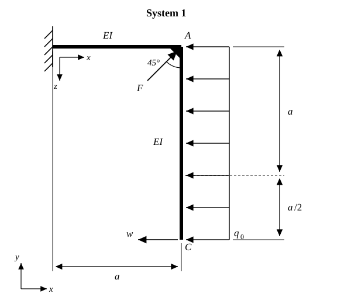
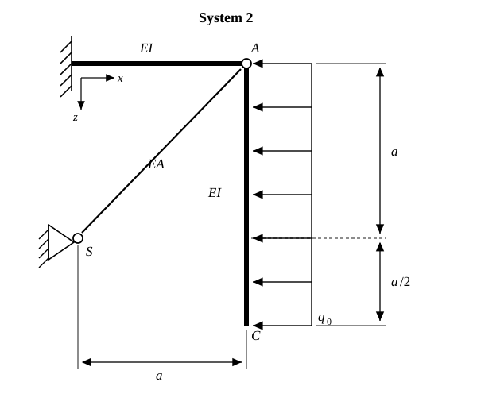
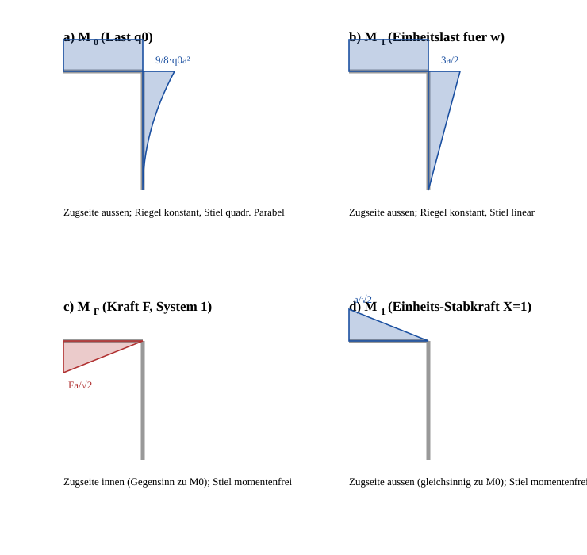

# Aufgabe 4.4 — Abgewinkelter Kragarm, Prinzip der virtuellen Kraefte

## Problemstellung

Gegeben ist ein abgewinkelter Kragarm mit der Biegesteifigkeit $EI$. Die Dehnsteifigkeit **des Balkens** darf vernachlaessigt werden (Normalkraft- und Querkraftanteile in der Formaenderungsenergie entfallen). Alle Teilaufgaben sind mit dem **Prinzip der virtuellen Kraefte** zu loesen.

**Geometrie (aus der Bemassung der Aufgabenskizze):**

- Der waagerechte Riegel ist an der Wand fest eingespannt und hat die Laenge $a$. Sein rechtes Ende ist der Eckpunkt $A$.
- In $A$ knickt das Tragwerk rechtwinklig ab. Der senkrechte Stiel laeuft von $A$ nach unten bis zum freien Ende $C$.
- Die Bemassungskette am rechten Rand ist zweiteilig: von $A$ bis zur Hoehe des Lagers $S$ betraegt der Abstand $a$, von dort bis zum freien Ende $C$ nochmals $a/2$. Die **Gesamtlaenge des Stiels** ist damit

$$\ell_{\text{Stiel}} = a + \frac{a}{2} = \frac{3a}{2}$$

- Ueber die **gesamte** Stiellaenge $3a/2$ wirkt die konstante Streckenlast $q_0$ **waagerecht** in negativer $x$-Richtung (in der Skizze nach links).

**System 1:** Zusaetzlich greift im Eckpunkt $A$ die Einzelkraft $F$ unter $45^\circ$ an; sie zeigt nach rechts oben, also in Richtung $\tfrac{1}{\sqrt2}(+1,+1)$.

**System 2:** Anstelle von $F$ ist der Eckpunkt $A$ gelenkig an einen Pendelstab mit der Dehnsteifigkeit $EA$ angeschlossen. Dessen zweiter Anschlusspunkt ist das Festlager $S$. $S$ liegt um $a$ links und um $a$ unterhalb von $A$; der Stab steht folglich unter $45^\circ$ und hat die Laenge

$$\ell_S = \sqrt{a^2 + a^2} = a\sqrt{2}$$

### Hinweis zur Auslegung der Skizze

Die Laenge des Stiels ist im Aufgabentext nicht ausgeschrieben, sondern nur ueber die Bemassungskette $a$ + $a/2$ gegeben. Sie wird hier konsequent als $3a/2$ gelesen; die Nachmessung der Originalskizze bestaetigt das Laengenverhaeltnis Stiel : Riegel $\approx 1{,}52 \approx 3/2$. Die Zwischenmarke der Bemassung liegt genau auf der Hoehe des Lagers $S$ aus System 2 — daraus folgt zugleich der $45^\circ$-Winkel des Pendelstabs. Beide Angaben werden in der gesamten Loesung so verwendet.

## Zielsetzung

- **a)** Bestimme im System 1 die Kraft $F$ so, dass die Verschiebung $w$ des freien Endes $C$ zu Null wird. $w$ ist die **waagerechte** Verschiebung von $C$, positiv in Lastrichtung von $q_0$ (nach links).
- **b)** Bestimme im System 2 die im Pendelstab $S$ uebertragene Kraft $S_{stab}$.
- **c)** Bestimme die Querschnittsflaeche $A$ des Pendelstabs so, dass $S_{stab} = -\sqrt{2}\,q_0 a$ wird.

## Gegeben

| Groesse | Bedeutung |
|---|---|
| $a$ | Grundlaenge; Riegel $= a$, Stiel $= 3a/2$, Stabversatz $= a$ je Richtung |
| $E$ | Elastizitaetsmodul (Balken und Stab gleiches Material) |
| $I$ | Flaechentraegheitsmoment des Balkenquerschnitts, Biegesteifigkeit $EI$ |
| $q_0$ | konstante Streckenlast, waagerecht, auf ganzer Stiellaenge $3a/2$ |
| $EA$ | Dehnsteifigkeit des Pendelstabs (nur System 2) |

Vernachlaessigt: Normalkraft- und Querkraftverformung **im Balken**. Die Dehnung **des Pendelstabs** darf natuerlich *nicht* vernachlaessigt werden — sie ist in Teil b) und c) gerade der entscheidende Anteil.

## Definitionen und Formeln

### 1. Arbeitssatz / Prinzip der virtuellen Kraefte (Einheitslastsatz)

**In Worten:** Will man an einer bestimmten Stelle eines elastischen Tragwerks die Verschiebung in einer bestimmten Richtung wissen, so bringt man an genau dieser Stelle und in genau dieser Richtung eine gedachte ("virtuelle") Einheitskraft vom Betrag 1 auf. Die aeussere Arbeit dieser Einheitskraft auf dem *wirklichen* Verschiebungsweg ist gleich der inneren Arbeit ihrer *eigenen* Schnittgroessen auf den *wirklichen* Verzerrungen. Aus dieser Gleichsetzung faellt die gesuchte Verschiebung direkt heraus:

$$1 \cdot \delta \;=\; \int \frac{M_0\,\bar M_1}{EI}\,\mathrm{d}s \;+\; \int \frac{N_0\,\bar N_1}{EA}\,\mathrm{d}s$$

- $M_0,\;N_0$ — Schnittgroessen aus der **wirklichen** Belastung ("0"-System)
- $\bar M_1,\;\bar N_1$ — Schnittgroessen aus der **virtuellen Einheitslast** ("1"-System)
- Da im Balken die Dehnsteifigkeit vernachlaessigt wird, entfaellt dort das zweite Integral. Nur im Pendelstab bleibt es stehen.

### 2. Vorzeichen- und Auftragsregel

Statt einer formalen Vorzeichenkonvention wird hier die anschauliche **Zugseitenregel** verwendet: Das Momentenbild wird stets auf derjenigen Faser aufgetragen, die durch das Moment **gedehnt** (auf Zug beansprucht) wird.

- Liegen $M_0$ und $\bar M_1$ auf **derselben** Seite des Stabes, ist der Integralbeitrag **positiv**.
- Liegen sie auf **gegenueberliegenden** Seiten, ist er **negativ**.

Das ist rechnerisch exakt gleichwertig zu einer durchgehenden Schnittgroessenkonvention, aber deutlich weniger fehleranfaellig bei Rahmen mit Ecken.

### 3. Koppeltafel (Integraltafel)

Fuer die hier auftretenden Kombinationen gilt mit Stablaenge $s$ und den Randordinaten $i$ (aus dem $M_0$-Bild) und $k$ (aus dem $\bar M_1$-Bild):

| $M_0$-Verlauf | $\bar M_1$-Verlauf | $\int M_0 \bar M_1\,\mathrm{d}s$ |
|---|---|---|
| Rechteck ($i$) | Rechteck ($k$) | $s\,i\,k$ |
| Rechteck ($i$) | Dreieck ($k$) | $\tfrac{1}{2}\,s\,i\,k$ |
| Dreieck ($i$) | Dreieck ($k$), gleiche Nullstelle | $\tfrac{1}{3}\,s\,i\,k$ |
| quadr. Parabel ($i$), Scheitel im Nullpunkt | Dreieck ($k$), gleiche Nullstelle | $\tfrac{1}{4}\,s\,i\,k$ |

### 4. Kraftgroessenverfahren (fuer System 2)

System 2 ist **einfach statisch unbestimmt**. Man schneidet den Pendelstab gedanklich durch und fuehrt seine Kraft $X = S_{stab}$ als statisch Unbestimmte ein (Zug positiv). Die Vertraeglichkeitsbedingung "die Schnittufer duerfen nicht klaffen" lautet

$$\delta_{10} + X\,\delta_{11} = 0$$

mit

$$\delta_{10} = \int \frac{M_0\,\bar M_1}{EI}\,\mathrm{d}s, \qquad
\delta_{11} = \int \frac{\bar M_1^{\,2}}{EI}\,\mathrm{d}s \;+\; \frac{\bar N_1^{\,2}\,\ell_S}{EA}$$

Der zweite Summand in $\delta_{11}$ ist die **Nachgiebigkeit des Stabes selbst** ($\bar N_1 = 1$). Wer ihn vergisst, rechnet einen starren Stab und bekommt eine zu grosse Stabkraft.

## Schritt-fuer-Schritt-Loesung

### Schritt 1 — Koordinaten und Laufvariablen festlegen

*Was:* Ein globales, rechtsdrehendes Koordinatensystem und je eine Laufvariable pro Stab.
*Warum:* Alle Momentenfunktionen muessen in einem einheitlichen Bezugssystem aufgestellt werden, sonst sind die Koppelprodukte nicht vergleichbar.

Globale Koordinaten: $x$ nach rechts, $y$ nach oben. Einspannstelle an der Wand: $O = (0,0)$.

| Punkt | Koordinaten |
|---|---|
| $O$ (Einspannung) | $(0,\;0)$ |
| $A$ (Ecke) | $(a,\;0)$ |
| $C$ (freies Ende) | $(a,\;-\tfrac{3a}{2})$ |
| $S$ (Festlager, nur System 2) | $(0,\;-a)$ |

Laufvariablen:

- **Riegel** $O \to A$: $x$ von der Wand aus, $0 \le x \le a$.
- **Stiel** $A \to C$: $\zeta$ **vom freien Ende $C$ nach oben**, $0 \le \zeta \le \tfrac{3a}{2}$.

Die Wahl von $\zeta$ ab dem freien Ende ist bewusst: Am freien Ende sind alle Schnittgroessen null, dadurch wird jede Momentenfunktion automatisch nullstellenrichtig und die Koppeltafel-Zeilen "Scheitel im Nullpunkt" sind direkt anwendbar.

### Schritt 2 — Statische Bestimmtheit pruefen

*Was:* Abzaehlen, ob wir die Schnittgroessen ohne Vertraeglichkeit bekommen.
*Warum:* Nur dann darf man $M_0$ direkt am Gleichgewicht ablesen.

- **System 1:** Ein Stab-Zug (Kragarm) mit einer einzigen festen Einspannung. Drei Auflagerreaktionen, drei Gleichgewichtsbedingungen in der Ebene $\Rightarrow$ **statisch bestimmt**. Alle Schnittgroessen folgen aus dem Gleichgewicht am freigeschnittenen freien Teil.
- **System 2:** Zusaetzlich ein Pendelstab mit Festlager $\Rightarrow$ eine ueberzaehlige Bindung $\Rightarrow$ **einfach statisch unbestimmt**. Hier ist das Kraftgroessenverfahren noetig.

### Schritt 3 — Momentenverlauf $M_0$ aus der Streckenlast $q_0$

*Was:* Biegemoment im Grundsystem (nur $q_0$, ohne $F$, ohne Stab).
*Warum:* $M_0$ ist der "wirkliche" Zustand in jeder Arbeitsgleichung dieser Aufgabe.

**Stiel** (Schnitt in Hoehe $\zeta$ ueber $C$): Freigeschnitten wird das Stueck unterhalb des Schnitts, Laenge $\zeta$. Darauf wirkt die Teil-Resultierende $q_0\,\zeta$ waagerecht, angreifend in der Mitte, also im Abstand $\zeta/2$ unter dem Schnitt. Der Hebelarm einer waagerechten Kraft bezueglich eines Punktes auf der senkrechten Stabachse ist genau dieser senkrechte Abstand:

$$\boxed{\;|M_0^{\text{Stiel}}(\zeta)| = q_0\,\zeta \cdot \frac{\zeta}{2} = \frac{q_0\,\zeta^2}{2}\;}$$

Das ist eine **quadratische Parabel** mit Scheitel (Wert 0 **und** Steigung 0) am freien Ende $C$. Randwert an der Ecke $A$:

$$|M_0(A)| = \frac{q_0}{2}\left(\frac{3a}{2}\right)^2 = \frac{q_0}{2}\cdot\frac{9a^2}{4} = \frac{9\,q_0 a^2}{8} = 1{,}125\,q_0a^2$$

**Riegel** (Schnitt bei $x$): Freigeschnitten wird alles rechts davon, also der Reststueck-Riegel plus der **gesamte** Stiel. Die Gesamtresultierende der Streckenlast ist

$$Q = q_0 \cdot \frac{3a}{2} = \frac{3}{2}q_0 a \quad \text{(waagerecht, nach links)}$$

Sie greift in halber Stielhoehe an, also $\tfrac{3a}{4}$ **unterhalb** der Riegelachse. Da $Q$ waagerecht und die Riegelachse ebenfalls waagerecht ist, ist der senkrechte Abstand zur Wirkungslinie **fuer jeden Schnittpunkt gleich gross**, naemlich $\tfrac{3a}{4}$. Das Moment ist deshalb **konstant**:

$$\boxed{\;|M_0^{\text{Riegel}}| = \frac{3}{2}q_0a \cdot \frac{3a}{4} = \frac{9\,q_0a^2}{8} \quad \text{(konstant)}\;}$$

Der Wert stimmt mit dem Eckwert des Stiels ueberein — das ist die geforderte **Momentenstetigkeit an der biegesteifen Ecke** und zugleich die erste Zwischenprobe.

**Zugseite:** Die Streckenlast drueckt den Stiel nach links; ein oben eingespannter Kragarm mit Last nach links wird auf der **rechten** (der Last abgewandten) Seite gedehnt — Zugseite aussen. Um die Ecke herum muss die Zugseite stetig bleiben, also liegt sie im Riegel **oben** (ebenfalls aussen). Kontrollueberlegung: Die Resultierende $Q$ wirkt als exzentrische **Druckkraft** auf den Riegel, mit einer Exzentrizitaet $\tfrac{3a}{4}$ *unterhalb* der Achse. Exzentrischer Druck unterhalb der Achse macht die untere Faser staerker gedrueckt und die obere Faser zugbeansprucht $\Rightarrow$ Zugseite oben. Beide Ueberlegungen stimmen ueberein.

### Schritt 4 — Virtuelles Momentenbild $\bar M_1$ fuer die Verschiebung $w$

*Was:* Einheitskraft "1" in $C$, waagerecht, in Richtung des gesuchten $w$ (nach links).
*Warum:* Nur eine Einheitslast an der gesuchten Stelle und in der gesuchten Richtung liefert ueber den Arbeitssatz genau diese eine Verschiebungskomponente.

**Stiel:** Freigeschnitten unterhalb des Schnitts liegt nur die Einheitskraft in $C$, Hebelarm $\zeta$:

$$|\bar M_1^{\text{Stiel}}(\zeta)| = 1 \cdot \zeta = \zeta \qquad \text{(linear, 0 in } C\text{)}$$

Randwert in $A$: $\bar M_1 = \tfrac{3a}{2}$.

**Riegel:** Die Einheitskraft greift in $C$ an, also $\tfrac{3a}{2}$ unter der Riegelachse. Wieder waagerechte Kraft, waagerechte Achse $\Rightarrow$ konstanter Hebelarm:

$$|\bar M_1^{\text{Riegel}}| = 1 \cdot \frac{3a}{2} = \frac{3a}{2} \qquad \text{(konstant)}$$

**Zugseite:** identisch zu $M_0$ (auch die Einheitslast zeigt nach links) — also **aussen**. Damit sind alle Koppelbeitraege fuer $w_q$ **positiv**.

### Schritt 5 — Verschiebung $w_q$ infolge $q_0$ allein

*Was:* Auswertung von $w_q = \int M_0 \bar M_1 / EI\,\mathrm{d}s$.
*Warum:* Das ist der Anteil, den $F$ spaeter kompensieren muss.

**Riegel** — Rechteck $\times$ Rechteck, Koeffizient 1:

$$w_{q,\text{Riegel}} = \frac{1}{EI}\cdot a \cdot \frac{9q_0a^2}{8}\cdot \frac{3a}{2} = \frac{27\,q_0a^4}{16\,EI}$$

**Stiel** — quadratische Parabel (Scheitel bei $\zeta=0$) $\times$ Dreieck (Nullstelle bei $\zeta=0$), Koeffizient $\tfrac14$:

$$w_{q,\text{Stiel}} = \frac{1}{EI}\cdot\frac{1}{4}\cdot\frac{3a}{2}\cdot\frac{9q_0a^2}{8}\cdot\frac{3a}{2} = \frac{81\,q_0a^4}{128\,EI}$$

Kontrolle durch direkte Integration:

$$\int_0^{3a/2}\frac{q_0\zeta^2}{2}\cdot\zeta\,\mathrm{d}\zeta = \frac{q_0}{2}\cdot\frac{1}{4}\left(\frac{3a}{2}\right)^4 = \frac{q_0}{8}\cdot\frac{81a^4}{16} = \frac{81\,q_0a^4}{128}\quad\checkmark$$

**Summe:**

$$w_q = \frac{q_0a^4}{EI}\left(\frac{27}{16} + \frac{81}{128}\right) = \frac{q_0a^4}{EI}\cdot\frac{216 + 81}{128} = \boxed{\frac{297\,q_0a^4}{128\,EI} \approx 2{,}320\,\frac{q_0a^4}{EI}}$$

Positives Vorzeichen bedeutet: $C$ verschiebt sich in Richtung der angesetzten Einheitslast, also **nach links** — physikalisch genau das, was die Last $q_0$ erwarten laesst.

### Schritt 6 — Momentenbild $M_F$ aus der Kraft $F$

*Was:* Biegemoment infolge der $45^\circ$-Kraft in $A$.
*Warum:* Es ist der zweite Superpositionsanteil von $w$.

Zerlegung: $F_x = \dfrac{F}{\sqrt2}$ (nach rechts), $F_y = \dfrac{F}{\sqrt2}$ (nach oben).

**Stiel:** $A$ liegt **oberhalb** jedes Stielschnitts. Am freigeschnittenen unteren Teilstueck greift $F$ also gar nicht an:

$$M_F^{\text{Stiel}} = 0$$

**Riegel** (Schnitt bei $x$): Der freigeschnittene rechte Teil enthaelt $A$. Die Komponente $F_x$ liegt genau **in** der Riegelachse — sie erzeugt nur Normalkraft, und die ist laut Aufgabenstellung nicht zu beruecksichtigen. Wirksam ist nur $F_y$ mit dem Hebelarm $(a-x)$:

$$|M_F^{\text{Riegel}}(x)| = \frac{F}{\sqrt2}\,(a-x)$$

Das ist ein **Dreieck**: null in $A$, Maximum an der Einspannung

$$|M_F(\text{Wand})| = \frac{F\,a}{\sqrt2} = \frac{\sqrt2}{2}F a$$

**Zugseite:** $F_y$ hebt das Riegelende an. Ein links eingespannter Kragarm mit Kraft nach oben am rechten Ende wird **unten** gedehnt $\Rightarrow$ Zugseite **innen**, also auf der zu $M_0$ **entgegengesetzten** Seite. Deshalb wirkt $F$ der Verschiebung $w$ entgegen — genau das ist ja der Sinn der Aufgabe.

### Schritt 7 — Verschiebungsanteil $w_F$

**Riegel** — Dreieck ($i = Fa/\sqrt2$ an der Wand) $\times$ Rechteck ($k = 3a/2$), Koeffizient $\tfrac12$, mit **negativem** Vorzeichen wegen der entgegengesetzten Zugseite:

$$w_F = -\frac{1}{EI}\cdot\frac12\cdot a\cdot\frac{Fa}{\sqrt2}\cdot\frac{3a}{2} = -\frac{3\,F a^3}{4\sqrt2\,EI} = -\frac{3\sqrt2\,F a^3}{8\,EI} \approx -0{,}5303\,\frac{Fa^3}{EI}$$

Der Stiel liefert keinen Beitrag, weil dort $M_F = 0$ ist.

### Schritt 8 — Teil a): Bedingung $w = 0$ aufloesen

*Was:* Superposition beider Anteile und Nullsetzen.
*Warum:* $w$ ist die gesuchte Zielgroesse; das Tragwerk ist linear elastisch, also duerfen die Anteile addiert werden.

$$w = w_q + w_F \stackrel{!}{=} 0
\quad\Longrightarrow\quad
\frac{297\,q_0a^4}{128\,EI} = \frac{3\,Fa^3}{4\sqrt2\,EI}$$

$EI$ kuerzt sich heraus — das Ergebnis haengt also **nicht** von der Biegesteifigkeit ab (beide Anteile sind gleich steifigkeitsempfindlich).

$$F = \frac{297\,q_0a^4}{128}\cdot\frac{4\sqrt2}{3\,a^3} = \frac{297\cdot 4\sqrt2}{128\cdot 3}\,q_0a = \frac{99\sqrt2}{32}\,q_0a$$

$$\boxed{\;F = \frac{99\sqrt2}{32}\,q_0\,a \approx 4{,}375\,q_0\,a\;}$$

Das positive Vorzeichen bestaetigt: $F$ wirkt tatsaechlich in der eingezeichneten Richtung (nach rechts oben).

### Schritt 9 — System 2: Grundsystem und virtuelles System des Kraftgroessenverfahrens

*Was:* Der Pendelstab wird entfernt und durch das Kraftpaar $X$ ersetzt.
*Warum:* Damit wird das unbestimmte System auf zwei bestimmte Rechnungen zurueckgefuehrt.

- **"0"-System:** Kragarm ohne Stab, nur $q_0$. Das $M_0$-Bild ist **exakt dasselbe** wie in Schritt 3 — das ist der Grund, weshalb sich die Vorarbeit doppelt auszahlt.
- **"1"-System:** Kragarm ohne Stab, belastet durch die Einheits-Stabkraft $X = 1$ (Zug positiv). Ein zugbeanspruchter Stab **zieht** $A$ in Richtung $S$, also nach **links unten**, Richtung $\tfrac{1}{\sqrt2}(-1,-1)$.

**$\bar M_1$ im "1"-System:**

- Stiel: $\bar M_1 = 0$ (Angriffspunkt $A$ liegt oberhalb aller Stielschnitte).
- Riegel: nur die senkrechte Komponente $\tfrac{1}{\sqrt2}$ (nach unten) ist wirksam, Hebelarm $(a-x)$:

$$|\bar M_1^{\text{Riegel}}(x)| = \frac{a-x}{\sqrt2}, \qquad |\bar M_1(\text{Wand})| = \frac{a}{\sqrt2}$$

**Zugseite:** Kraft am Riegelende nach **unten** $\Rightarrow$ links eingespannter Kragarm wird **oben** gedehnt $\Rightarrow$ Zugseite **aussen** — dieselbe Seite wie $M_0$. Folge: $\delta_{10} > 0$ und damit $X < 0$, der Stab bekommt **Druck**. Das ist auch anschaulich richtig: $q_0$ drueckt den Stiel nach links, $A$ weicht nach links aus, der Abstand $\overline{SA}$ wird kleiner, der Stab wird gestaucht.

Ausserdem: $\bar N_1 = 1$ im Stab selbst (Einheits-Zugkraft), Stablaenge $\ell_S = a\sqrt2$.

### Schritt 10 — Nachgiebigkeitszahlen $\delta_{10}$ und $\delta_{11}$

**$\delta_{10}$** — nur der Riegel traegt bei (im Stiel ist $\bar M_1 = 0$): Rechteck ($i = \tfrac{9q_0a^2}{8}$) $\times$ Dreieck ($k = \tfrac{a}{\sqrt2}$ an der Wand), Koeffizient $\tfrac12$, Vorzeichen positiv (gleiche Zugseite):

$$\delta_{10} = \frac{1}{EI}\cdot\frac12\cdot a\cdot\frac{9q_0a^2}{8}\cdot\frac{a}{\sqrt2}
= \frac{9\,q_0a^4}{16\sqrt2\,EI}
= \boxed{\frac{9\sqrt2\,q_0a^4}{32\,EI} \approx 0{,}3977\,\frac{q_0a^4}{EI}}$$

**$\delta_{11}$** — Biegeanteil des Riegels (Dreieck $\times$ Dreieck, gleiche Nullstelle in $A$, Koeffizient $\tfrac13$) **plus** Dehnungsanteil des Stabes:

$$\delta_{11} = \frac{1}{EI}\cdot\frac13\cdot a\cdot\left(\frac{a}{\sqrt2}\right)^2 \;+\; \frac{1^2\cdot a\sqrt2}{EA}
= \boxed{\frac{a^3}{6\,EI} + \frac{\sqrt2\,a}{EA}}$$

Kontrolle des Biegeanteils durch direkte Integration:

$$\int_0^a \frac{(a-x)^2}{2}\,\mathrm{d}x = \frac{1}{2}\cdot\frac{a^3}{3} = \frac{a^3}{6}\quad\checkmark$$

### Schritt 11 — Teil b): Stabkraft $S_{stab}$

Vertraeglichkeitsbedingung $\delta_{10} + X\,\delta_{11} = 0$:

$$X = S_{stab} = -\frac{\delta_{10}}{\delta_{11}}
= -\frac{\dfrac{9\sqrt2\,q_0a^4}{32\,EI}}{\dfrac{a^3}{6\,EI} + \dfrac{\sqrt2\,a}{EA}}$$

Erweitern von Zaehler und Nenner mit $\dfrac{96\,EI}{a^3}$ liefert die kompakte Form:

$$\boxed{\;S_{stab} = -\frac{27\sqrt2\,q_0\,a}{\;16 + 96\sqrt2\,\dfrac{EI}{EA\,a^2}\;}\;}$$

**Deutung der Formel:**

- Das Minuszeichen bedeutet **Druck** im Stab.
- Grenzfall **starrer Stab** ($EA \to \infty$): der zweite Nennerterm verschwindet,

$$S_{stab} \;\longrightarrow\; -\frac{27\sqrt2}{16}\,q_0a \approx -2{,}386\,q_0a$$

Das ist der betragsmaessig **groesstmoegliche** Wert. Jeder reale, nachgiebige Stab traegt weniger.
- Grenzfall **sehr weicher Stab** ($EA \to 0$): der Nenner waechst ueber alle Grenzen, $S_{stab} \to 0$. Der Stab ist dann wirkungslos und System 2 verhaelt sich wie der reine Kragarm.

### Schritt 12 — Teil c): Querschnittsflaeche $A$ des Stabes

*Was:* $EA$ so waehlen, dass sich der vorgegebene Wert $S_{stab} = -\sqrt2\,q_0a$ einstellt.
*Warum:* Der Zielwert liegt betragsmaessig unter dem Starrstab-Grenzwert $2{,}386\,q_0a$ — er ist also mit einem endlichen, positiven $A$ ueberhaupt erreichbar. Diese Plausibilitaetspruefung sollte man **vor** dem Rechnen machen.

Einsetzen in die Vertraeglichkeitsbedingung, geschrieben als $\delta_{10} = -X\,\delta_{11}$ mit $X = -\sqrt2 q_0 a$:

$$\frac{9\sqrt2\,q_0a^4}{32\,EI} = \sqrt2\,q_0a\left(\frac{a^3}{6\,EI} + \frac{\sqrt2\,a}{EA}\right)$$

Division durch $\sqrt2\,q_0a$:

$$\frac{9\,a^3}{32\,EI} = \frac{a^3}{6\,EI} + \frac{\sqrt2\,a}{EA}$$

$$\frac{\sqrt2\,a}{EA} = a^3\left(\frac{9}{32} - \frac{1}{6}\right)\frac{1}{EI} = a^3\cdot\frac{27-16}{96}\cdot\frac{1}{EI} = \frac{11\,a^3}{96\,EI}$$

$$EA = \frac{96\,\sqrt2\,a\,EI}{11\,a^3} = \frac{96\sqrt2\,EI}{11\,a^2}$$

$$\boxed{\;A = \frac{96\sqrt2}{11}\cdot\frac{I}{a^2} \approx 12{,}34\,\frac{I}{a^2}\;}$$

Das Ergebnis ist **positiv** und damit physikalisch sinnvoll.

## Verifikation

### V1 — Momentenstetigkeit an der Ecke $A$

| Bild | Wert im Riegel bei $x=a$ | Wert im Stiel bei $\zeta = 3a/2$ |
|---|---|---|
| $M_0$ | $\tfrac{9}{8}q_0a^2$ | $\tfrac{q_0}{2}\left(\tfrac{3a}{2}\right)^2 = \tfrac{9}{8}q_0a^2$ ✓ |
| $\bar M_1$ (fuer $w$) | $\tfrac{3a}{2}$ | $\tfrac{3a}{2}$ ✓ |

Beide Bilder gehen stetig um die Ecke — das $M_0$-Bild wurde aus zwei voellig verschiedenen Freischnitten hergeleitet, die Uebereinstimmung ist deshalb eine echte Probe.

### V2 — Teil a) rueckwaerts eingesetzt

$$w_F = -\frac{3\sqrt2\,a^3}{8\,EI}\cdot F
= -\frac{3\sqrt2\,a^3}{8\,EI}\cdot\frac{99\sqrt2}{32}q_0a
= -\frac{3\cdot 99\cdot 2}{8\cdot 32}\cdot\frac{q_0a^4}{EI}
= -\frac{594}{256}\cdot\frac{q_0a^4}{EI}
= -\frac{297\,q_0a^4}{128\,EI}$$

$$w = w_q + w_F = \frac{297\,q_0a^4}{128\,EI} - \frac{297\,q_0a^4}{128\,EI} = 0 \quad\checkmark$$

### V3 — Teil c) rueckwaerts eingesetzt

Mit $EA = \dfrac{96\sqrt2\,EI}{11a^2}$ wird der Stabanteil

$$\frac{\sqrt2\,a}{EA} = \sqrt2\,a\cdot\frac{11a^2}{96\sqrt2\,EI} = \frac{11\,a^3}{96\,EI}$$

$$\delta_{11} = \frac{a^3}{6EI} + \frac{11a^3}{96EI} = \frac{16a^3 + 11a^3}{96\,EI} = \frac{27\,a^3}{96\,EI} = \frac{9\,a^3}{32\,EI}$$

$$S_{stab} = -\frac{\delta_{10}}{\delta_{11}} = -\frac{\dfrac{9\sqrt2\,q_0a^4}{32EI}}{\dfrac{9a^3}{32EI}} = -\sqrt2\,q_0a \quad\checkmark$$

Exakte Uebereinstimmung mit dem geforderten Wert.

### V4 — Konsistenzprobe ueber die kompakte b)-Formel

Mit $A = \dfrac{96\sqrt2}{11}\dfrac{I}{a^2}$ gilt

$$96\sqrt2\,\frac{EI}{EA\,a^2} = 96\sqrt2\cdot\frac{EI\cdot 11a^2}{96\sqrt2\,EI\cdot a^2} = 11$$

$$S_{stab} = -\frac{27\sqrt2\,q_0a}{16+11} = -\frac{27\sqrt2\,q_0a}{27} = -\sqrt2\,q_0a \quad\checkmark$$

Zwei unabhaengige Rechenwege fuehren auf dasselbe Ergebnis.

### V5 — Dimensionskontrolle

| Groesse | Formel | Dimension |
|---|---|---|
| $w_q$ | $q_0a^4/EI$ | $\frac{[\mathrm{N/m}][\mathrm{m}^4]}{[\mathrm{N/m^2}][\mathrm{m}^4]} = [\mathrm{m}]$ ✓ |
| $F$ | $q_0a$ | $[\mathrm{N/m}][\mathrm{m}] = [\mathrm{N}]$ ✓ |
| $\delta_{11}$ | $a^3/EI$ bzw. $a/EA$ | beide $[\mathrm{m/N}]$ ✓ |
| $A$ | $I/a^2$ | $[\mathrm{m^4}]/[\mathrm{m^2}] = [\mathrm{m^2}]$ ✓ |

### V6 — Physikalische Plausibilitaet

- $F \approx 4{,}38\,q_0a$ ist deutlich groesser als die Gesamtlast $Q = 1{,}5\,q_0a$. Das muss so sein: $F$ greift in $A$ an und hat gegenueber der Einspannung nur den kurzen Hebelarm $a/\sqrt2$, waehrend $q_0$ ueber den gesamten Stiel mit Hebelarm $\tfrac34 a$ wirkt und zusaetzlich den Stiel selbst verbiegt. Ein kurzer Hebel braucht eine grosse Kraft.
- $|S_{stab}| < \tfrac{27\sqrt2}{16}q_0a$ fuer jedes endliche $EA$ ✓ (Monotonie der b)-Formel).
- Der geforderte Wert $\sqrt2 q_0a \approx 1{,}414\,q_0a$ liegt unterhalb dieser Schranke $\approx 2{,}386\,q_0a$, deshalb existiert eine Loesung mit $A > 0$ ✓.

## Endergebnis

| Teil | Ergebnis | Zahlenwert |
|---|---|---|
| **a)** | $F = \dfrac{99\sqrt2}{32}\,q_0a$ | $\approx 4{,}375\;q_0a$ |
| **b)** | $S_{stab} = -\dfrac{27\sqrt2\,q_0a}{16 + 96\sqrt2\,\frac{EI}{EA\,a^2}}$ | Druck; Grenzwert bei starrem Stab $-2{,}386\,q_0a$ |
| **c)** | $A = \dfrac{96\sqrt2}{11}\cdot\dfrac{I}{a^2}$ | $\approx 12{,}34\;\dfrac{I}{a^2}$ |

Zwischenergebnisse:

$$w_q = \frac{297\,q_0a^4}{128\,EI}, \qquad
\delta_{10} = \frac{9\sqrt2\,q_0a^4}{32\,EI}, \qquad
\delta_{11} = \frac{a^3}{6\,EI} + \frac{\sqrt2\,a}{EA}$$

## Haeufige Fehler

1. **Stiellaenge als $a$ statt $3a/2$ gelesen.** Die Bemassung ist eine Kette aus $a$ und $a/2$. Wer nur $a$ ansetzt, bekommt in $w_q$ einen um den Faktor $(3/2)^4 = 5{,}06$ (Stielanteil) bzw. $(3/2)^2$ (Riegelanteil) falschen Wert. **Abhilfe:** Bemassungsketten immer aufsummieren und den Gesamtwert einmal explizit hinschreiben.

2. **Das konstante Riegelmoment uebersehen.** Viele setzen im Riegel faelschlich einen linearen Verlauf an. Eine **waagerechte** Kraft hat gegenueber jedem Punkt der **waagerechten** Riegelachse denselben senkrechten Hebelarm — das Moment ist konstant. **Abhilfe:** Immer fragen, ob Kraftrichtung und Stabachse parallel sind.

3. **Nachgiebigkeit des Pendelstabs in $\delta_{11}$ vergessen.** Ohne den Term $\sqrt2 a/EA$ rechnet man einen starren Stab und erhaelt $-2{,}386\,q_0a$ statt des geforderten Wertes; Teil c) wird dann unloesbar. **Abhilfe:** Ein Bauteil, dessen Steifigkeit ($EA$) ueberhaupt gegeben ist, muss auch in der Rechnung auftauchen — sonst waere die Angabe sinnlos.

4. **Stablaenge $a$ statt $a\sqrt2$.** Der Stab ueberbrueckt $a$ waagerecht **und** $a$ senkrecht. **Abhilfe:** Der $45^\circ$-Winkel ist genau das Warnsignal fuer den Faktor $\sqrt2$.

5. **Normalkraftanteile inkonsistent behandelt.** Im Balken duerfen sie entfallen (Angabe), im Pendelstab **nicht**. Ebenso liefert die Komponente $F_x$ im Riegel kein Moment, weil sie in der Stabachse liegt — sie darf nicht als Querlast missbraucht werden. **Abhilfe:** Kraft konsequent in achsparallel (= Normalkraft) und achsnormal (= Biegung) zerlegen.

6. **Vorzeichenfehler bei $w_F$.** $M_F$ liegt auf der **inneren** Zugseite, $M_0$ und $\bar M_1$ auf der **aeusseren**. Wer das Vorzeichen verschenkt, erhaelt ein negatives $F$ oder addiert die Anteile faelschlich. **Abhilfe:** Momentenbilder immer auf der Zugseite auftragen und die Seitenlage vor dem Koppeln vergleichen.

7. **Falscher Koppeltafel-Koeffizient beim Stiel.** Unter dem Namen „quadratische Parabel“ stehen in den Tafeln **zwei verschiedene Zeilen**. Gemeint ist dort meist die **symmetrische** Parabel aus einer Gleichstreckenlast auf einem beidseitig gelagerten Feld (null an beiden Enden, Stich in Feldmitte) — fuer sie gilt zusammen mit einem Dreieck der Koeffizient $\tfrac13$. Der Stiel hier ist aber ein Kragarm: seine Parabel hat den **Scheitel am Rand**, also Wert *und* Steigung null am freien Ende. Faellt dieser Scheitel mit der Nullstelle des Dreiecks zusammen, gilt $\tfrac14$. Beide Werte sind richtig, nur fuer verschiedene Formen. **Abhilfe:** Vor dem Ablesen pruefen, wo der Scheitel liegt, und im Zweifel das Integral $\int_0^{L}\tfrac{q_0\zeta^2}{2}\,\zeta\,\mathrm{d}\zeta$ direkt ausrechnen — das dauert 20 Sekunden.

8. **$\delta_{10}$ und $\delta_{11}$ aus verschiedenen "1"-Systemen gemischt.** In Teil a) zeigt die Einheitslast nach **links unten** (Zugrichtung des Stabes). Beide Groessen muessen aus **demselben** $\bar M_1$-Bild stammen. **Abhilfe:** Das $\bar M_1$-Bild einmal zeichnen und beschriften, dann fuer beide Integrale wiederverwenden.

9. **Erreichbarkeit in Teil c) nicht geprueft.** Waere der geforderte Zielwert groesser als der Starrstab-Grenzwert, gaebe es kein positives $A$. **Abhilfe:** Vor dem Aufloesen den Grenzfall $EA\to\infty$ berechnen und vergleichen.
