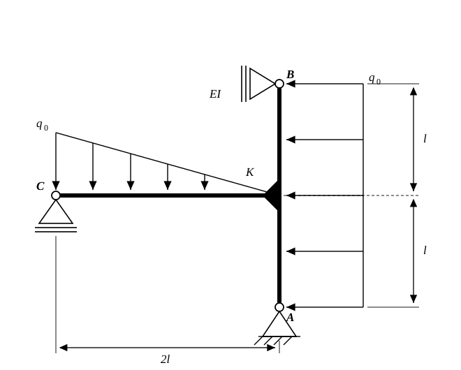
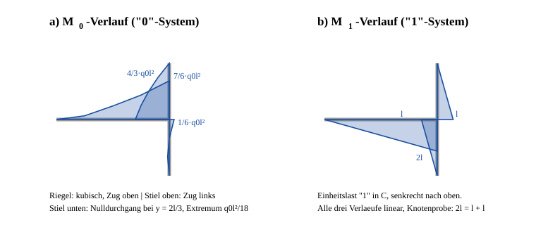

# Aufgabe 4.5 — Statisch unbestimmter Rahmen, Auflagerkraft mit dem Prinzip der virtuellen Kraefte

## Problemstellung

Gegeben ist eine Rahmenkonstruktion mit durchgehend konstanter Biegesteifigkeit $EI$, gelagert in den Punkten $A$, $B$ und $C$. Gesucht ist die Auflagerreaktion in $C$, ermittelt mit dem **Prinzip der virtuellen Kraefte**.

**Aufbau:**

- Ein durchgehender senkrechter Stiel laeuft von $A$ (unten) nach $B$ (oben), Gesamtlaenge $2l$.
- Auf halber Hoehe sitzt die biegesteife Ecke $K$. Von dort laeuft der waagerechte Riegel nach links bis $C$, Laenge $2l$.
- **Lager $A$:** Festlager (zwei Reaktionen).
- **Lager $B$:** Rollenlager an einer senkrechten Flaeche — es sperrt die **waagerechte** Verschiebung, die senkrechte bleibt frei (eine Reaktion, waagerecht).
- **Lager $C$:** Rollenlager auf waagerechter Flaeche — es sperrt die **senkrechte** Verschiebung (eine Reaktion, senkrecht).

**Belastung:**

- Gleichstreckenlast $q_0$ **waagerecht** ueber die **gesamte** Stiellaenge $2l$, gerichtet nach links.
- **Dreieckslast** auf dem Riegel, senkrecht nach unten: Hoechstwert $q_0$ bei $C$, linear auf null abfallend an der Ecke $K$.

### Hinweis zur Auslegung der Skizze

Die Bezeichnung $K$ fuer die Rahmenecke ist eine Ergaenzung dieser Loesung; die Originalskizze beschriftet nur $A$, $B$ und $C$. Aus der Zeichnung gelesen und hier durchgaengig verwendet:

1. Die Bemassung am rechten Rand ist zweiteilig, $l$ und nochmals $l$. Der Stiel ist also **$2l$ lang** und die Ecke $K$ liegt **genau auf halber Hoehe** — die Zwischenmarke der Bemassung liegt auf der Hoehe des Riegels.
2. Der Lastblock der Gleichstreckenlast reicht von $B$ bis $A$ ueber die **volle** Stiellaenge $2l$, nicht nur ueber ein Teilstueck.
3. Die Dreieckslast hat ihren **Hoechstwert bei $C$** und laeuft an der Ecke auf null aus — die Hypotenuse faellt von links nach rechts auf die Riegelachse zu.
4. Das Lagersymbol in $B$ steht an einer **senkrechten** Wand (Doppelstrich links, Dreieck rechts davon). Es sperrt daher waagerecht, nicht senkrecht. Vertauscht man das, wird das System kinematisch verschieblich und die Aufgabe unloesbar — die Probe ist also eingebaut.

## Zielsetzung

- **a)** Momentenverlauf im „0"-System zeichnen.
- **b)** Momentenverlauf im „1"-System zeichnen.
- **c)** Auflagerkraft in $C$ berechnen.

## Gegeben

| Groesse | Bedeutung |
|---|---|
| $l$ | Grundlaenge; Stiel $2l$, Riegel $2l$, Ecke $K$ auf halber Stielhoehe |
| $EI$ | Biegesteifigkeit, in allen Staeben gleich und konstant |
| $q_0$ | Hoechstwert beider Streckenlasten |

Normalkraft- und Querkraftverformungen werden — wie in dieser Aufgabensammlung durchgehend — vernachlaessigt.

## Definitionen und Formeln

### 1. Abzaehlkriterium

$$n = r - 3$$

mit $r$ = Anzahl der Auflagerreaktionen (ebenes System ohne Gelenke, drei Gleichgewichtsbedingungen). $n > 0$ bedeutet statisch unbestimmt, $n$ ist der Grad.

### 2. Kraftgroessenverfahren

**In Worten:** Man entfernt so viele Bindungen, bis ein statisch bestimmtes, stabiles **Grundsystem** uebrig bleibt, und ersetzt jede entfernte Bindung durch ihre unbekannte Kraftgroesse $X$. Das Grundsystem wird zweimal gerechnet: einmal nur mit der aeusseren Last („0"-System) und einmal nur mit der Einheitslast $X = 1$ („1"-System). Die Vertraeglichkeit fordert, dass die Verschiebung am Ort der entfernten Bindung in Wirklichkeit null ist:

$$\delta_{10} + X\,\delta_{11} = 0 \qquad\Longrightarrow\qquad X = -\frac{\delta_{10}}{\delta_{11}}$$

$$\delta_{10} = \int \frac{M_0\,\bar M_1}{EI}\,\mathrm{d}s, \qquad
\delta_{11} = \int \frac{\bar M_1^{\,2}}{EI}\,\mathrm{d}s$$

$\delta_{10}$ ist die Verschiebung am freigesetzten Lager infolge der aeusseren Last, $\delta_{11}$ die Verschiebung infolge der Einheitslast. Der Endzustand folgt aus Superposition: $M = M_0 + X\,\bar M_1$.

### 3. Vorzeichen bei einem T-Knoten

Bei einer Ecke aus **zwei** Staeben laeuft die Zugseite stetig um die Ecke. Der Knoten $K$ hier hat aber **drei** Stabenden. Dort gilt statt der Stetigkeit das **Knotengleichgewicht**: die Summe der drei Stabendmomente ist null. Deshalb wird pro Stab eine feste Schnittuferseite vereinbart und beibehalten:

| Stab | gerechnet aus dem Teilsystem | Laufvariable |
|---|---|---|
| Riegel $C \to K$ | von $C$ aus | $s$, ab $C$, $0 \le s \le 2l$ |
| Stiel unten $A \to K$ | von $A$ aus | $y$, ab $A$, $0 \le y \le l$ |
| Stiel oben $B \to K$ | von $B$ aus | $u$, ab $B$, $0 \le u \le l$ |

Nur so sind $M_0$ und $\bar M_1$ pro Stab vorzeichenrichtig koppelbar. Die Summe der drei Stabendmomente in $K$ muss null ergeben — das ist die eingebaute Probe.

### 4. Koppeltafel — und wann sie hier nicht hilft

| $M_0$ | $\bar M_1$ | $\int M_0\bar M_1\,\mathrm{d}s$ |
|---|---|---|
| Rechteck ($i$) | Rechteck ($k$) | $s\,i\,k$ |
| Rechteck ($i$) | Dreieck ($k$) | $\tfrac12\,s\,i\,k$ |
| Dreieck ($i$) | Dreieck ($k$), gleiche Nullstelle | $\tfrac13\,s\,i\,k$ |
| quadr. Parabel ($i$), **Scheitel** im gemeinsamen Nullpunkt | Dreieck ($k$), gleiche Nullstelle | $\tfrac14\,s\,i\,k$ |
| quadr. Parabel ($i$), **symmetrisch**, null an beiden Enden, Stich $i$ in Feldmitte | Dreieck ($k$) | $\tfrac13\,s\,i\,k$ |

**Achtung — zwei verschiedene Zeilen tragen denselben Namen.** „Quadratische Parabel“ bezeichnet in den meisten Formelsammlungen die **symmetrische** Parabel aus einer Gleichstreckenlast auf einem beidseitig gelagerten Feld; dort gilt $\tfrac13$. Die Parabel eines Kragarms hat dagegen ihren **Scheitel am Rand**, also Wert *und* Steigung null am freien Ende; dort gilt $\tfrac14$. Beide Werte sind richtig, nur eben fuer verschiedene Formen. Vor dem Ablesen immer pruefen, wo der Scheitel liegt.

Der Riegel traegt hier eine **Dreieckslast**. Sein Momentenverlauf ist kein reiner Verlauf aus der Tafel, sondern eine **Mischung aus quadratischem und kubischem Anteil**. Fuer ihn wird direkt integriert. Wer die Tafel trotzdem anwendet, rechnet systematisch falsch.

## Schritt-fuer-Schritt-Loesung

### Schritt 1 — Koordinaten und Punkte

Globale Koordinaten: $x$ nach rechts, $y$ nach oben, Ursprung in $A$.

| Punkt | Koordinaten |
|---|---|
| $A$ (Festlager, Stielfuss) | $(0,\;0)$ |
| $K$ (biegesteife Ecke) | $(0,\;l)$ |
| $B$ (Rollenlager oben) | $(0,\;2l)$ |
| $C$ (Rollenlager links) | $(-2l,\;l)$ |

**Lastresultierende:**

- Stiel: $Q_{\text{St}} = q_0 \cdot 2l = 2q_0l$, waagerecht nach links, angreifend auf halber Hoehe, also in $(0,\;l)$.
- Riegel (Dreieck, Hoechstwert bei $C$): $Q_{\text{Ri}} = \tfrac12 q_0 \cdot 2l = q_0 l$, senkrecht nach unten. Der Schwerpunkt einer Dreieckslast liegt bei **einem Drittel der Laenge vom Hoechstwert aus**, also $\tfrac{2l}{3}$ rechts von $C$: in $\left(-\tfrac{4l}{3},\;l\right)$.

### Schritt 2 — Grad der statischen Unbestimmtheit

*Was:* Abzaehlen.
*Warum:* Erst danach steht fest, ob ueberhaupt eine Vertraeglichkeitsbedingung gebraucht wird.

| Lager | Art | Reaktionen |
|---|---|---|
| $A$ | Festlager | 2 |
| $B$ | Rollenlager, waagerecht sperrend | 1 |
| $C$ | Rollenlager, senkrecht sperrend | 1 |
| | **Summe $r$** | **4** |

$$n = r - 3 = 4 - 3 = 1 \quad\Longrightarrow\quad \textbf{einfach statisch unbestimmt}$$

### Schritt 3 — Grundsystem waehlen

*Was:* Das Lager $C$ entfernen, seine Kraft als $X$ einfuehren.
*Warum:* Genau die Groesse, nach der gefragt ist, wird damit zur statisch Unbestimmten — man erhaelt sie direkt, ohne Umweg.

Nach dem Entfernen bleiben $A$ (2) und $B$ (1), zusammen drei Reaktionen bei drei Gleichgewichtsbedingungen. **Stabilitaetspruefung:** $A$ sperrt beide Verschiebungen, $B$ verhindert die Drehung um $A$, weil seine Wirkungslinie nicht durch $A$ geht. Das Grundsystem ist statisch bestimmt **und** stabil — beides muss geprueft werden, ein bestimmtes aber verschiebliches Grundsystem waere unbrauchbar.

$X = C$ wird positiv **nach oben** angesetzt.

### Schritt 4 — Auflagerreaktionen im „0"-System

*Was:* Gleichgewicht am Grundsystem, belastet nur mit $q_0$.

$$\sum F_y = 0:\quad A_y^{(0)} - q_0 l = 0 \quad\Longrightarrow\quad A_y^{(0)} = q_0 l$$

Momentengleichgewicht um $A$ (positiv linksdrehend). $B_x$ greift in $(0,2l)$ an, die Stiellast in $(0,l)$, die Riegellast in $(-\tfrac{4l}{3}, l)$:

$$-2l\,B_x^{(0)} \;+\; \underbrace{2q_0l^2}_{\text{Stiellast}} \;+\; \underbrace{\tfrac{4}{3}q_0l^2}_{\text{Riegellast}} = 0
\quad\Longrightarrow\quad
B_x^{(0)} = \frac{5\,q_0 l}{3}$$

$$\sum F_x = 0:\quad A_x^{(0)} = 2q_0l - \frac{5q_0l}{3} = \frac{q_0 l}{3}$$

### Schritt 5 — Teilaufgabe a): Momentenverlauf $M_0$

**Riegel, von $C$ aus** ($0 \le s \le 2l$). Im Grundsystem ist $C$ frei — links vom Schnitt wirkt nur die Dreieckslast. Ihre Intensitaet betraegt $q(s) = q_0\left(1 - \tfrac{s}{2l}\right)$:

$$M_0^{\text{Ri}}(s) = \int_0^{s} q_0\left(1-\frac{\sigma}{2l}\right)(s-\sigma)\,\mathrm{d}\sigma
= q_0\left(\frac{s^2}{2} - \frac{s^3}{12\,l}\right)$$

Randwerte: $M_0(C) = 0$ (freies Ende ✓), $M_0(K) = q_0\left(2l^2 - \tfrac{2l^2}{3}\right) = \dfrac{4\,q_0l^2}{3}$.

Der Verlauf ist **kubisch**, monoton wachsend, Zugseite **oben**.

**Stiel unten, von $A$ aus** ($0 \le y \le l$). Wirksam sind die Reaktion $A^{(0)}$ und der Lastanteil bis zur Schnitthoehe:

$$M_0^{\text{St,u}}(y) = \frac{q_0 l\,y}{3} - \frac{q_0\,y^2}{2}$$

| $y$ | $M_0$ | Bedeutung |
|---|---|---|
| $0$ | $0$ | Festlager, momentenfrei ✓ |
| $l/3$ | $+\dfrac{q_0l^2}{18}$ | Extremum (Zugseite links) |
| $2l/3$ | $0$ | Nulldurchgang, Zugseite wechselt |
| $l$ | $-\dfrac{q_0l^2}{6}$ | Anschluss an $K$ (Zugseite rechts) |

**Stiel oben, von $B$ aus** ($u = 2l - y$, $0 \le u \le l$):

$$M_0^{\text{St,o}}(u) = -\frac{5\,q_0l}{3}\,u + \frac{q_0\,u^2}{2}$$

Randwerte: $M_0(B) = 0$ (Rollenlager, momentenfrei ✓), $M_0(K) = -\tfrac{5}{3}q_0l^2 + \tfrac12 q_0l^2 = -\dfrac{7\,q_0l^2}{6}$. Kein Nulldurchgang im Bereich, Zugseite durchgehend **links**.

### Schritt 6 — Knotenprobe im „0"-System

*Was:* Summe der drei Stabendmomente in $K$.
*Warum:* Die drei Werte stammen aus drei voellig getrennten Freischnitten. Wenn sie sich zu null addieren, ist praktisch ausgeschlossen, dass einer davon falsch ist.

$$\underbrace{+\frac{4}{3}q_0l^2}_{\text{Riegel}} \;\underbrace{-\;\frac{1}{6}q_0l^2}_{\text{Stiel unten}} \;\underbrace{-\;\frac{7}{6}q_0l^2}_{\text{Stiel oben}}
= q_0l^2\cdot\frac{8 - 1 - 7}{6} = 0 \quad\checkmark$$

### Schritt 7 — Teilaufgabe b): „1"-System

*Was:* Grundsystem, belastet nur mit der Einheitskraft $1$ in $C$, senkrecht nach oben.

$$\sum F_y = 0:\ \bar A_y = -1
\qquad
\sum M_A = 0:\ -2l\,\bar B_x - 2l\cdot 1 = 0 \ \Rightarrow\ \bar B_x = -1
\qquad
\sum F_x = 0:\ \bar A_x = +1$$

Die negativen Vorzeichen bedeuten nur, dass $\bar B_x$ nach links und $\bar A_y$ nach unten zeigen.

**Momentenverlaeufe — alle drei linear:**

| Stab | $\bar M_1$ | Wert in $K$ | Zugseite |
|---|---|---|---|
| Riegel, ab $C$ | $-s$ | $-2l$ | unten |
| Stiel unten, ab $A$ | $+y$ | $+l$ | links |
| Stiel oben, ab $B$ | $+u$ | $+l$ | rechts |

**Knotenprobe:** $-2l + l + l = 0$ ✓

### Schritt 8 — Nachgiebigkeitszahl $\delta_{10}$

*Was:* $\delta_{10} = \int M_0 \bar M_1 / EI\,\mathrm{d}s$ ueber alle drei Staebe.

**Riegel** — kubisch mal linear, direkte Integration (Koppeltafel nicht anwendbar):

$$\int_0^{2l} q_0\left(\frac{s^2}{2}-\frac{s^3}{12l}\right)(-s)\,\mathrm{d}s
= -q_0\left[\frac{s^4}{8}-\frac{s^5}{60\,l}\right]_0^{2l}
= -q_0\left(2l^4 - \frac{8l^4}{15}\right) = -\frac{22\,q_0l^4}{15}$$

**Stiel unten:**

$$\int_0^{l}\left(\frac{q_0ly}{3}-\frac{q_0y^2}{2}\right) y\,\mathrm{d}y
= q_0\left(\frac{l^4}{9}-\frac{l^4}{8}\right) = -\frac{q_0l^4}{72}$$

**Stiel oben:**

$$\int_0^{l}\left(-\frac{5q_0l}{3}u+\frac{q_0u^2}{2}\right) u\,\mathrm{d}u
= -\frac{5q_0l^4}{9}+\frac{q_0l^4}{8} = -\frac{31\,q_0l^4}{72}$$

**Summe:**

$$\delta_{10} = \frac{q_0l^4}{EI}\left(-\frac{22}{15}-\frac{1}{72}-\frac{31}{72}\right)
= \frac{q_0l^4}{EI}\left(-\frac{22}{15}-\frac{4}{9}\right)
= \boxed{-\frac{86\,q_0l^4}{45\,EI} \approx -1{,}911\,\frac{q_0l^4}{EI}}$$

Das Minuszeichen heisst: $C$ senkt sich im Grundsystem **ab**, also entgegen der angesetzten Einheitslast. Physikalisch richtig — die Dreieckslast drueckt das freie Riegelende nach unten.

### Schritt 9 — Nachgiebigkeitszahl $\delta_{11}$

Drei Dreiecke, jeweils $\int \bar M_1^2\,\mathrm{d}s = \tfrac13 s\,k^2$:

$$\delta_{11} = \frac{1}{EI}\left[\underbrace{\frac{(2l)^3}{3}}_{\text{Riegel}} + \underbrace{\frac{l^3}{3}}_{\text{Stiel u.}} + \underbrace{\frac{l^3}{3}}_{\text{Stiel o.}}\right]
= \frac{1}{EI}\left(\frac{8l^3}{3}+\frac{l^3}{3}+\frac{l^3}{3}\right)
= \boxed{\frac{10\,l^3}{3\,EI}}$$

### Schritt 10 — Teilaufgabe c): Auflagerkraft in $C$

$$C = X = -\frac{\delta_{10}}{\delta_{11}}
= \frac{\dfrac{86\,q_0l^4}{45\,EI}}{\dfrac{10\,l^3}{3\,EI}}
= \frac{86}{45}\cdot\frac{3}{10}\,q_0l
= \frac{258}{450}\,q_0l$$

$$\boxed{\;C = \frac{43}{75}\,q_0\,l \approx 0{,}573\,q_0\,l \quad\text{(nach oben)}\;}$$

$EI$ kuerzt sich heraus — bei durchgehend konstanter Biegesteifigkeit haengt die Kraftverteilung nur von der Geometrie ab, nicht vom Steifigkeitsniveau.

### Schritt 11 — Uebrige Auflagerreaktionen durch Superposition

$$A_x = A_x^{(0)} + X\bar A_x = \frac{q_0l}{3} + \frac{43q_0l}{75} = \frac{68\,q_0l}{75}
\qquad
A_y = q_0l - \frac{43q_0l}{75} = \frac{32\,q_0l}{75}$$

$$B_x = \frac{5q_0l}{3} - \frac{43q_0l}{75} = \frac{82\,q_0l}{75}$$

## Verifikation

### V1 — Knotenproben

„0"-System: $\tfrac86 - \tfrac16 - \tfrac76 = 0$ ✓ &nbsp;&nbsp; „1"-System: $-2l+l+l = 0$ ✓

Beide aus jeweils drei unabhaengigen Freischnitten.

### V2 — Randbedingungen

$M_0 = 0$ in $A$ (Festlager), in $B$ (Rollenlager) und in $C$ (im Grundsystem freies Ende); ebenso $\bar M_1 = 0$ an allen dreien. Alle sechs Bedingungen sind erfuellt ✓

### V3 — Gesamtgleichgewicht mit dem Endergebnis

$$\sum F_x:\quad \frac{68}{75}q_0l + \frac{82}{75}q_0l = \frac{150}{75}q_0l = 2q_0l \quad\checkmark\ \text{(= Stiellast)}$$

$$\sum F_y:\quad \frac{32}{75}q_0l + \frac{43}{75}q_0l = \frac{75}{75}q_0l = q_0l \quad\checkmark\ \text{(= Riegellast)}$$

$$\sum M_A:\quad -2l\cdot\frac{82}{75}q_0l + 2q_0l^2 + \frac{4}{3}q_0l^2 - 2l\cdot\frac{43}{75}q_0l
= -\frac{250}{75}q_0l^2 + \frac{10}{3}q_0l^2 = 0 \quad\checkmark$$

Alle drei Gleichgewichtsbedingungen sind mit dem berechneten $C$ erfuellt. Das ist eine echte Probe: $C$ wurde aus der **Vertraeglichkeit** gewonnen, das Gleichgewicht ist eine davon unabhaengige Forderung.

### V4 — Numerische Gegenrechnung

Eine unabhaengige Nachrechnung mit finiten Balkenelementen (Rahmenelement mit je drei Freiheitsgraden pro Knoten, Staebe in 200 Elemente unterteilt, Dehnsteifigkeit praktisch starr) liefert

| Groesse | numerisch | analytisch |
|---|---|---|
| $C$ | $0{,}573335\,q_0l$ | $\tfrac{43}{75} = 0{,}573\overline{3}\,q_0l$ ✓ |
| $A_x$ | $0{,}906713\,q_0l$ | $\tfrac{68}{75} = 0{,}906\overline{6}\,q_0l$ ✓ |
| $B_x$ | $1{,}093377\,q_0l$ | $\tfrac{82}{75} = 1{,}093\overline{3}\,q_0l$ ✓ |

### V5 — Dimensionskontrolle

| Groesse | Formel | Dimension |
|---|---|---|
| $\delta_{10}$ | $q_0l^4/EI$ | $\frac{[\mathrm{N/m}][\mathrm{m^4}]}{[\mathrm{N/m^2}][\mathrm{m^4}]}=[\mathrm{m}]$ ✓ |
| $\delta_{11}$ | $l^3/EI$ | $[\mathrm{m/N}]$ ✓ |
| $C$ | $q_0l$ | $[\mathrm{N}]$ ✓ |

### V6 — Plausibilitaet

Die gesamte senkrechte Last betraegt $q_0l$. Davon traegt $C$ etwa $57\,\%$, $A$ etwa $43\,\%$. Da die Dreieckslast ihren Schwerpunkt bei $\tfrac{2l}{3}$ von $C$ hat, also naeher an $C$ als an der Ecke, ist der groessere Anteil bei $C$ zu erwarten ✓. $C$ zeigt nach oben, wie es ein Rollenlager unter einer nach unten gerichteten Last tun muss ✓.

## Endergebnis

| Groesse | Ergebnis | Zahlenwert |
|---|---|---|
| **$C$** (Teilaufgabe c) | $\dfrac{43}{75}\,q_0l$, nach oben | $\approx 0{,}573\,q_0l$ |
| $A_x$ | $\dfrac{68}{75}\,q_0l$, nach rechts | $\approx 0{,}907\,q_0l$ |
| $A_y$ | $\dfrac{32}{75}\,q_0l$, nach oben | $\approx 0{,}427\,q_0l$ |
| $B_x$ | $\dfrac{82}{75}\,q_0l$, nach rechts | $\approx 1{,}093\,q_0l$ |

Zwischenergebnisse:

$$\delta_{10} = -\frac{86\,q_0l^4}{45\,EI}, \qquad \delta_{11} = \frac{10\,l^3}{3\,EI}$$

Momentenrandwerte an der Ecke $K$ im „0"-System: Riegel $\tfrac43 q_0l^2$, Stiel unten $\tfrac16 q_0l^2$, Stiel oben $\tfrac76 q_0l^2$.

## Haeufige Fehler

1. **Lager $B$ falsch gedeutet.** Das Dreieck steht an einer **senkrechten** Wand, das Lager sperrt also waagerecht. Wer es als senkrecht sperrendes Lager liest, erhaelt ein System, das sich waagerecht ungehindert verschieben kann. **Abhilfe:** Die Rollen liegen immer **parallel** zur Flaeche; gesperrt wird **senkrecht** zur Flaeche.

2. **Schwerpunkt der Dreieckslast bei $l$ statt bei $\tfrac{2l}{3}$ von $C$.** Der Schwerpunkt liegt bei einem Drittel der Laenge, gemessen **vom Hoechstwert aus**. **Abhilfe:** Merksatz — der Schwerpunkt liegt immer auf der „schweren" Seite.

3. **Koppeltafel auf den Riegel angewandt.** Aus einer Dreieckslast entsteht ein Moment mit quadratischem **und** kubischem Anteil, kein Tafelverlauf. **Abhilfe:** Bei Dreieckslast direkt integrieren.

4. **Zugseite stetig um den Knoten $K$ gefuehrt.** Das gilt nur fuer Ecken aus **zwei** Staeben. $K$ hat **drei** Stabenden; dort gilt das Knotengleichgewicht, das Moment springt. **Abhilfe:** Pro Stab eine Schnittuferseite festlegen und die Summe der drei Endmomente pruefen.

5. **Grundsystem nur auf Bestimmtheit, nicht auf Stabilitaet geprueft.** Drei Reaktionen genuegen nicht, wenn ihre Wirkungslinien sich in einem Punkt schneiden oder parallel sind. **Abhilfe:** Immer zusaetzlich fragen, ob eine Starrkoerperbewegung moeglich bleibt.

6. **Nur den Riegel integriert.** $\delta_{10}$ und $\delta_{11}$ laufen ueber **alle** Staebe. Der Stiel liefert hier rund $23\,\%$ von $\delta_{10}$ und $20\,\%$ von $\delta_{11}$. **Abhilfe:** Beide Stielabschnitte getrennt fuehren, die Ecke $K$ ist eine Bereichsgrenze.

7. **Stiel als ein Stueck von $A$ bis $B$ integriert.** In $K$ greift der Riegel an, dort springt das Moment. **Abhilfe:** Der Stiel besteht aus zwei Integrationsbereichen.

8. **Vorzeichen von $X$ verschenkt.** $\delta_{10}$ ist negativ, $\delta_{11}$ stets positiv, also ist $X = -\delta_{10}/\delta_{11}$ positiv. Ein negatives Ergebnis hier bedeutet einen Vorzeichenfehler in $\delta_{10}$, nicht ein nach unten gerichtetes Lager. **Abhilfe:** $\delta_{11}$ ist als Integral ueber ein Quadrat **immer** positiv — das ist ein kostenloser Zwischentest.

9. **Nulldurchgang im unteren Stiel uebersehen.** $M_0$ wechselt bei $y = \tfrac{2l}{3}$ das Vorzeichen. Wer den Verlauf ohne Vorzeichenwechsel zeichnet, bekommt Teilaufgabe a) falsch, obwohl das Ergebnis von c) stimmen kann. **Abhilfe:** $M_0(y) = 0$ ausrechnen, nicht schaetzen.
