Mechanik in der Werkstofftechnik II: Elastostatik

Kapitel 10: Zug und Druck in Stäben

Univ. Prof. Dr.-Ing Sebastian Münstermann + VerformungBeanspruchung von elastischen Tragwerken

Kinematische Beziehungen

Elastizitätsmodell

Betrachtung des Stabs

## 10.1 Spannung

Betrachtung eines geraden Stabes mit konstanter Querschnittsfläche �.

▪ Die Verbindungslinie der Schwerpunkte der Querschnittsflächen heißt Stabachse.

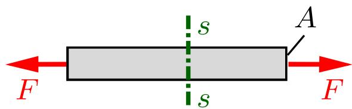

▪ Die Wirkungsline von $F$ ist die Stabachse.

▪ Die äußere Belastung � verursacht innere Kräfte.

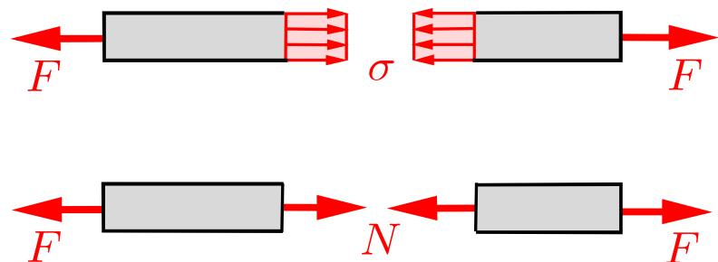

$$
\sigma = \frac {N}{A} = \frac {F}{A}
$$

(Technische Spannung)

Bestimmung der inneren Kräfte durch einen geraden Schnitt $s - s$ durch den Stab.

▪ Flächenkräfte in der Schnittebene Spannungen � [Kraft / Fläche $\triangleq { \mathsf { N } } / { \mathsf { m m } } ^ { 2 } \triangleq { \mathsf { M P a } } ]$ nach Augustin Louis Cauchy (1789-1857)

▪ Annahme: Spannungen stehen senkrecht zur Schnittfläche und sind gleichförmig verteilt.

▪ Normalspannung N: σ steht normal zu $\mathsf { \Omega } \mathsf { S } - \mathsf { \Omega } \mathsf { S }$

▪ Zugstab: N ist positiv $ \sigma$ ist positiv Zugspannung

3▪ Druckstab: N ist negativ $ \sigma$ ist negativ Druckspannung

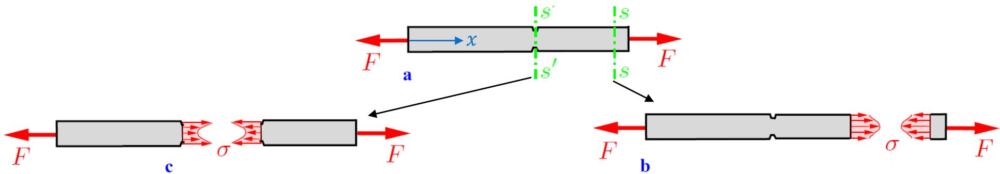

▪ Ungleichförmige Spannungsverteilung in Schnitt $\mathsf { \Omega } \mathsf { S } - \mathsf { \Omega } \mathsf { S }$ (Stabende) und $\mathsf { S } ^ { \prime } - \mathsf { S } ^ { \prime }$ (Kerbe) → Spannungsspitzen

Spannungsüberhöhung nimmt mit Abstand zum Stabende schnell ab

 Bei diesen Fällen kann die Spannungsverteilungen nicht mit der elementaren Theorie des Zugstabes ermittelt werden!

Bei Stäben mit schwach veränderlicher Querschnittfläche gilt als gute Näherung:

$$
\sigma (x) = \frac {N (x)}{A (x)}
$$

## 10.1 Spannung

▪ Querschnittsbemessung in der Praxis (Dimensionierung)

▪ Gewählte Abmessungen Keine Überschreitung vorgegebener maximaler Beanspruchung

$$
\mid \sigma \mid \leq \sigma_{zul}\quad \text{zulässige Spannung}
$$

▪ Erforderliche Querschnittsfläche $A _ { e r f }$

$$
A _ {e r f} = | N | / \sigma_ {z u l}
$$

▪ Anmerkung: Ein auf Druck beanspruchter schlanker Stab kann durch Knicken versagen, bevor die Spannung einen unzulässig großen Wert annimmt (wird später behandelt).

## 10.1 Spannung

Beispiel: Ein konischer Stab (Länge �) mit kreisförmigem Querschnitt (Endradien $r _ { 0 }$ bzw. $2 r _ { 0 } )$ wird durch eine Druckkraft � in der Stabachse belastet. Wie groß ist die Normalspannung in einem beliebigen Querschnitt bei einem Schnitt senkrecht zur Stabachse?

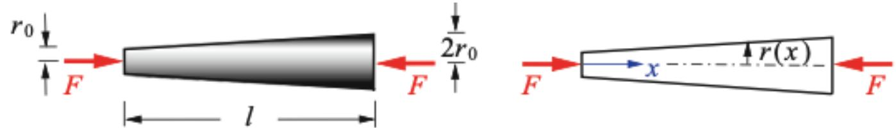

▪ Radius für den konischen Druckstab $r ( x )$

$$
r (x) = r _ {0} + r _ {0} \cdot \frac {x}{l} = r _ {0} \cdot \left(1 + \frac {x}{l}\right)
$$

▪ Querschnittsfläche $A ( x ) = \pi \cdot r ( x ) ^ { 2 }$

▪ Normalspannung $\sigma ( x ) = N ( x ) / A ( x )$ mit $N ( x ) = N = - F$

$$
\sigma (x) = - \frac {F}{\pi \cdot \left[ r _ {0} \cdot \left(1 + \frac {x}{l}\right) \right] ^ {2}}
$$

(Druckspannung)

$$
\sigma (x = 0) = 4 \cdot \sigma (x = l)
$$

## 10.2 Dehnung

▪ Untersuchung der Verformung eines elastischen Körpers.

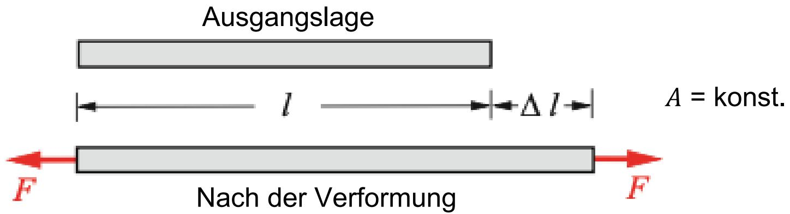

▪ Dehnung ε: Längenänderungsverhältnis zur Ausgangslänge �

$$
\varepsilon = \frac {\Delta l}{l}
$$

[dimensionslos] (Technische Dehnung)

▪ Verlängerung des Stabs: $\Delta l > 0 $ positive Dehnung

▪ Verkürzung des Stabs: $\Delta l < 0 $ negative Dehnung

▪ Betrachtung kleiner Deformationen: $| \Delta l | \ll l$ bzw. $| \varepsilon | \ll 1$

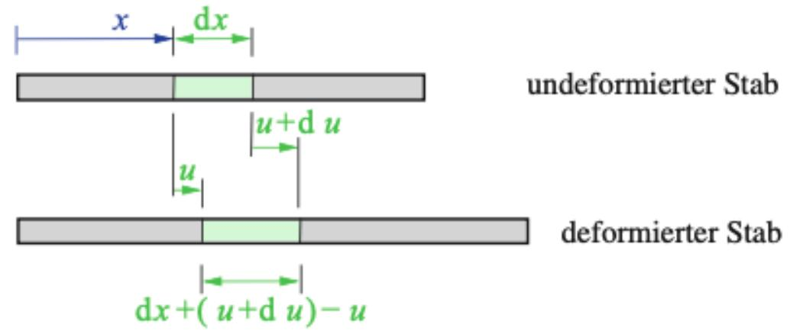

� ≠ konst.

▪ Dehnung ortsabhängig veränderliche Querschnittfläche

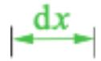

▪ Betrachtung eines Stabelements

▪ Verschiebung $u ( x )$ ist ortsabhängig

▪ Örtliche Dehnung:

$$
\varepsilon (x) = \frac {d u}{d x} = \frac {\Delta l}{l}
$$

▪ Bestimmung $\begin{array} { r } { \mathrm { u } ( x ) \mathrm { : u } ( x ) = \int \mathfrak { \varepsilon } ( x ) } \end{array}$ ��

## Kinematik

Verschiebung � und Dehnung ε beschreiben die Geometrie der Verformung → kinematische Größen

▪ Spannungen → Kraftgrößen → ein Maß für die Beanspruchung des Materials (eines Körpers)

▪ Dehnungen → Kinematische Größen → ein Maß für die Verformung

## Stoffgesetz/-modell beschreibet die physikalische oder phänomenologische Beziehung zwischen Spannungen und Dehnungen

▪ Stoffmodell hängt vom Material ab!

▪ Ermittlung der Stoffmodelle nur mit Experimenten möglich.

▪ Zug- bzw. Druckversuch

▪ Probenstab wird gedehnt bzw. gestaucht

$$
\rightarrow \sigma = F / A
$$

▪ Gleichzeitige Änderung der Stablänge

$$
\rightarrow \varepsilon = \Delta l / l
$$

▪ Darstellung in Spannungs-Dehnungs-Diagramm

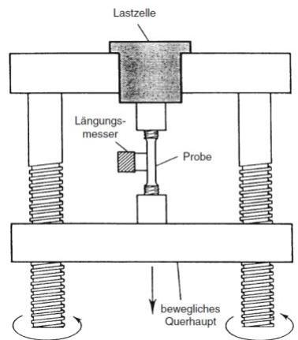  
Fließgrenze (Streckgrenze)  
Proportionalitätsgrenze

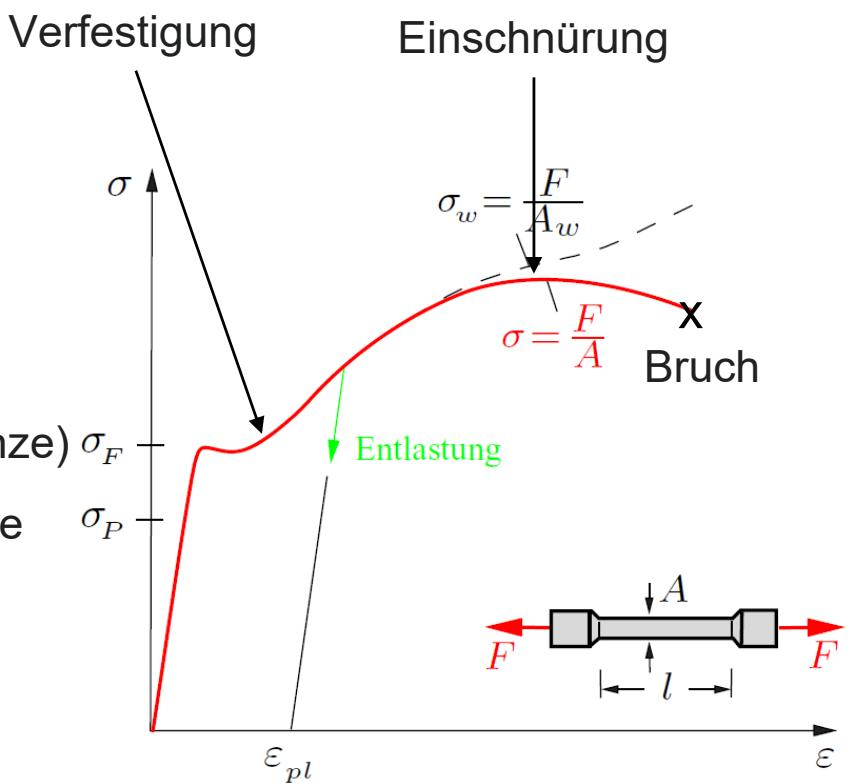  
$\sigma _ { w } \colon$ Wahre Spannung

## 10.3 Stoffgesetz/-modell

$\lvert \sigma < \sigma _ { F } \rvert$ → Elastisch: Material nimmt nach vollständiger Entlastung ursprüngliche Länge an

$\lfloor \sigma > \sigma _ { F } \rvert$ → Plastisch: Bei völliger Entlastung bleibt die plastische Dehnung $\varepsilon _ { p l }$ zurück

▪ $\sigma \leq \sigma _ { p }$ → Linear-elastisch (Fokus dieser Veranstaltung!)

▪ Linear-elastisches Materialverhalten:

$$
\boldsymbol {\sigma} = \boldsymbol {E} \cdot \boldsymbol {\varepsilon}
$$

Hooksches Modell

Proportionalitätsfaktor E → Elastizitätsmodul $[ \mathsf { M P a } = \mathsf { N } / \mathsf { m m } ^ { 2 } ]$

▪ Stabdehnung infolge Zug- und Druckkraft

$$
\varepsilon = \sigma / _ {E}
$$

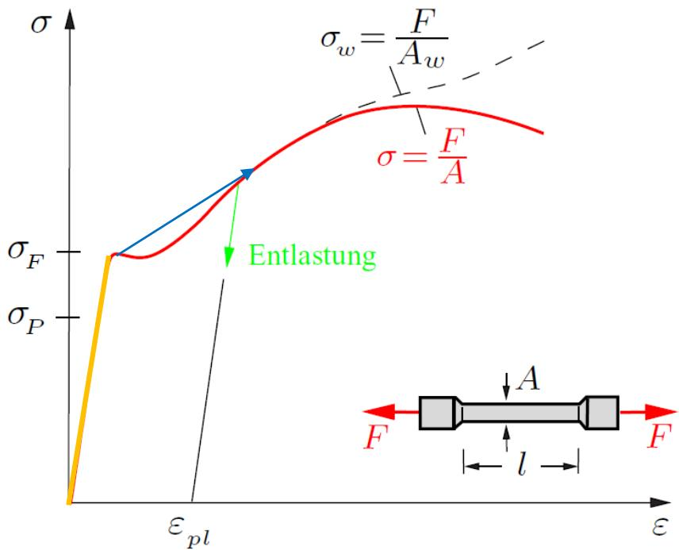

## 10.4 Einzelstab

▪ Ermittlung der Spannungen und Verformung eines Stabes (unbeweglich, im Gleichgewicht) durch drei verschiedene Arten von Gleichungen

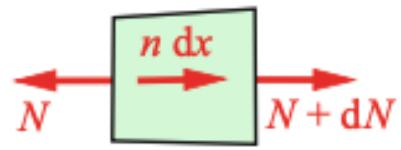

Einzelkräfte

Linienkräfte

$$
\begin{array}{c}\mid \leftarrow \mathrm{d} x \rightarrow \mid\\x \qquad x + \mathrm{d} x\end{array}
$$

1. Gleichgewichtsbedingung:

$$
\rightarrow : N + d N + n \cdot d x - N = 0
$$

$$
\frac {d N}{d x} + n = 0
$$

$$
F _ {1} = F _ {2} + n \cdot l
$$

2. Kinematik:

3. Elastizitätsmodell

$$
\varepsilon (x) = \frac {d u}{d x}
$$

Elastizitätsgesetz/-modell für den Stab

$$
\varepsilon = \frac {\sigma}{E} + \alpha_ {T} \Delta T
$$

$$
\frac {d u}{d x} = \frac {N}{E A} + \alpha_ {T} \Delta T
$$

$$
\sigma = \frac {N}{A}
$$

Dehnsteifigkeit (��)

## 10.4 Einzelstab

▪ Verschiebung eines Stabquerschnitts

$$
\varepsilon = \frac {d u}{d x} \longrightarrow \Delta l = u (l) - u (0) = \int_ {0} ^ {l} \varepsilon \cdot d x \longrightarrow \Delta l = \int_ {0} ^ {l} \left(\frac {N}{E A} + \alpha_ {T} \Delta T\right) \cdot d x
$$

Sonderfall → konstante Dehnsteifigkeit, $n = 0 , \Delta T = \mathsf { k o n s t } .$ $N = F$

$$
\Delta l = \frac {F \cdot l}{E A} + \alpha_ {T} \cdot \Delta T \cdot l
$$

▪ $\Delta T = 0 \colon$

$$
F = 0:
$$

$$
\Delta l = \frac{\boldsymbol{F}\cdot\boldsymbol{l}}{EA}
$$

$$
\Delta l = \alpha_ {T} \cdot \Delta T \cdot l
$$

## ▪ Statisch bestimmte Problemstellung:

▪ Normalkraft $\mathsf { N } ( \mathsf { x } )$ mit Gleichgewichtsbedingungen bestimmbar

▪ Dehnung: � � ; $\sigma = \frac { N } { A } ; \varepsilon = \frac { \sigma } { E }$

▪ :Verschiebung $\textstyle \int d u = \int \varepsilon d x$

▪ $\Delta T \to \mathsf { W } \ddot { \mathsf { a } }$ rmedehnung; keine zusätzlichen Spannungen

## ▪ Statisch unbestimmte Problemstellung

▪ Normalkraft $\mathsf { N } ( \mathsf { x } )$ nicht mit Gleichgewichtsbedingungen bestimmbar

■ Gleichgewicht; Kinematik; Elastizitätsgesetz

▪ $\Delta T \to \mathsf { W } \ddot { \mathsf { a } }$ rmedehnung; Zusätzliche Spannungen

## 10.4 Einzelstab

▪ Abschließende Differentialgleichung für die Verschiebung �

$$
(E \cdot A \cdot u ^ {\prime}) ^ {\prime} = - n + (E \cdot A \cdot \alpha_ {T} \cdot \Delta T) ^ {\prime}
$$

Ableitung nach �

$$
\frac {d u}{d x} = \frac {N}{E A} + \alpha_ {T} \Delta T
$$

$$
\frac {d N}{d x} + n = 0
$$

▪ Für $E \cdot A = k o n s t .$ . und $\Delta T = k o n s t .$

$$
E \cdot A \cdot u ^ {\prime \prime} = - n
$$

## 10.4 Einzelstab

Beispiel: Hängender Stab unter Eigengewicht / Statisch bestimmt $\begin{array} { r } { \mathrm { / ~ } A ( x ) = \left. { k o n s t . } \ : / \ : \Delta l ? , \sigma ? \right. } \end{array}$

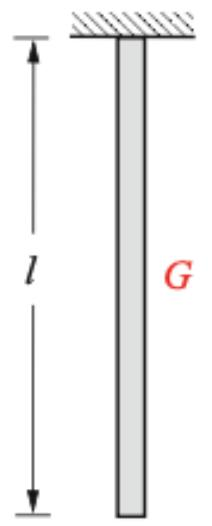

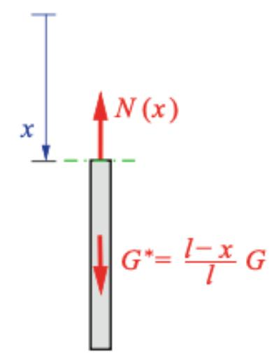

▪ Konstante Streckenlast $n = G / l$

▪ $E \cdot A = k o n s t . \mathsf { u n d } \Delta T = k o n s t$

$$
\Rightarrow E \cdot A \cdot u ^ {\prime \prime} = - n = - \frac {G}{l}
$$

$$
E \cdot A \cdot u ^ {\prime} = - \frac {G}{l} \cdot x + C _ {1}
$$

$$
E \cdot A \cdot u = - \frac {G}{2 l} \cdot x ^ {2} + C _ {1} \cdot x + C _ {2}
$$

▪ Randbedingungen: $u ( x = 0 ) = 0 \Rightarrow C _ { 2 } = 0 ; u ^ { \prime } ( x = l ) = 0 \Rightarrow C _ { 1 } = G$

$$
u (x) = \frac {1}{2} \frac {G l}{E A} \left(2 \frac {x}{l} - \frac {x ^ {2}}{l ^ {2}}\right);
$$

$$
N (x) = E A u ^ {\prime} (x) = G (1 - \frac {x}{l})
$$

$$
\Delta l = u (l) - u (0)
$$

$$
u (l) = \frac {1}{2} \frac {G l}{E A}; u (0) = 0
$$

$$
\sigma (x) = \frac {N (x)}{A} \Rightarrow \frac {G}{A} (1 - \frac {x}{l})
$$

## 10.4 Einzelstab

Beispiel: Beidseitig eingespannter Stab / Statisch unbestimmt $/ \ A _ { 1 } , A _ { 2 } \ .$ / Gesucht sind Lagerreaktionen für den Fall, wenn der Stab 1 gleichförmig um Δ� erwärmt wird.

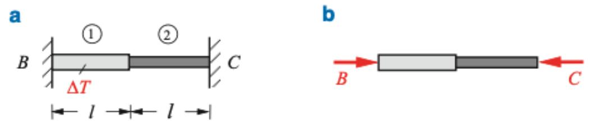

▪ Gleichgewichtsbedingung in ①

→: B − C = 0

$$
N = - B = - C
$$

▪ Verformungen in ① und ②

$$
\Delta l _ {1} = \frac {N l}{E A _ {1}} + \alpha_ {T} \Delta T l, \qquad \Delta l _ {2} = \frac {N l}{E A _ {2}}
$$

▪ Randbedingung: $\Delta l = \Delta l _ { 1 } + \Delta l _ { 2 } = 0$

$$
\frac {N l}{E A _ {1}} + \alpha_ {T} \Delta T l + \frac {N l}{E A _ {2}} = 0
$$

$$
- N = \frac {E A _ {1} A _ {2} \alpha_ {T} \Delta T}{A _ {1} + A _ {2}}
$$

Alternative Lösung:

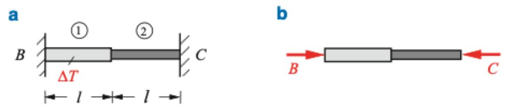

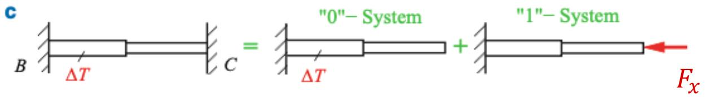

Statisch bestimmtes $, 0 ^ { 6 6 } = 5$ ystem: reine Wärmeausdehnung ohne Normalkraft

$$
\Delta l _ {1} ^ {(0)} = u _ {c} ^ {(0)} = \alpha_ {T} \cdot \Delta T \cdot l
$$

▪ Statisch bestimmtes $, 1 ^ { 6 6 } = 5 1$ ystem:

$$
u _ {c} ^ {(1)} = \Delta l _ {1} ^ {(1)} + \Delta l _ {2} ^ {(1)} = - \frac {F _ {x} l}{E A _ {1}} - \frac {F _ {x} l}{E A _ {2}}
$$

▪ Superposition: $u _ { c } = u _ { c } ^ { ( 0 ) } + u _ { c } ^ { ( 1 ) }$

▪ Randbedingung: $u _ { c } = u _ { c } ^ { ( 0 ) } + u _ { c } ^ { ( 1 ) } = 0$

$$
\alpha_ {T} \cdot \Delta T \cdot l - \frac {F _ {x} l}{E A _ {1}} - \frac {F _ {x} l}{E A _ {2}} = 0
$$

$$
\Rightarrow \mathrm{F} _ {\mathrm{x}} = \mathrm{C} = \mathrm{B} = \frac {\mathrm{EA} _ {1} \mathrm{A} _ {2} \alpha_ {T} \Delta T}{A _ {1} + A _ {2}}
$$

## 10.5 Statisch bestimmte Stabsysteme

1. Ermittlung der Stabkräfte aus den Gleichgewichtsbedingung.

2. Berechnung von Spannungen & Längenänderung

3. Annahme: Längenänderung sind kleiner als die Stablängen → Aufstellung der Gleichgewichtsbedingung am unverformten System zulässig.

Beispiel: Gesucht ist Verschiebung vom Punkt C. Beide Stäbe haben die gleiche Dehnsteifigkeit ��.

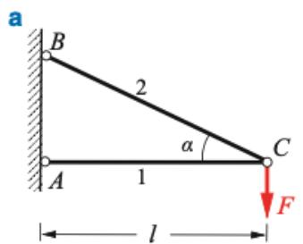

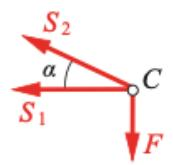

▪ Gleichgewichtsbedingungen am Knoten C:

$$
\begin{array}{r l}{\uparrow :}&{S _ {2} \sin \alpha - F = 0}\\{\leftarrow :}&{S _ {1} + S _ {2} \cos \alpha = 0}\end{array}\quad \rightarrow \quad S _ {1} = - \frac {F}{\tan \alpha}, \quad S _ {2} = \frac {F}{\sin \alpha}
$$

▪ Längenänderung der Stäbe:

$$
\Delta l _ {1} = \frac {S _ {1} l _ {1}}{E A} = - \frac {F l}{E A} \frac {1}{\tan \alpha}, \quad \Delta l _ {2} = \frac {S _ {2} l _ {2}}{E A} = \frac {F l}{E A} \frac {1}{\sin \alpha \cos \alpha}
$$

b

## 10.5 Statisch bestimmte Stabsysteme

Beispiel: Gesucht ist Verschiebung vom Punkt C. Beide Stäbe haben die gleiche Dehnsteifigkeit ��.

C  
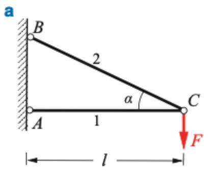

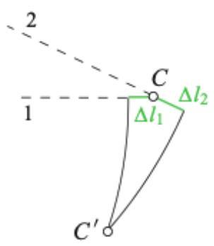

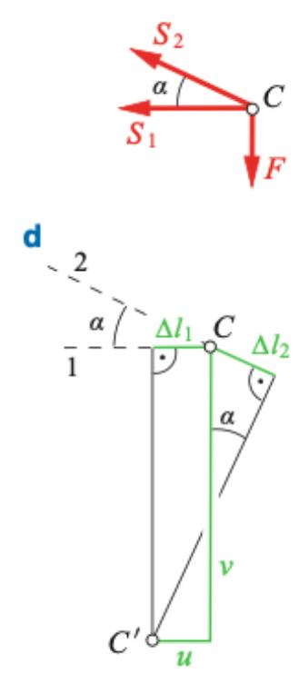

• Verschiebungen klein!

• Kreisbogen kann durch die Tangente ersetzt werden!

Horizontalverschiebung:

$$
u = | \Delta l _ {1} | = \frac {F l}{E A} \frac {1}{\tan \alpha}
$$

Vertikalverschiebung

$$
v = \frac {\Delta l _ {2}}{\sin \alpha} + \frac {u}{\tan \alpha} = \frac {F l}{E A} \frac {1 + \cos^ {3} \alpha}{\sin^ {2} \alpha \cos \alpha}
$$

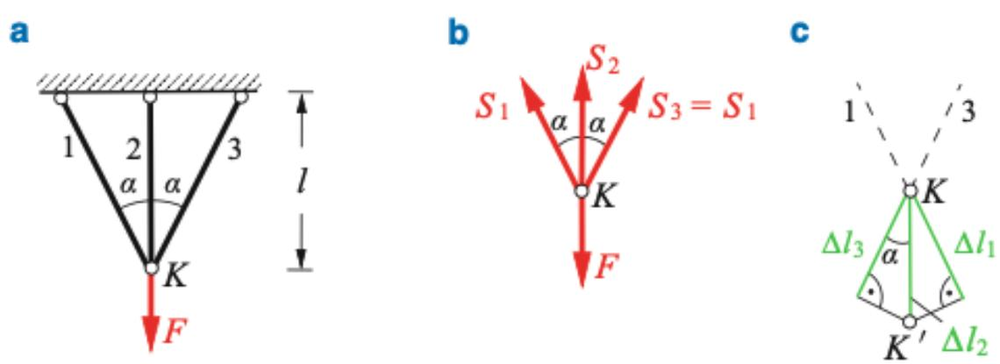

## 10.6 Statisch unbestimmte Stabsysteme

▪ Betrachtung von Gleichgewicht + Kinematik + Elastizitätsgesetz

Beispiel: Stabsystem bestehend aus drei Stäben mit Dehnsteifigkeiten $E A _ { 1 } , E A _ { 2 } , E A _ { 3 } = E A _ { 1 }$ . Die Stäbe sind für � = 0 spannungsfrei. Das System ist einfach statisch unbestimmt. Die Verschiebung vom Punkt K und die Stabkräfte sind gesucht.

▪ Gleichgewichtsbedingungen am Knoten K:

$$
\rightarrow : \quad - S _ {1} \sin \alpha + S _ {3} \sin \alpha = 0 \quad \rightarrow \quad S _ {1} = S _ {3},
$$

$S _ { 1 } \cos \alpha + S _ { 2 } + S _ { 3 }$ COs a ${ \mathrm { \Omega } } _ { \cdot } - F = 0 \to S _ { 1 } = S _ { 3 } = { \frac { F - S _ { 2 } } { 2 \cos \alpha } }$

▪ Längenänderung der Stäbe:

$$
\Delta l _ {1} = \Delta l _ {3} = \frac {S _ {1} l _ {1}}{E A _ {1}}, \quad \Delta l _ {2} = \frac {S _ {2} l}{E A _ {2}}
$$

▪ Verschiebungsplan (c):

$$
\Delta l _ {1} = \Delta l _ {2} \cos \alpha
$$

## 10.6 Statisch unbestimmte Stabsysteme

Beispiel: Stabsystem bestehend aus drei Stäben mit Dehnsteifigkeiten $E A _ { 1 } , E A _ { 2 } , E A _ { 3 } = E A _ { 1 }$ . Die Stäbe sind für $F = 0$ spannungsfrei. Das System ist einfach statisch unbestimmt. Die Verschiebung vom Punkt K und die Stabkräfte sind gesucht.

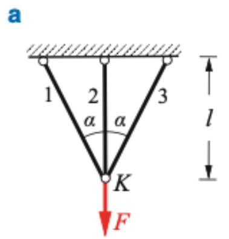

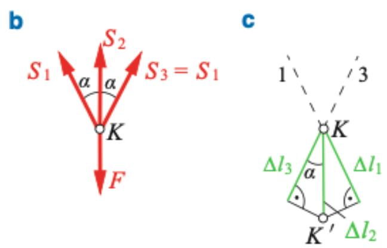

▪ Einsetzen in $\Delta l _ { 1 } = \Delta l _ { 2 }$ COs α

▪ Stabkraft $S _ { 2 }$

$$
S _ {2} = \frac {F}{1 + 2 \frac {E A _ {1}}{E A _ {2}} \cos^ {3} \alpha}
$$

▪ Vertikale Verschiebung $\Delta l _ { 2 }$

$$
v = \Delta l _ {2} = \frac {S _ {2} l}{E A _ {2}} = \frac {\frac {F l}{E A _ {2}}}{1 + 2 \frac {E A _ {1}}{E A _ {2}} \cos^ {3} \alpha}
$$

▪ Stabkräfte $S _ { 1 , 3 }$

$$
S _ {1} = S _ {3} = \frac {\frac {E A _ {1}}{E A _ {2}} \cos^ {2} \alpha}{1 + 2 \frac {E A _ {1}}{E A _ {2}} \cos^ {3} \alpha} F
$$

## 10.7 Zusammenfassung

Normalspannung im Schnitt senkrecht zur Stabachse → $\sigma = N / A$

▪ Dehnung $ \varepsilon = d u / d x ; \varepsilon \ll 1$

▪ Hookesches Gesetz/ Modell → $\sigma = E$ ⋅ ε

▪ Längenänderung: $\begin{array} { r } { \Delta l = \int _ { 0 } ^ { l } \left( \frac { N } { E A } + \alpha _ { T } \Delta T \right) } \end{array}$ ⋅ ��

▪ $\mathsf { F u r } N = F ; \Delta T = 0 , E A = \mathsf { k o n s t } .$ →Δ� = �⋅� ��

▪ F $\ddot { \mathsf { U } } \mathsf { r } N = F ; \Delta T = \mathsf { k o n s t } .$

$$
\rightarrow \Delta l = \alpha_ {T} \cdot \Delta T \cdot l
$$

▪ Statisch bestimmtes System: N, σ, ε, Δ� und � können der Reihe nach aus Gleichgewicht, Elastizitätsgesetz und Kinematik ermittelt werden. Δ� verursacht keine Spannung.

Statisch unbestimmtes System: Gleichgewicht, Elastizitätsgesetz und Kinematik müsse gleichzeigt betrachtet werden. Δ� verursacht i.d.R. Wärmespannung.

## Vielen Dank für Ihre Aufmerksamkeit!