## Mechanik in der Werkstofftechnik II: Elastostatik

Kapitel 11: Spannungszustand

Univ. Prof. Dr.-Ing Sebastian Münstermann

## Organisatorische Informationen

## Ansprechpartner

• Maximilian Hribsek

− Fragen bzgl. Vorlesungen, Übungen und Selbstrechenübungen

• Berk Tekkaya

− Fragen bzgl. Übungen

− Fragen bzgl. organisatorischer Probleme wie,

Termine und Räume, Anmeldung zur Vorlesung, Zugang zum Moodle-Lernraum, Anmeldung zur Prüfung

Kontakt: technischemechanik@ibf.rwth-aachen.de

## Organisatorische Informationen

Die Termine für die Vorlesungen, Übungen und Selbstrechenübungen sind im Aushang in Moodle zu finden

Im Sommersemester werden sechs Selbstrechenübungsgruppen pro Woche angeboten. (Start am 29.04.26)

Die Teilnehmerzahl jeder Selbstrechenübung ist begrenzt. Eine Anmeldung ist erforderlich und der Zugang zur Anmeldung wird zeitnahe in Moodle freigeschaltet.

Mechanik in der Werkstofftechnik II - Vorlesung (VO) [23ss-52.00075]  

<table><tr><td rowspan=1 colspan=1></td><td rowspan=1 colspan=1>Termine</td><td rowspan=1 colspan=1>Ort</td></tr><tr><td rowspan=1 colspan=1>1</td><td rowspan=1 colspan=1>Mittwochs, 14:30-16:00</td><td rowspan=1 colspan=1>R5, Schinkelstr. 1, Templergraben 51</td></tr><tr><td rowspan=1 colspan=1>2</td><td rowspan=1 colspan=1>Mittwochs,16:30–18:00</td><td rowspan=1 colspan=1>R5, Schinkelstr. 1, Templergraben 51</td></tr><tr><td rowspan=1 colspan=1>3</td><td rowspan=1 colspan=1>Mittwochs, 18:30–20:00</td><td rowspan=1 colspan=1>R5, Schinkelstr. 1, Templergraben 51</td></tr><tr><td rowspan=1 colspan=1>4</td><td rowspan=1 colspan=1>Freitags, 12:30–14:00</td><td rowspan=1 colspan=1>HKW 1, Wüllnerstraße 1</td></tr><tr><td rowspan=1 colspan=1>5</td><td rowspan=1 colspan=1>Freitags, 14:30–16:00</td><td rowspan=1 colspan=1>HKW 1, Wüllnerstraße 1</td></tr><tr><td rowspan=1 colspan=1>6</td><td rowspan=1 colspan=1>Freitags, 16:30–18:00</td><td rowspan=1 colspan=1>HKW 1, Wüllnerstraße 1</td></tr></table>

## Vorlesung

Dietmar Gross·Werner Hauger Jörg Schröder·Wolfgang A.Wall

## Technische Mechanik 2

Elastostatik 13. Auflage

LEHRBUCH

Dietmar Gross · Werner Hauger Jörg Schröder · Wolfgang A.Wal

## Technische Mechanik 3

14. Auflage

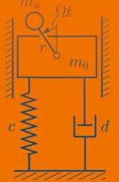

EXTRAS ONLINE

Springer Vieweg

EXTRAS ONLINE

## Übung/Selbstrechenübungen

LEHRBUCH

LEHRBUCH

Dietmar Gross · Wolfgang Ehlers Peter Wriggers · Jörg Schröder Ralf Müller

Formeln und Aufgaben zur Technischen Mechanik2

Elastostatik, Hydrostatik

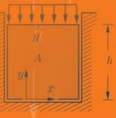

Dietmar Gross · Wolfgang Ehlers Peter Wriggers · Jörg Schröder Ralf Müller

Formeln und Aufgaben zur Technischen Mechanik 3

12. Auflage

Springer Vieweg

## 11.1 Spannungsvektor und Spannungstensor

▪ Betrachtung eines Körpers, der beliebig durch Einzelkräfte $\boldsymbol { F } _ { i }$ und Flächenlasten $\pmb { p }$ belastet ist.

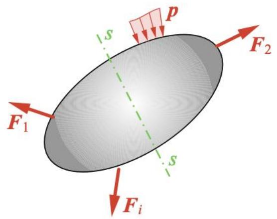

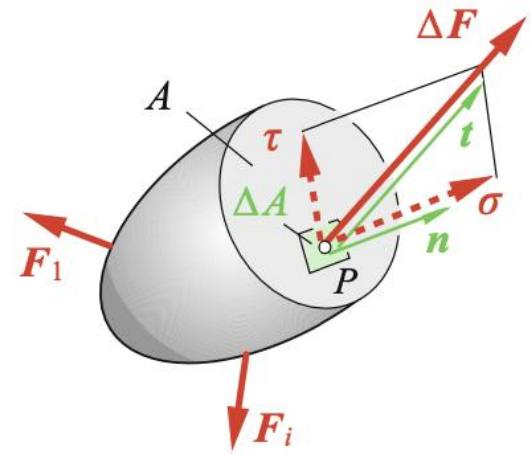

▪ Die äußeren Belastungen führen zu inneren Kräften (=Spannungen).

▪ Die Spannungen sind über die Schnittfläche � veränderlich verteilt (im Gegensatz zum Zugstab).

▪ Definition der Spannungen in einem beliebigen Punkt � in der Schnittfläche $\Delta A$ , wo eine Kraft $\Delta F$ angreift.

Mittlere Spannung (Kraft pro Fläche) für das Flächenelement: $\Delta F / \Delta A$

▪ Voraussetzung: $\Delta F / \Delta A$ strebt für $\Delta A  0$ gegen einen endlichen Wert!

�

(Normalspannung)

Zerlegung in eine Komponente normal zur Schnittfläche

▪ Spannungsvektor �:

$$
\frac { 1 1 0 0 0 } { 1 0 0 0 } = \frac { 1 0 0 0 } { 1 0 0 0 } = \frac { 1 0 0 0 } { 1 0 0 0 }
$$

�

(Schubspannung)

Zerlegung in eine Komponente in der Schnittfläche (tangential)

## 11.1 Spannungsvektor und Spannungstensor

▪ Spannungsvektor � ist ortsabhängig!

▪ Die Spannungsverteilung in der Schnittfläche Δ� ist erst dann bekannt, wenn der Spannungsvektor � für alle Punkte von � angegeben werden kann.

▪ Nur durch � kann der Spannungszustand in einem Punkt � nicht ausreichend beschrieben werden!

Legt man durch den Punkt � Schnitte in verschiedenen Richtungen, so wirken dort entsprechend der unterschiedlichen Orientierung der Flächenelemente unterschiedliche Schnittkräfte.

→ Spannungen hängen neben Ort auch von der Schnittrichtung (=Normalenvektor �) ab.

## 11.1 Spannungsvektor und Spannungstensor

▪ Der Spannungszustand in einem Punkt � wird durch die drei Spannungsvektoren in drei senkrecht aufeinander stehenden Schnittflächen festgelegt.

Diese Schnittflächen lassen sich mit den Koordinatenebenen eines kartesischen Koordinatensystems zusammenfallen.

b  
a  
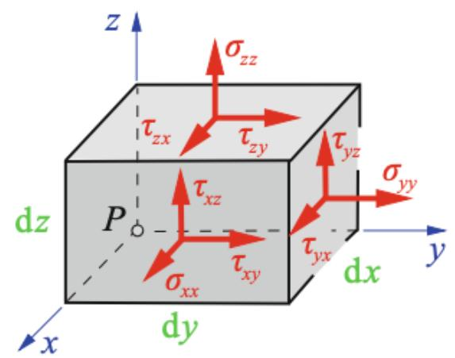

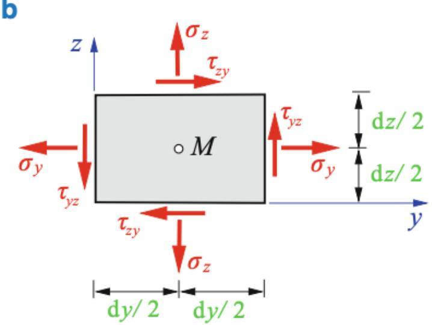  
Betrachtung eines infinitesimalen Quaders in der Umgebung von �

▪ In einer der sechs Flächen wirkt ein Spannungsvektor.

▪ Zerlegung dieser Spannungsvektoren in Normal- & Schubspannungen.

Zerlegung der Schubspannungen in die Komponenten nach den Koordinatenrichtungen.

▪ Kennzeichnung durch Doppelindizes:

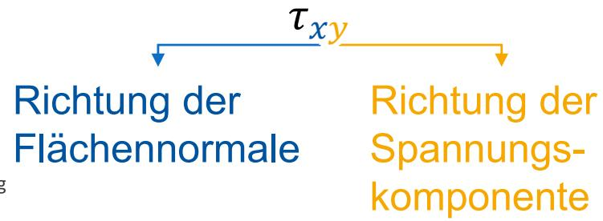

## 11.1 Spannungsvektor und Spannungstensor

▪ Normalspannungen können in vereinfachter Schreibweise dargestellt werden.

$$
\sigma _ { x x } = \sigma _ { x } ; \sigma _ { y y } = \sigma _ { y } ; \sigma _ { z z } = \sigma _ { z }
$$

▪ Aufstellung des Spannungsvektors für die Schnittfläche, deren Normale in � −Richtung zeigt:

$$
1 2 - 1 = 1 2
$$

Vorzeichenkonvention für Spannungen:

Positive Spannungen zeigen an einem positiven (negativen) Schnittufer in die positive (negative) Koordinatenrichtung.

→ Positive (negative) Normalspannungen beanspruchen den infinitesimalen Quader auf Zug (Druck)

## 11.1 Spannungsvektor und Spannungstensor

▪ Die Zerlegung der Spannungsvektoren in ihre Komponenten liefert drei Normalspannungen und sechs Schubspannungen!

▪ Nicht alle Schubspannungen sind unabhängig voneinander: Bildung des Momentengleichgewichts um eine zur x-Achse parallele Achse durch den Mittelpunkt �:

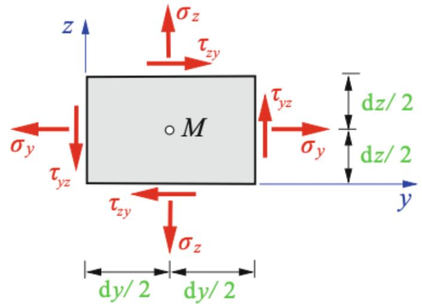

$$
\Sigma M ^ { ( M ) } = 0
$$

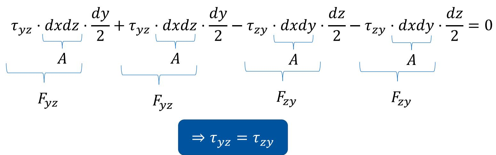

▪ Aus Momentengleichgewicht um die anderen Achsen folgt:

$$
( \frac { 1 } { 2 } , \frac { 1 } { 3 } ) = \frac { 1 } { 2 } \textcircled { 1 }
$$

$$
1 0 0 0 = 1 0 0 0
$$

## 11.1 Spannungsvektor und Spannungstensor

▪ Anordnung der Komponenten der einzelnen Spannungsvektoren in einen Tensor $( = , \mathsf { M a t r i x } ^ { 6 6 } )$

$$
{ \pmb { \sigma } } = \left[ { \begin{array} { l l l } { \sigma _ { x x } } & { \tau _ { x y } } & { \tau _ { x z } } \\ { \tau _ { y x } } & { \sigma _ { y y } } & { \tau _ { y z } } \\ { \tau _ { z x } } & { \tau _ { z y } } & { \sigma _ { z z } } \end{array} } \right] = \left[ { \begin{array} { l l l } { \sigma _ { x } } & { \tau _ { x y } } & { \tau _ { x z } } \\ { \tau _ { x y } } & { \sigma _ { y } } & { \tau _ { y z } } \\ { \tau _ { x z } } & { \tau _ { y z } } & { \sigma _ { z } } \end{array} } \right]
$$

▪ Die Hauptdiagonale besteht aus Normalspannungen �.

▪ Die übrigen Komponenten sind Schubspannungen �.

▪ Der Spannungstensor � ist symmetrisch und besteht aus sechs unabhängigen Einträgen.

Durch die Spannungsvektoren für drei senkrecht aufeinander stehende Schnitte und durch den Spannungstensor ist der Spannungszustand in einem Punkt eindeutig festgelegt!

## 11.2 Ebener Spannungszustand

▪ Untersuchung des Spannungszustandes in einer Scheibe.

▪ Scheibe: Ebenes Tragwerk, dessen Dicke � klein gegen die Längen der Seiten ist und das nur in seiner Ebene belastet wird.

▪ Die Ober- & Unterseite der Scheibe sind unbelastet.

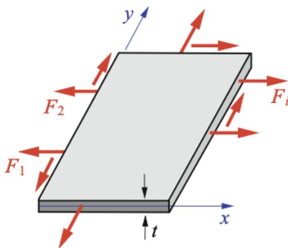

Es treten keine Kräfte in �-Richtung → keine Spannungen in �-Richtung!

$$
1 0 0 0 - 1 0 0 0 = 1 0 0 0 - 1 0 0 0
$$

– Kleine Dicke → Spannungen $\sigma _ { x } , \sigma _ { y } , \tau _ { x y } = \tau _ { y x }$ sind über die Dicke konst.

→ Ebener Spannungszustand

$$
\mathbf { \sigma } _ { \sigma } = \left[ \begin{array} { l l } { \sigma _ { x } } & { \tau _ { x y } } \\ { \tau _ { x y } } & { \sigma _ { y } } \end{array} \right]
$$

Spannungen hängen i.d.R. von den Koordinaten (�, �) ab. Wenn die Spannungen ortsunabhängig sind → homogener Spannungszustand

## 11.2.1 Koordinatentransformation

▪ Bisher: Betrachtung der Spannungen an einem Punkt auf der Scheibe, an dem die Schnitte parallel, senkrecht zu den Koordinatenachsen gesetzt wurden.

Jetzt: Untersuchung der Spannungen an einem Punkt auf der Scheibe, an dem die Schnitte beliebig, senkrecht zur Scheibe gesetzt werden.

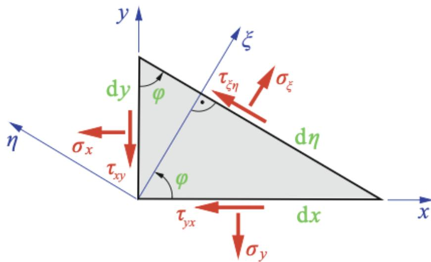

Infinitesimales Dreieck der Dicke � herausgeschnitten aus der Scheibe

▪ Schnittrichtung charakterisiert durch $x , y \cdot$ -Koordinaten und den Winkel $\varphi$

▪ Drehung des $x , y { = } \mathsf { S } )$ stems um � entspricht dem $\eta , \xi { \mathrm { - } } { \mathsf { S } } \mathrm { y }$ stem

▪ �-Achse steht normal zur schrägen Schnittfläche

▪ Gleichgewicht in $\eta , \xi \mathrm { - } \mathsf { R i c h t u n g e r }$ n: $d A = d \eta t$

$$
\begin{array} { r l } { \nearrow : } & { \sigma _ { \xi } { \mathrm { d } } A - ( \sigma _ { x } { \mathrm { d } } A \cos \varphi ) \cos \varphi - ( \tau _ { x y } { \mathrm { d } } A \cos \varphi ) \sin \varphi } \\ & { \qquad - ( \sigma _ { y } { \mathrm { d } } A \sin \varphi ) \sin \varphi - ( \tau _ { y x } { \mathrm { d } } A \sin \varphi ) \cos \varphi = 0 , } \end{array}
$$

$$
\begin{array} { r l } { \setminus : } & { \tau _ { \xi \eta } \mathrm { d } A + ( \sigma _ { x } \mathrm { d } A \cos \varphi ) \sin \varphi - ( \tau _ { x y } \mathrm { d } A \cos \varphi ) \cos \varphi } \\ & { \qquad - ( \sigma _ { y } \mathrm { d } A \sin \varphi ) \cos \varphi + ( \tau _ { y x } \mathrm { d } A \sin \varphi ) \sin \varphi = 0 . } \end{array}
$$

## 11.2.1 Koordinatentransformation

$$
\begin{array} { r l } { \nearrow : } & { \sigma _ { \xi } { \mathrm { d } } A - ( \sigma _ { x } { \mathrm { d } } A \cos \varphi ) \cos \varphi - ( \tau _ { x y } { \mathrm { d } } A \cos \varphi ) \sin \varphi } \\ & { \qquad - ( \sigma _ { y } { \mathrm { d } } A \sin \varphi ) \sin \varphi - ( \tau _ { y x } { \mathrm { d } } A \sin \varphi ) \cos \varphi = 0 , } \end{array}
$$

$$
\begin{array} { r l } { \setminus : } & { \tau _ { \xi \eta } \mathrm { d } A + ( \sigma _ { x } \mathrm { d } A \cos \varphi ) \sin \varphi - ( \tau _ { x y } \mathrm { d } A \cos \varphi ) \cos \varphi } \\ & { \qquad - ( \sigma _ { y } \mathrm { d } A \sin \varphi ) \cos \varphi + ( \tau _ { y x } \mathrm { d } A \sin \varphi ) \sin \varphi = 0 . } \end{array}
$$

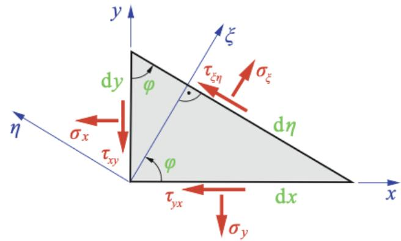

▪ Mit $\tau _ { y x } = \tau _ { x y }$

$\sigma _ { \xi } = \sigma _ { x } \cos ^ { 2 } \varphi + \sigma _ { y } \sin ^ { 2 } \varphi + 2 \tau _ { x y }$ sin � cos �

$$
\tau _ { \xi \eta } = - { \left( \sigma _ { x } - \sigma _ { y } \right) } \sin \varphi \cos \varphi + \tau _ { x y } ( \cos ^ { 2 } \varphi - \sin ^ { 2 } \varphi )
$$

▪ Berechnung der Normalspannung $\sigma _ { \eta }$ durch Drehung von $\sigma _ { \xi } \ : \mathsf { u m } \ : \frac { \pi } { 2 }$

$$
\sigma _ { \xi } \left( \varphi + \frac { \pi } { 2 } \right) = \sigma _ { \eta } = \sigma _ { x } \cos ^ { 2 } ( \varphi + \frac { \pi } { 2 } ) + \sigma _ { y } \sin ^ { 2 } ( \varphi + \frac { \pi } { 2 } ) + 2 \tau _ { x y } \sin ( \varphi + \frac { \pi } { 2 } ) \cos ( \varphi + \frac { \pi } { 2 } )
$$

$$
\Rightarrow \sigma _ { \eta } = \sigma _ { x } \sin ^ { 2 } ( \varphi ) + \sigma _ { y } \cos ^ { 2 } ( \varphi ) - 2 \tau _ { x y } \cos ( \varphi ) \sin ( \varphi ) \quad { \mathrm { ~ m i t ~ } } \cos ( \varphi + { \frac { \pi } { 2 } } ) = - \sin ( \varphi ) \ \sin \ ( \varphi + { \frac { \pi } { 2 } } ) = \cos ( \varphi )
$$

## 11.2.1 Koordinatentransformation

▪ Nach weiteren Umformungen erhält man die Transformationsgleichungen:

$\frac { 1 } { 2 } \times ( 2 - \frac { 1 } { 2 } + \frac { 1 } { 2 } + \frac { 1 } { 2 } ) = \frac { 1 } { 2 } ( 2 - \frac { 1 } { 2 } )$ cos 2� + ��� sin 2�

$$
\frac { 1 } { 2 } \times ( \frac { 1 } { 2 } - \frac { 1 } { 2 } ) \times ( \frac { 1 } { 2 } - \frac { 1 } { 2 } ) \times ( \frac { 1 } { 2 } - \frac { 1 } { 2 } ) \times ( \frac { 1 } { 2 } - \frac { 1 } { 2 } ) \times ( \frac { 1 } { 2 } - \frac { 1 } { 2 } ) \times ( \frac { 1 } { 2 } - \frac { 1 } { 2 } ) \times ( \frac { 1 } { 2 } - \frac { 1 } { 2 } )
$$

$$
v =
$$

$\frac { 1 } { 2 } \times ( \frac { 1 } { 2 } - \frac { 1 } { 2 } ) \times 1 1 0 0 \times \frac { 1 } { 2 } \times 1 0 0 = \frac { 1 } { 2 } \times 1 0 0$ cos 2�

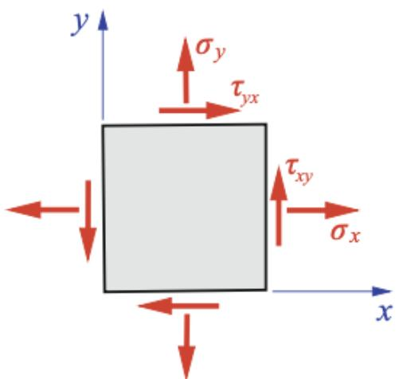

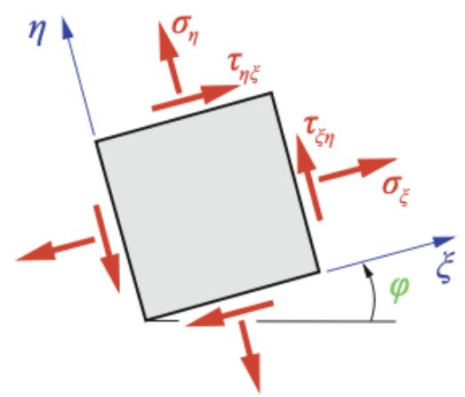

Die Spannungen repräsentieren in jedem der Koordinatensysteme den gleichen Spannungszustand

Eine Größe, deren Komponenten zwei Koordinatenindizes besitzen und beim Übergang von einem Koordinatensystem zu einem dazu gedrehten Koordinatensystem nach einer bestimmten Vorschrift transformiert werden, heißt Tensor 2. Stufe!

$\Rightarrow \mathsf { F i r }$ den Spannungstensor gegeben durch die Transformationsgleichungen!

▪ Mit anderen Worten: Tensoren sind rotationsunabhängig! → Die physikalische Aussage bleibt

15 unverändert!

## 11.2.1 Koordinatentransformation

$$
\sigma _ { \xi } = \frac { 1 } { 2 } \left( \sigma _ { x } + \sigma _ { y } \right) + \frac { 1 } { 2 } \left( \sigma _ { x } - \sigma _ { y } \right) \cos { 2 \varphi } + \tau _ { x y } \sin { 2 \varphi }
$$

$$
+ \sigma _ { \eta } = \frac { 1 } { 2 } \left( \sigma _ { x } + \sigma _ { y } \right) - \frac { 1 } { 2 } \big ( \sigma _ { x } - \sigma _ { y } \big ) \cos 2 \varphi - \tau _ { x y } \sin 2 \varphi
$$

$$
\sigma _ { \xi } + \sigma _ { \eta } = \sigma _ { x } + \sigma _ { y }
$$

▪ Die Summe der Normalspannungen hat in jedem Koordinatensystem den gleichen Wert!

▪ Die Summe $\sigma _ { x } + \sigma _ { y }$ wird als eine Invariante des Spannungstensors bezeichnet.

▪ Die Determinante $\sigma _ { x } \sigma _ { y } - \tau _ { x y } ^ { 2 }$ des Spannungstensors stellt eine weitere Invariante des Spannungstensors dar!

## 11.2.1 Koordinatentransformation

▪ Sonderfall:

$$
\textcircled { 9 } \times \textcircled { 2 } \times \textcircled { 2 } \times \textcircled { 2 } \times \textcircled { 2 } \times \textcircled { 1 }
$$

$$
\scriptstyle ( 2 , 3 , 2 ) = ( 2 , 3 , 2 ) = ( 2 , 3 , 2 ) = ( 4 , 5 , 2 ) = ( 1 , 5 , 2 ) = ( 1 , 5 , 2 ) = ( 1 , 5 , 2 ) = ( 1 , 5 , 2 ) = ( 1 , 5 , 2 ) = ( 1 , 5 , 2 ) = ( 1 , 5 , 2 ) = ( 1 , 5 , 2 ) = ( 1 , 5 , 2 ) = ( 1 , 5 , 2 ) = ( 1 , 5 , 2 ) = ( 1 , 5 , 2 ) = ( 1 , 5 , 2 ) = ( 1 , 5 , 2 ) = ( 1 , 5 , 2 ) = ( 1 , 5 , 2 ) = ( 1 , 5 , 2 ) = ( 1 , 5 , 2 ) = ( 1 , 5 , 2 ) = ( 1 , 5 , 2 ) = ( 1 , 5 , 2 ) = ( 1 , 5 , 2 ) = ( 1 , 5 , 2 ) = ( 1 , 5 , 2 ) = ( 1 , 5 , 2 ) = ( 1 , 5 , 2 ) = ( 1 , 5 , 2 ) = ( 1 , 5 , 2 ) = ( 1 , 5 , 2 ) = ( 1 , 5 , 2 ) = ( 1 , 5 , 2 ) = ( 1 , 5 , 2 ) = ( 1 , 5 , 5 , 2 ) = ( 1 , 5 , 5 , 5 ) = ( 1 , 5 , 5 , 5 ) = ( 1 , 5 , 5 , 5 ) = ( 1 , 5 , 5 , 5 ) = 5 = ( 1 , 5 , 5 , 5 , 5 ) = 5 ,
$$

▪ Normalspannungen sind in allen Schnittrichtungen gleich (unabhängig von $\varphi ) \&$ Schubspannungen verschwinden → hydrostatischer Spannungszustand!

## 11.2.2 Hauptspannungen

▪ Die Spannungen $\sigma _ { \xi } , \sigma _ { \eta }$ und $\tau _ { \xi \eta }$ hängen von der Schnittrichtung (= vom Winkel $\varphi )$ ab.

▪ Untersuchung der Extremalwerte der Spannungen abhängig von $\varphi \mathrm { : }$

Normalspannungen:

$$
\frac { d \sigma _ { \xi } } { d \varphi } = 0 \mathrm {  ~ \ b z w . ~ } \frac { d \sigma _ { \eta } } { d \varphi } = 0
$$

$$
\sigma _ { \xi } = \frac { 1 } { 2 } \left( \sigma _ { x } + \sigma _ { y } \right) + \frac { 1 } { 2 } \left( \sigma _ { x } - \sigma _ { y } \right) \cos 2 \varphi + \tau _ { x y } \sin 2 \varphi
$$

$$
\frac { d \sigma _ { \xi } } { d \varphi } = - \big ( \sigma _ { x } - \sigma _ { y } \big ) \sin 2 \varphi + 2 \tau _ { x y } \ \cos 2 \varphi = 0
$$

▪ Für $\varphi = \varphi ^ { * }$ , bei dem ein Extremalwert auftrifft:

$$
( \frac { 2 } { 5 } , \frac { 2 } { 5 } , \frac { 3 } { 5 } ) = \frac { ( \frac { 3 } { 5 } , \frac { 2 } { 5 } ) } { ( \frac { 2 } { 5 } , \frac { 3 } { 5 } ) }
$$

Tangensfunktion ist � periodisch

$$
( \sqrt [ [object Object] ] { 1 0 } ) / ( 0 ) = ( \sqrt [ [object Object] ] { 1 0 } ) / ( 0 ) = ( \frac { 1 1 } { 2 } )
$$

Zwei senkrecht aufeinander stehende Schnittrichtungen �∗ & $\textcircled { 1 } : \frac { 1 } { 2 } = \frac { 1 } { 2 }$

Hauptrichtungen

## 11.2.2 Hauptspannungen

Berechnung der zu diesen Schnittrichtungen gehörenden Normalspannungen:

$$
\sigma _ { \xi } ( \varphi = \varphi ^ { * } ) = \frac { 1 } { 2 } \left( \sigma _ { x } + \sigma _ { y } \right) + \frac { 1 } { 2 } \big ( \sigma _ { x } - \sigma _ { y } \big ) \cos 2 \varphi ^ { * } + \tau _ { x y } \sin 2 \varphi ^ { * }
$$

$$
\sigma _ { \eta } ( \varphi = \varphi ^ { \ast } ) = \frac { 1 } { 2 } \left( \sigma _ { x } + \sigma _ { y } \right) - \frac { 1 } { 2 } \left( \sigma _ { x } - \sigma _ { y } \right) \cos 2 \varphi ^ { \ast } - \tau _ { x y } \sin 2 \varphi ^ { \ast }
$$

$$
( \frac { 2 } { 1 0 } ) \times \frac { 2 } { 1 0 } = \frac { 2 \times 2 } { 1 0 } = \frac { 2 } { 1 0 }
$$

▪ Mit sin $\begin{array} { r } { 2 \varphi ^ { \ast } = \frac { \tan 2 \varphi ^ { \ast } } { \sqrt { 1 + \tan ^ { 2 } 2 \varphi ^ { \ast } } } = \frac { 2 \tau _ { x y } } { \sqrt { \left( \sigma _ { x } - \sigma _ { y } \right) ^ { 2 } + 4 \tau _ { x y } ^ { 2 } } } } \end{array}$ und cos $\begin{array} { r } { 2 \varphi ^ { \ast } = \frac { 1 } { \sqrt { 1 + \tan ^ { 2 } 2 \varphi ^ { \ast } } } = \frac { \sigma _ { x } - \sigma _ { y } } { \sqrt { \left( \sigma _ { x } - \sigma _ { y } \right) ^ { 2 } + 4 \tau _ { x y } ^ { 2 } } } } \end{array}$

$$
= \frac { 1 } { 2 } ( 1 4 \times 1 0 ^ { - 3 } ) \times 1 0 ^ { - 3 } \times 1 0 ^ { - 3 } \times 1 0 ^ { - 3 } \times 1 0 ^ { - 3 } \times 1 0 ^ { - 3 }
$$

▪ $\sigma _ { 1 }$ und $\sigma _ { 2 }$ heißen Hauptspannungen $( \sigma _ { 1 } > \sigma _ { 2 } )$

▪ Für $\tau _ { \xi \eta } ( \varphi = \varphi ^ { * } ) = 0 $ Schubspannungen verschwinden in den Schnittrichtungen, für welche Normalspannungen ihre Extrenalwerte $( \sigma _ { 1 , 2 } )$ annehmen!

b

## 11.2.2 Hauptspannungen

▪ Hauptachsensystem: Ein Koordinatensystem, dessen Achsen zu den Hauptrichtungen parallel sind.

▪ Bezeichnung durch 1 & 2: 1-Achse in Richtung von $\sigma _ { 1 }$ , 2-Achse in Richtung von $\sigma _ { 2 }$

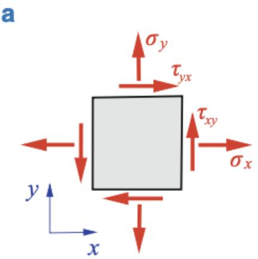

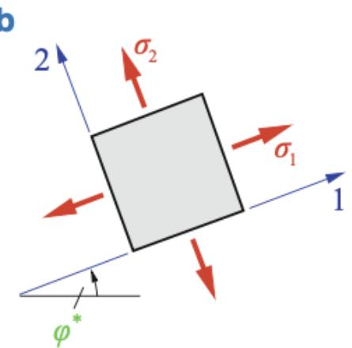

▪ Berechnung der Extremalwerte der Schubspannungen aus $\begin{array} { r } { \frac { d \tau _ { \xi \eta } } { d \varphi } = 0 } \end{array}$

$$
\frac { d \tau _ { \xi \eta } } { d \varphi } = \frac { d ( - \frac { 1 } { 2 } \left( \sigma _ { x } - \sigma _ { y } \right) \sin 2 \varphi + \tau _ { x y } \cos 2 \varphi ) } { d \varphi } = - \left( \sigma _ { x } - \sigma _ { y } \right) \cos 2 \varphi - 2 \tau _ { x y } \sin 2 \varphi = 0
$$

$$
( \frac { 1 } { 2 } \times 1 0 0 \% ) ^ { 2 } = \frac { ( 2 \times 1 0 0 ) ^ { 2 } } { ( 2 \times 1 0 0 ) ^ { 2 } }
$$

Extremalwert bei $\varphi = \varphi ^ { * * }$

## 11.2.2 Hauptspannungen

▪ Aus

$$
( \frac { 2 } { 1 0 } ) \times 2 ( \% ) = \frac { 1 2 ( \frac { 2 } { 1 0 } ) } { 0 . 2 }
$$

$$
( \frac { 1 } { 2 } ) ( 1 + \frac { 1 } { 2 } ) ( 1 0 ) \div ( \frac { 1 } { 2 } + \frac { 1 } { 2 } ) ( \frac { 1 } { 2 } ) ( 1 0 )
$$

$$
( \frac { 1 } { 2 } ) ( 1 1 - 2 \sqrt { 2 } ) ^ { 2 } = ( \frac { 1 } { 2 } ) ^ { 2 } ( 1 1 - 2 \sqrt { 2 } ) ^ { 2 }
$$

Extremalwerte der Schubspannungen Hauptschubspannungen

$$
( \frac { 1 } { 2 } + \frac { 1 } { 1 1 } + \frac { 1 } { 1 1 } ) \div ( \frac { 1 } { 2 } + \frac { 1 } { 1 1 } ) = \frac { 1 } { 2 } ( \frac { 1 } { 2 } + \frac { 1 } { 1 1 } ) = \frac { 1 } { 2 } ( \frac { 1 } { 2 } + \frac { 1 } { 1 1 } ) = \frac { 1 } { 2 } ( \frac { 1 } { 2 } + \frac { 1 } { 2 } )
$$

$$
( 1 2 - \frac { 1 3 } { 2 } ) ^ { 2 } = \frac { 1 3 } { 1 4 }
$$

$$
( 1 ) 2 \times ( 1 0 ) ^ { 2 } = 1 1
$$

$$
( 1 ) a ( 0 , 0 ) = \frac { 1 1 } { 1 2 } \times ( 0 , 0 )
$$

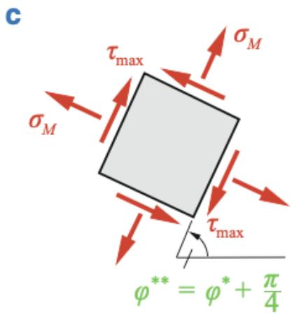

▪ Normalspannungen bei $\varphi = \varphi ^ { * * }$

$$
O B C = \frac { 1 } { 2 } ( c m ^ { 2 } - \frac { 1 } { 2 } \sqrt { 2 } ) = \frac { 1 1 } { 2 } ( c m - \frac { 1 } { 2 } )
$$

In den Schnitten extremaler Schubspannungen verschwinden die Normalspannungen im allgemeinen nicht!

## 11.2.3 Mohrscher Spannungskreis

$$
\begin{array} { r l } & { \qquad \widehat { \gamma _ { \mathrm { r e f f } } } \quad \underset { \mathrm { o r f } } { \overset { \mathrm { n u p t e r m a t i o n } } { \longrightarrow } } } \\ & { \qquad \quad + \underset { \mathrm { i f } } { \overset { \mathrm { n u p t e r m a t i o n } } { \longrightarrow } } \quad \underset { \mathrm { o r f } } { \overset { \mathrm { n u p t e r m a t i o n } } { \longrightarrow } } \quad \underset { \mathrm { o r f } } { \overset { \mathrm { n u p t e r m a t i o n } } { \longrightarrow } } } \\ & { \qquad \quad + \underset { \mathrm { i f } } { \overset { \mathrm { n u p t e r m a t i o n } } { \longrightarrow } } \quad \underset { \mathrm { o r f } } { \overset { \mathrm { n u p t e r m a t i o n } } { \longrightarrow } } \quad \underset { \mathrm { o r f } } { \overset { \mathrm { n u p t e r m a t i o n } } { \longrightarrow } } \quad \underset { \mathrm { o r f } } { \overset { \mathrm { n u p t e r m a t i o n } } { \longrightarrow } } \quad \underset { \mathrm { o r f } } { \overset { \mathrm { n u p t e r m a t i o n } } { \longrightarrow } } \quad \underset { \mathrm { o r f } } { \overset { \mathrm { n u p t e r m a t i o n } } { \longrightarrow } } } \\ & { \qquad \quad + \underset { \mathrm { i f } } { \overset { \mathrm { n u p t e r m a t i o n } } { \longrightarrow } } \quad \underset { \mathrm { o r f } } { \overset { \mathrm { n u p t e r m a t i o n } } { \longrightarrow } } \quad \underset { \mathrm { o r f } } { \overset { \mathrm { n u p t e r m a t i o n } } { \longrightarrow } } \quad \underset { \mathrm { o r f } } { \overset { \mathrm { n u p t e r m a t i o n } } { \longrightarrow } } \quad \underset { \mathrm { o r f } } { \overset { \mathrm { n u p t e r m a t i o n } } { \longrightarrow } } } \\ &  \qquad \quad - \underset { \mathrm { i f } } { \overset { \mathrm { n u p t e r m a t i o n } } { \longrightarrow } } \quad \underset { \mathrm { o r f } } { \overset { \mathrm { n u p t e r m a t i o n } } { \longrightarrow } } \quad \underset { \mathrm { o r f } } { \overset { \mathrm { n u p t e r m a t i o n } } { \longrightarrow } } \quad \underset { \mathrm { o r f } }  \overset  \mathrm  n u p t e \end{array}
$$

## 11.2.3 Mohrscher Spannungskreis

▪ Gleichung eines Kreises in der $\sigma , \tau$ −Ebene: die Punkte liegen $( \sigma , \tau )$ liegen auf dem nach Otto Mohr (1835- 1918) bekannten Spannungskreis mit dem Mittelpunkt $( \sigma _ { M } , 0 )$ und dem Radius �.

$$
( 0 ) ( 0 - \frac { 1 } { 2 } ) \times ( 0 . 2 5 - 0 . 5 ) = 1 . 5
$$

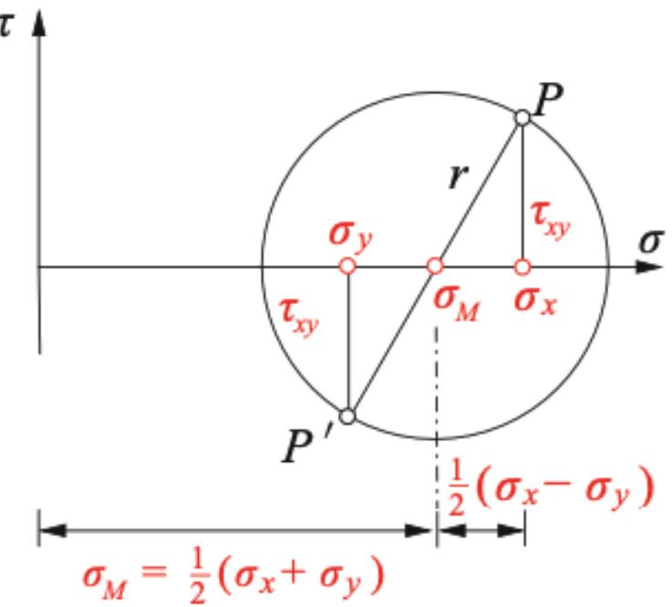

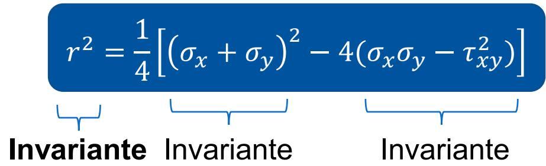

▪ Der Kreis lässt sich konstruieren, wenn $\sigma _ { x } , \sigma _ { y } \& \tau _ { x y }$ bekannt sind.

▪ $\sigma _ { M }$ & � müssen nicht berechnet werden.

▪ Vorgehen:

▪ Einzeichnen der Spannungen $\sigma _ { x }$ und $\sigma _ { y }$ auf der $\sigma { - } \mathsf { A }$ chse (Vorzeichen beachten)

Eintragen der Schubspannungen: Vorzeichenrichtig über $\sigma _ { x }$ und mit dem umgekehrten Vorzeichen über $\sigma _ { y }$

▪ Mit $P \ \& \ P ^ { \prime }$ liegen zwei Punkte des Kreises fest.

▪ Der Schnittpunkt mit der x-Achse liefert den Kreismittelpunkt.

▪ Damit kann der Kreis gezeichnet werden.

## 11.2.3 Mohrscher Spannungskreis

▪ Der Spannungszustand in einem Punkt auf einer Scheibe wird durch den Mohrschen Spannungskreis beschrieben → zu jedem Schnitt gehört ein Punkt auf dem Kreis.

▪ Aus dem Spannungskreis können die Spannungen in beliebigen Schnitten sowie Extremalwerte der Spannungen und die dazu gehörigen Schnittrichtungen bestimmt werden → Die Hauptspannungen und Hauptschubspannungen lassen sich ablesen.

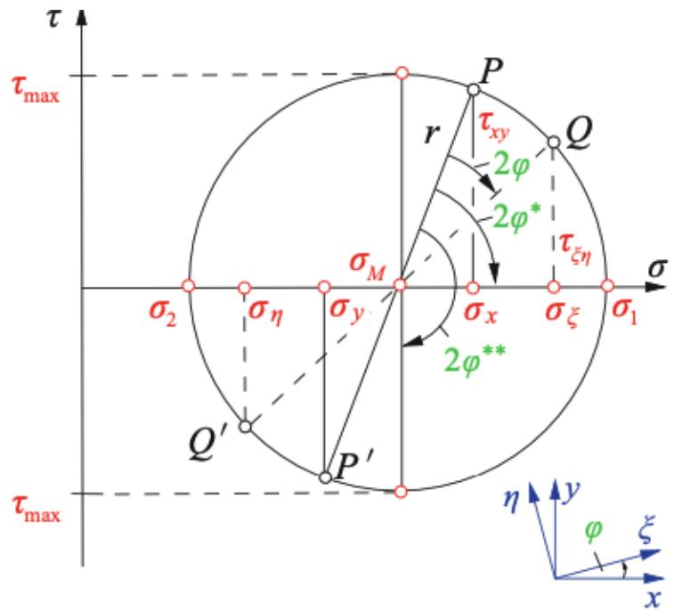

▪ Betrachtung des Punktes �, der zum Schnitt in der �, �-Ebene gehört.

▪ �, �-System wurde um den Winkel � (positiv) gedreht → �, �- System

Eintragung des doppelten Winkels −2� (entgegengesetzt) im Spannungskreis

▪ Hauptspannungen und Hauptschubspannungen sind durch $\varphi ^ { * }$ und $\varphi ^ { * * }$

## 11.2.3 Mohrscher Spannungskreis

▪ Sonderfall 1: Einachsiger Zug

Schubspannungen

$$
\pmb { \sigma } = \left[ \begin{array} { c c } { \sigma _ { x } = \sigma _ { 0 } } & { 0 } \\ { 0 } & { 0 } \end{array} \right]
$$

$$
\sigma _ { x } = \sigma _ { 0 } \to \sigma _ { 1 }
$$

$$
\sigma _ { y } = 0  \sigma _ { 2 }
$$

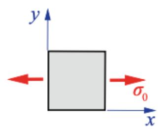

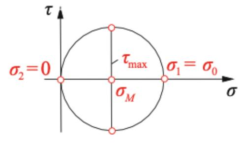

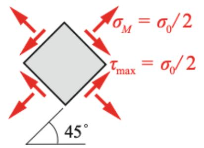

▪ Sonderfall 2: Reiner Schubspannungszustand $\pmb { \sigma } = \left[ \begin{array} { c c } { 0 } & { \tau _ { 0 } } \\ { \tau _ { 0 } } & { 0 } \end{array} \right]$ �� = 0

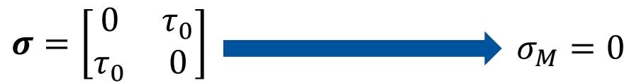

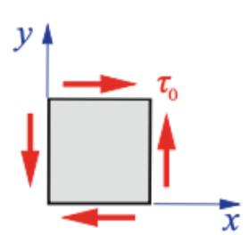

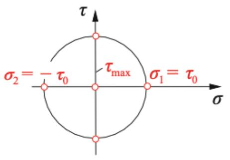

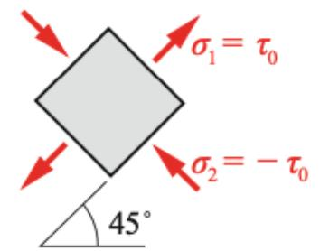

## 11.2.3 Mohrscher Spannungskreis

▪ Sonderfall 3: Hydrostatischer Spannungszustand

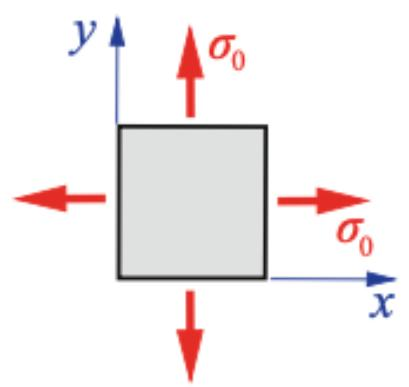

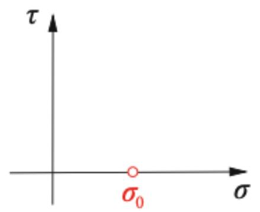

$$
{ \pmb { \sigma } } = \left[ \begin{array} { c c } { \sigma _ { x } = \sigma _ { 0 } } & { 0 } \\ { 0 } & { \sigma _ { y } = \sigma _ { 0 } } \end{array} \right]
$$

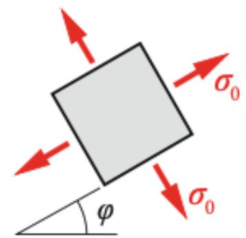

## 11.2.3 Mohrscher Spannungskreis

Beispiel: Ein ebener Spannungszustand ist durch $\sigma _ { x } = 5 0 ~ \mathsf { M P a } , \sigma _ { y } = - 2 0$ MPa und $\tau _ { x y } = 3 0$ MPa gegeben. a) Man bestimme mit Hilfe eines Mohrschen Spannungskreises die Hauptspannungen $\&$ die Hauptrichtungen

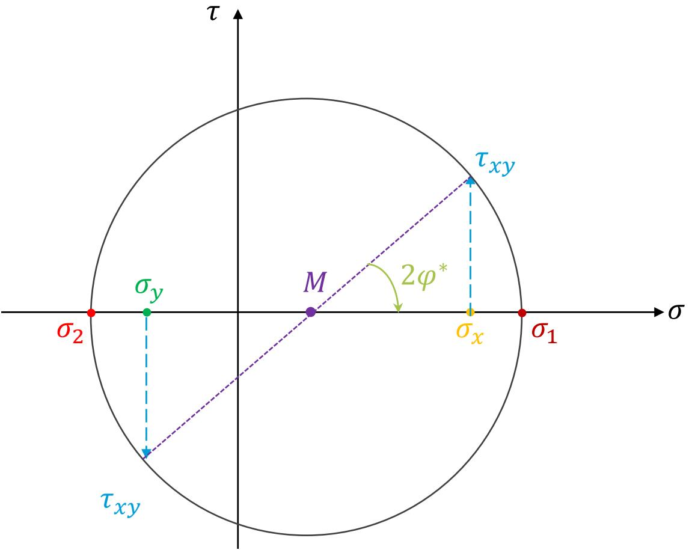

$$
\sigma _ { 1 } \approx 6 1 ~ \mathsf { M P a }
$$

$$
\sigma _ { 2 } \approx - 3 1 \mathsf { M P a }
$$

$$
2 \varphi ^ { * } = 4 0 ^ { \circ } \Rightarrow \varphi ^ { * } = 2 0 ^ { \circ }
$$

## 11.2.3 Mohrscher Spannungskreis

Beispiel: Ein ebener Spannungszustand ist durch $\sigma _ { x } = 5 0 ~ \mathsf { M P a } , \sigma _ { y } = - 2 0$ MPa und $\tau _ { x y } = 3 0$ MPa gegeben. b) Man bestimme mit Hilfe eines Mohrschen Spannungskreises die Normal- und die Schubspannung in einer Schnittfläche, deren Normale den Winke $\varphi = 3 0 ^ { \circ }$ mit der x-Achse bildet.

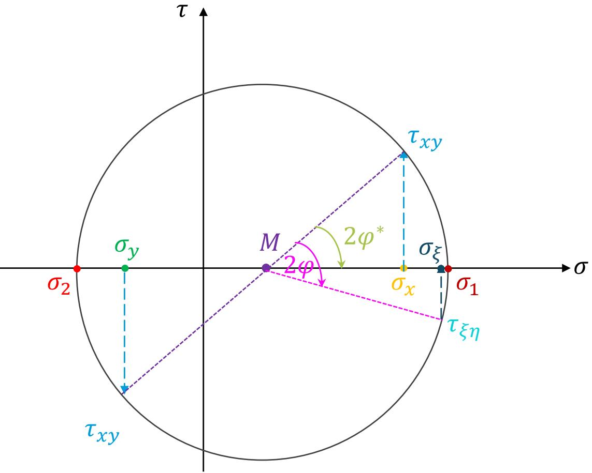

$$
\sigma _ { \xi } \approx 5 8 { , } 4 ~ \mathsf { M P a }
$$

$$
\tau _ { \xi \eta } \approx - 1 3 , 5 \ \mathsf { M P a }
$$

## 11.2.4 Dünnwandiger Kessel

Betrachtung eines dünnwandigen, zylindrischen Kessels unter der Annahme eines ebenen Spannungszustandes (ESZ) mit Radius � und der Wandstärke �.

▪ Der Kessel steht unter einem Innendruck $p ,$ welcher Spannungen in der Wand des Kessels verursacht.

Bei hinreichender Entfernung von den Deckeln ist der Spannungszustand ortsunabhängig.

▪ Aus $t \ll r$ können die Spannungen in radialer Richtung vernachlässigt werden.

In der Mantelfläche $\$ 52$

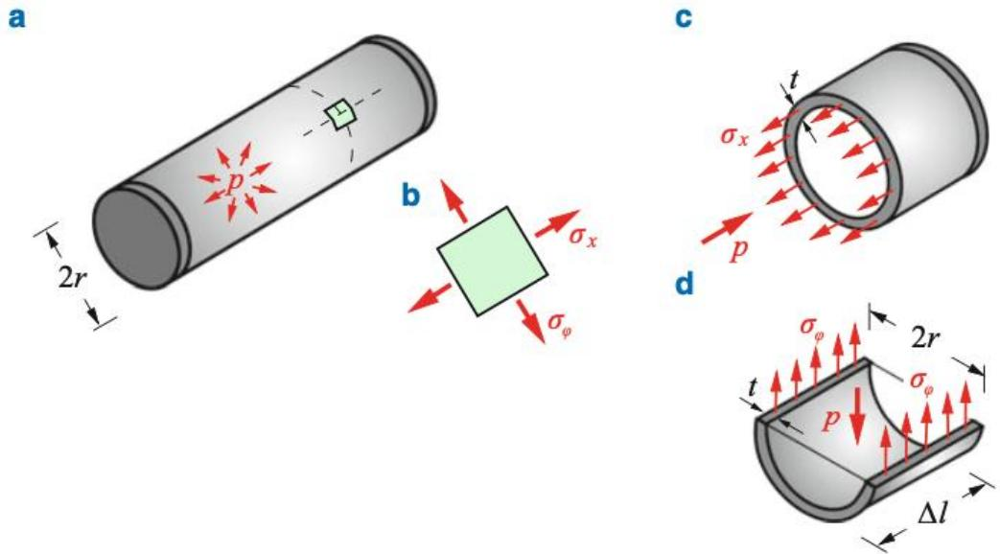

▪ Aus c) Kräftegleichgewicht in x-Richtung:

$$
{ \begin{array} { r l } & { \sigma _ { x } \cdot ( \pi \cdot ( r + t ) ^ { 2 } - \pi \cdot r ^ { 2 } ) = p \cdot \pi \cdot r ^ { 2 } } \\ & { \sigma _ { x } \cdot ( \pi \cdot r ^ { 2 } + 2 \cdot \pi \cdot r \cdot t + \pi \setminus t _ { \ast } ^ { 2 } - \pi \cdot r ^ { 2 } ) = p \cdot \pi \cdot r ^ { 2 } } \\ & { \qquad \approx 0 \left( t \ll r \right) } \end{array} }
$$

$$
( 2 7 , 3 ) = \frac { 1 1 } { 2 }
$$

$\sigma _ { x } \colon$ Längsspannungen

## 11.2.4 Dünnwandiger Kessel

▪ Aus d) Kräftegleichgewicht in vertikaler Richtung:

$$
2 \cdot \sigma _ { \varphi } \cdot \Delta l \cdot t = p \cdot \Delta l \cdot 2 r
$$

$$
\equiv \langle \boldsymbol { \theta } \rangle _ { \langle 0 \rangle } = \langle \boldsymbol { \theta } \rangle _ { \langle 0 \rangle } ^ { \prime \prime }
$$

$\sigma _ { \varphi } \mathrm { : }$ : Umfangsspannungen

▪ $\sigma _ { \varphi } = 2 \cdot \sigma _ { x } $ Versagen durch Rissbildung in Längsrichtung

▪ Kesselformeln:

$$
0 . 2 \dot { 0 } = 0 . 2 0 \dot { 0 } = 0 . 2 0 \dot { 0 } = 0 . 2 0 0 \dot { 0 }
$$

▪ Kesselformeln auch bei Kesseln unter Außendruck anwendbar → Vorzeichen von � ändern → Druckspannungen!

▪ Es treten keine Schubspannungen auf $\Rightarrow \sigma _ { x , \varphi }$ Hauptspannungen

$$
\begin{array} { r } { \tau _ { m a x } = \frac { 1 } { 2 } ( \sigma _ { 1 } - \sigma _ { 2 } ) = \frac { 1 } { 4 } \cdot p \cdot \frac { r } { t } } \end{array}
$$

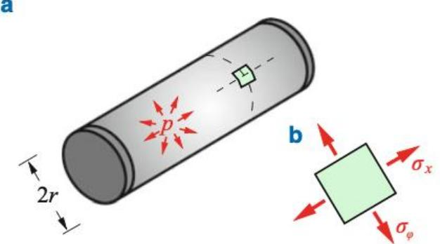

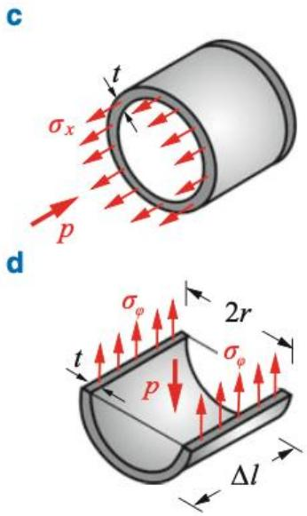

## 11.2.4 Dünnwandiger Kessel

▪ Betrachtung eines dünnwandigen, kugelförmigen Kessels mit Radius � unter einem Innendruck $p .$

▪ Es entstehen $\sigma _ { t }$ und $\sigma _ { \varphi }$ Spannungen.

a

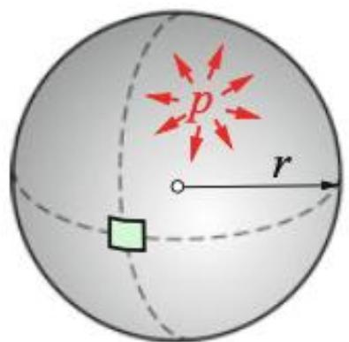

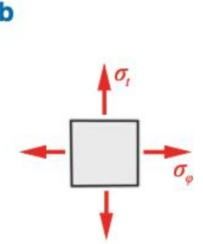

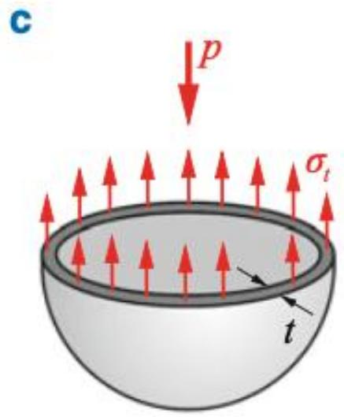

▪ Gleichgewicht:

$$
\sigma _ { t } \cdot 2 \cdot \pi \cdot r \cdot t = p \cdot \pi \cdot r ^ { 2 } \to \sigma _ { t } = { \frac { 1 } { 2 } } \cdot p \cdot { \frac { r } { t } }
$$

$$
\sigma _ { \varphi } \cdot 2 \cdot \pi \cdot r \cdot t = p \cdot \pi \cdot r ^ { 2 } \to \sigma _ { \varphi } = { \frac { 1 } { 2 } } \cdot p \cdot { \frac { r } { t } }
$$

$$
= 2 0 \textcircled { 1 } = 0 . 7 \times 2 = \frac { 1 1 } { 2 } \times 2 \times 2
$$

## 11.3 Gleichgewichtsbedingungen

▪ Spannungszustand in einem Punkt eines Körpers durch den Spannungszustand definiert!

▪ Die Komponenten des Spannungstensors sind durch die Gleichgewichtsbedingungen miteinander verknüpft.

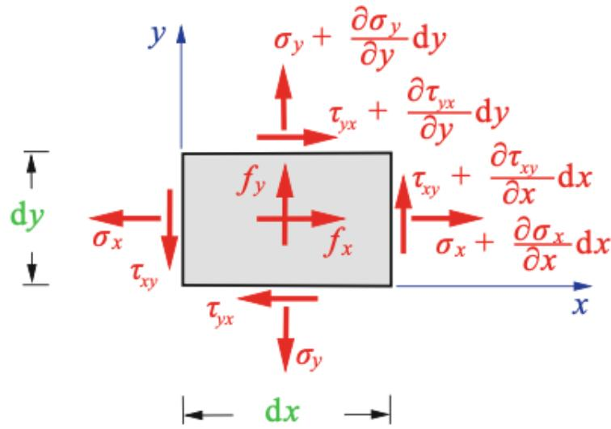

Infinitesimales Element aus einer Scheibe (ESZ)

$f \colon$ Volumenkraft (z.B. Gewicht)

�: Dicke

$$
\begin{array} { c } { \displaystyle \sum _ { \alpha } F _ { x } = 0 \Rightarrow - \sigma _ { x } \cdot d y \cdot t - \tau _ { y x } \cdot d { \mathbf x } \cdot t + \left( \sigma _ { x } + \frac { \partial \sigma _ { x } } { \partial x } \cdot d x \right) \cdot d y \cdot t } \\ { + \left( \tau _ { y x } + \frac { \partial \sigma _ { y x } } { \partial y } \cdot d y \right) \cdot d x \cdot t + f _ { x } \cdot d x \cdot d y \cdot t = 0 } \end{array}
$$

$$
= \frac { 0 . 0 2 } { 0 . 0 2 } - \frac { 0 . 0 2 } { 0 . 0 2 } - 0 . 5 m = 0
$$

$$
\sum F _ { y } = 0 { \mathrm { : } }
$$

$$
\frac { 6 0 0 0 } { 0 . 6 } = \frac { 6 0 0 0 } { 0 . 6 } = \frac { 0 . 6 } { 0 . 6 } = \frac { 1 . 6 } { 0 . 6 } = 0
$$

## 11.4 Zusammenfassung

▪ Der Spannungszustand in einem Punkt eines Körpers ist durch den Spannungstensor gegeben. Er hat im räumlichen Fall 3x3 Komponenten (beachte Symmetrie). Im ebenen Spannungszustand (ESZ) reduziert er sich auf $\pmb { \sigma } = \left[ \begin{array} { l l } { \sigma _ { x } } & { \tau _ { x y } } \\ { \tau _ { x y } } & { \sigma _ { y } } \end{array} \right]$

▪ Vorzeichenkonvention: positive Spannungen zeigen an einem positiven (negativen) Schnittufer in positive (negative) Koordinatenrichtungen.

▪ Transformationsbeziehungen: $\begin{array} { r } { \sigma _ { \xi } = \frac { 1 } { 2 } \left( \sigma _ { x } + \sigma _ { y } \right) + \frac { 1 } { 2 } \left( \sigma _ { x } - \sigma _ { y } \right) } \end{array}$ cos $2 \varphi + \tau _ { x y }$ sin 2� ; $\begin{array} { r } { \sigma _ { \eta } = \frac { 1 } { 2 } \left( \sigma _ { x } + \sigma _ { y } \right) - \frac { 1 } { 2 } \left( \sigma _ { x } - \sigma _ { y } \right) } \end{array}$ cos $2 \varphi - \tau _ { x y }$ sin 2� ; $\begin{array} { r } { \tau _ { \xi \eta } = - \frac { 1 } { 2 } \big ( \sigma _ { x } - \sigma _ { y } \big ) } \end{array}$ sin $2 \varphi + \tau _ { x y }$ cos 2�

▪ Hauptspannungen und –richtungen: $\begin{array} { r } { \sigma _ { 1 , 2 } = \frac { \sigma _ { x } + \sigma _ { y } } { 2 } \pm \sqrt { \left( \frac { \sigma _ { x } - \sigma _ { y } } { 2 } \right) ^ { 2 } + \tau _ { x y } ^ { 2 } } } \end{array}$ ; tan $\begin{array} { r } { 2 \varphi ^ { \ast } = \frac { 2 \tau _ { x y } } { \sigma _ { x } - \sigma _ { y } }  \varphi _ { 1 } ^ { \ast } , ~ \varphi _ { 1 } ^ { \ast } = \varphi _ { 1 } ^ { \ast } \pm \pi / 2 } \end{array}$

▪ Max. Schubspannung und ihre Richtung: $\begin{array} { r } { \tau _ { m a x } = \sqrt { \left( \frac { \sigma _ { x } - \sigma _ { y } } { 2 } \right) ^ { 2 } + \tau _ { x y } ^ { 2 } } ; \varphi ^ { * * } = \varphi ^ { * } \pm \pi / 4 } \end{array}$

▪ Mohrscher Spannungskreis → geometrische Darstellung der Koordinatentransformation

▪ Gleichgewicht: $\begin{array} { r } { \frac { \partial \sigma _ { x } } { \partial x } + \frac { \partial \tau _ { y x } } { \partial y } + f _ { x } = 0 ; \frac { \partial \tau _ { x y } } { \partial x } + \frac { \partial \sigma _ { y } } { \partial x } + f _ { y } = 0 } \end{array}$

## Vielen Dank für Ihre Aufmerksamkeit!