## Mechanik in der Werkstofftechnik II: Elastostatik

Kapitel 12: Verzerrungszustand, Elastizitätsgesetz

Univ. Prof. Dr.-Ing Sebastian Münstermann

## 12.1 Verzerrungszustand

Die Kinematik bei der einachsigen Deformation eines Zugstabes:

Verschiebung: �

Dehnung: $\ell = 0 , 0 , \ell = 0$

■ Verformung von flächenförmigen Körpern: Scheibe

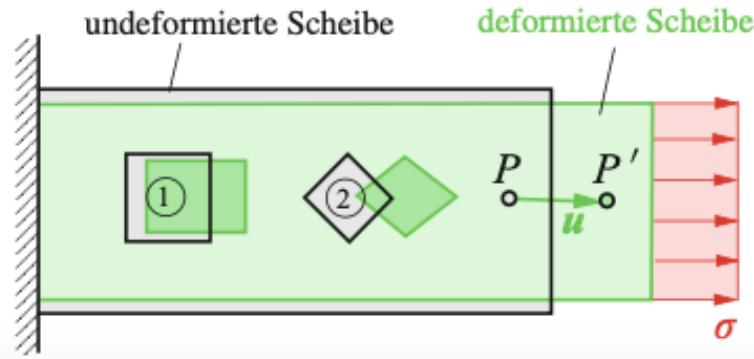

▪ Verschiebungsvektor � ist ortsabhängig. Beim Quadrat ⓵ ändern sich die Seitenlängen, während sich beim Quadrat ⓵ sowohl die Seitenlängen als auch die Winkel ändern.

## 12.1 Verzerrungszustand

▪ Betrachtung der Änderungen der Seitenlänge und der Winkel unter Berücksichtigung kleiner Deformationen!

Verschiebungsvektor von �:

$$
\boldsymbol { r } ( x , y ) = \boldsymbol { u } ( x , y ) \cdot \boldsymbol { e } _ { x } + \boldsymbol { v } ( x , y ) \cdot \boldsymbol { e } _ { y }
$$

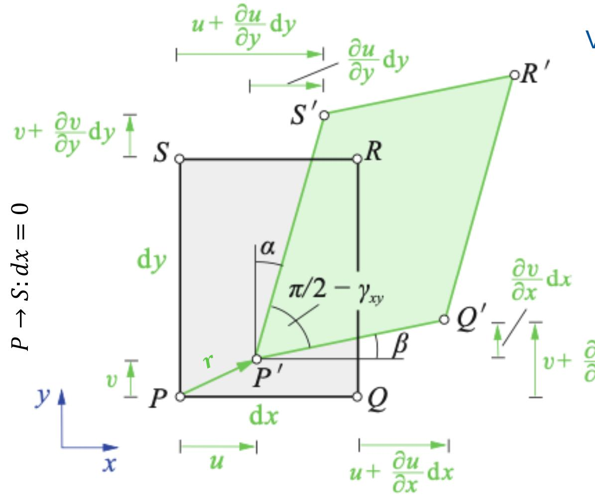

$$
P  Q \colon d y = 0
$$

Verschiebung eines zu � benachbarten Punktes:

$$
u ( x + d x , y + d y ) = u ( x , y ) + { \frac { \partial u ( x , y ) } { \partial x } } d x + { \frac { \partial u ( x , y ) } { \partial y } } d y + \cdots
$$

$$
v ( x + d x , y + d y ) = v ( x , y ) + { \frac { \partial v ( x , y ) } { \partial x } } d x + { \frac { \partial v ( x , y ) } { \partial y } } d y + \cdots
$$

$$
\int ^ { \mathrm { \Omega } } v + \frac { \partial v } { \partial x } \mathrm { d } x
$$

$$
{ \overline { { P ^ { \prime } Q ^ { \prime } } } } \approx d x + \left( u + { \frac { \partial u } { \partial x } } d x \right) - u = d x + { \frac { \partial u } { \partial x } } d x
$$

$$
\varepsilon _ { x } = { \frac { { \overline { { P ^ { \prime } Q ^ { \prime } } } } - { \overline { { P Q } } } } { \overline { { P Q } } } } = { \frac { \left( d x + { \frac { \partial u } { \partial x } } d x \right) - d x } { d x } } = { \frac { \partial u } { \partial x } }
$$

## Taylorreihe

Taylorreihe ist eine Potenzreihe.

▪ Jede beliebige Funktion lässt sich durch Taylorreihen beschreiben.

▪ Taylorreihen können als eine Annährung einer Funktion an einem Auswertungs-/Entwicklungspunkt interpretiert werden.

1d:

$$
f ( y ) : = \sum _ { n = 0 } ^ { \infty } { \frac { f ^ { ( n ) } ( y _ { 0 } ) } { n ! } } ( y - y _ { 0 } ) ^ { n } = f ( y _ { 0 } ) + f ^ { \prime } ( y _ { 0 } ) ( y - y _ { 0 } ) + { \frac { f ^ { \prime \prime } ( y _ { 0 } ) } { 2 ! } } ( y - y _ { 0 } ) ^ { 2 } + \cdots
$$

Betrachtung kleiner Verschiebungen an der Stelle � um die Strecke d�:

$$
y _ { 0 } = x
$$

$$
y = x + d x
$$

$$
f ( y = x + d x ) = f ( x ) + f ^ { \prime } ( x ) ( x + d x - x ) + { \frac { f ^ { \prime \prime } ( x ) } { 2 ! } } ( x + d x - x ) ^ { 2 } + \cdots
$$

Mehrdimensional:

$$
f ( x , y ) = f ( x , y ) + \frac { \frac { \partial f } { d x } ( x _ { 0 } , y _ { 0 } ) } { 1 ! } ( x - x _ { 0 } ) + \frac { \frac { \partial f } { d y } ( x _ { 0 } , y _ { 0 } ) } { 1 ! } ( y - y _ { 0 } ) +
$$

$$
\frac { \frac { \partial ^ { 2 } f } { d x ^ { 2 } } ( x _ { 0 } , y _ { 0 } ) } { 2 ! } ( x - x _ { 0 } ) ^ { 2 } + \frac { \frac { \partial ^ { 2 } f } { d y ^ { 2 } } ( x _ { 0 } , y _ { 0 } ) } { 2 ! } ( y - y _ { 0 } ) ^ { 2 } + \frac { \frac { \partial ^ { 2 } f } { d x d y } ( x _ { 0 } , y _ { 0 } ) } { 1 ! } ( x - x _ { 0 } ) ( y - y _ { 0 } )
$$

## 12.1 Verzerrungszustand

▪ Betrachtung der Änderungen der Seitenlänge und der Winkel unter Berücksichtigung kleiner Deformationen

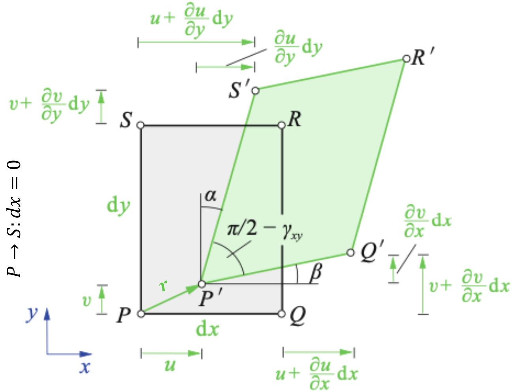

$$
{ \overline { { P ^ { \prime } S ^ { \prime } } } } \approx d y + \left( v + { \frac { \partial v } { \partial y } } d y \right) - v = d y + { \frac { \partial v } { \partial y } } d y
$$

$$
\varepsilon _ { y } = { \cfrac { { \cfrac { - { \cfrac { - { \cfrac { 2 } { P ^ { \prime } S ^ { \prime } } } } - { \cfrac { - { \cfrac { 2 } { P S } } } } { P S } } } } } { \cfrac { - { \cfrac { \cfrac { \cfrac { \ c { \cfrac { \ c { \cfrac { \ c { \cfrac { \ c { \partial } } { \cfrac { \cfrac { \ c { \cfrac { \ c { \cfrac { \ c { \cfrac { \ c { \partial } } { \cfrac { \cfrac { \ c { \cfrac { \ c { \cfrac { \ c { \cfrac { \ c { \cfrac { \ c { \ c H } } { P S } } } } } } } } } } } } } } } } } } } } } } } } } } } } } = { \cfrac { \partial { y } } } } }
$$

$$
P  Q \colon d y = 0
$$

## 12.1 Verzerrungszustand

Änderung des ursprünglich rechten Winkels ist gegeben durch $\alpha$ und $\beta \colon$

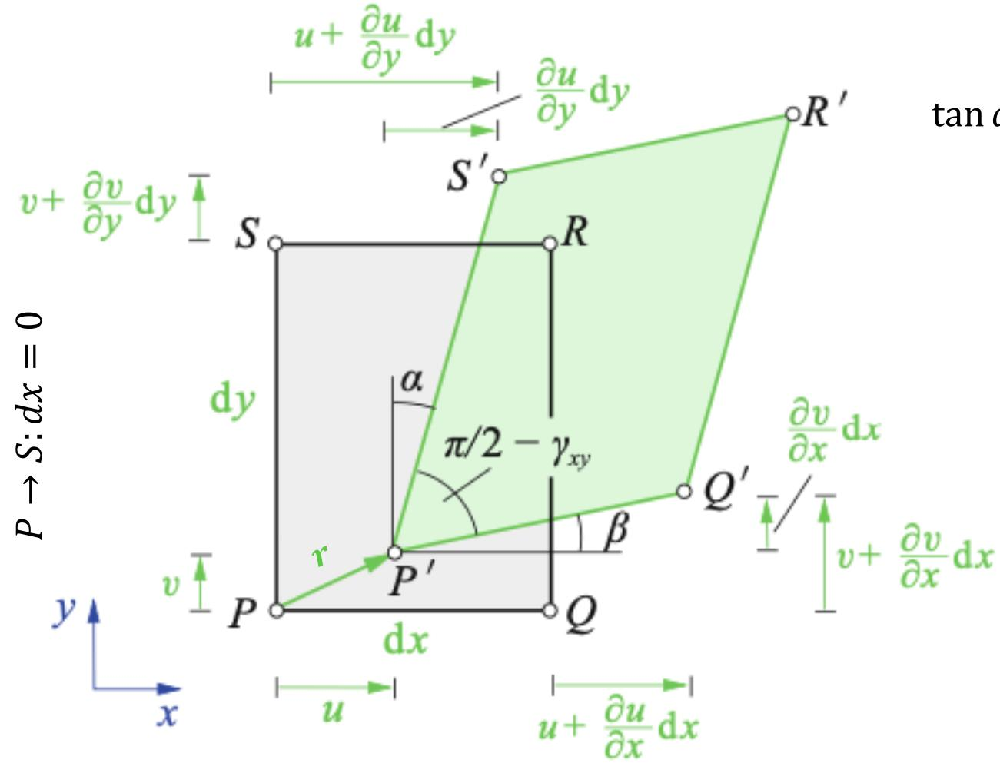

$$
P  Q \colon d y = 0
$$

$$
\tan \alpha = { \frac { { \frac { \partial u } { \partial y } } d y } { d y + { \frac { \partial v } { \partial y } } d y } } = { \frac { { \frac { \partial u } { \partial y } } d y } { \left[ 1 + { \frac { \partial v } { \partial y } } \right] d y } } { \frac { \mathrm { V e r f o r m u n g } } { \left( { \frac { \partial v } { \partial y } } = \varepsilon _ { y } \ll 1 \right) } } \alpha = { \frac { \partial u } { \partial y } }
$$

$$
\tan \beta = { \frac { { \frac { \partial v } { \partial x } } d x } { d x + { \frac { \partial u } { \partial x } } d x } } { \frac { \stackrel { \mathrm { k l e i n e } } { = } } { \longrightarrow } } \beta = { \frac { \partial v } { \partial x } }
$$

Gesamte Winkeländerung: $\gamma _ { x y } = \alpha + \beta $

$$
1 6 0 ^ { \circ } = \frac { 6 \pi } { 6 0 ^ { \circ } } = \frac { 6 \pi } { 6 0 ^ { \circ } } = 1 6 0 ^ { \circ }
$$

��� ≔ Gleitung / Scherung → Winkeländerung in der ��-Ebene

## 12.1 Verzerrungszustand

▪ Verzerrung = Dehnung + Gleitung

▪ Verzerrungen sind durch die kinematischen Beziehungen $( \varepsilon _ { x } , \varepsilon _ { y } , \gamma _ { x y } )$ mit den Verschiebungen geknüpft.

▪ Sind Verschiebungen vorgegeben, lassen sich die Verzerrungen durch Ableiten berechnen.

▪ Durch $\varepsilon _ { x } , \varepsilon _ { y }$ und $\gamma _ { x y }$ ist der ebene Verzerrungszustand (EVZ) im Punkt � festgelegt.

▪ Verzerrungstensor für den EVZ: $\pmb { \varepsilon } = \left[ \begin{array} { c c } { \varepsilon _ { x } } & { \frac { 1 } { 2 } \gamma _ { x y } } \\ { \frac { 1 } { 2 } \gamma _ { x y } } & { \varepsilon _ { y } } \end{array} \right]$ Analogie zum Spannungstensor: $\pmb { \sigma } = \left[ \begin{array} { l l } { \sigma _ { x } } & { \tau _ { x y } } \\ { \tau _ { x y } } & { \sigma _ { y } } \end{array} \right]$

▪ Hauptdiagonale besteht aus Dehnungen, während die Nebendiagonale die halben Gleitungen beinhaltet.

## 12.1 Verzerrungszustand

▪ Die Eigenschaften des Spannungstensors bei einem ebenen Spannungszustand können sinngemäß auf den Verzerrungstensor übertragen werden.

▪ Drehung des $x y \cdot$ -Koordinatensystems um den Winkel $\varphi \ ( \xi \eta \cdot$ -Koordinatensystem)

▪ Transformationsgleichungen:

$$
\angle B = \angle C = \angle C = \angle D = \angle C = \angle C = \angle C = \angle C = \angle C = \angle C = \angle C = \angle C = \angle C = \angle C = 9 0 ^ { \circ }
$$

▪ Hauptrichtungen:

$$
\angle D = \frac { 1 } { 2 } ( c - 2 0 ) = ( c - 2 0 ) ( c - 2 0 ) ( c - 2 0 ) ( c - 2 0 ) ( c - 2 0 ) ( c - 2 0 ) ( c - 2 0 ) ( c - 2 0 ) ( c - 2 0 ) ( c - 2 0 ) ( c - 2 0 ) ( c - 2 0 )
$$

$$
( \frac { 1 0 0 } { 1 0 0 } ) \times 0 . 2 = \frac { 1 6 0 } { 1 2 0 }
$$

▪ Hauptdehnungen:

$$
2 0 0 0 0 0 0 0 0 0 0 0 0 0 0 0 0 0 0 0 0 0 0 0 0 0 0 0 0 0 0 0 0 0 0 0 0 0 0 0 0 0 0 0 0 0 0 0 0 0 0 0 0 0 0 0 0 0 0 0 0 0 0 0 0 0 0 0 0 0 0 0 0 0 0 0 0 0 0 0 0 0 0 0 0 0 0 0 0 0 0 0 0 0 0 0 0 0 0 0 0 0 0 0 0 0 0 0 0 0 0 0 0 0 0 0 0 0 0 0 0 0 0 0 0 0 0 0 0 0 0 0 0 0 0 0 0 0 0 0 0 0 0 0 0 0 0 0 0 0 0 0 0 0 0 0 0 0 0 0 0 0 0 0 0 0 0 0 0 0 0 0 0 0 0 0 0 0 0 0 0 0 0 0 0 0 0 0 0 0 0 0 0 0 0 0 0 0 0 0 0 0 0 0 0 0 0 0 0 0 0 0 0 0 0 0 0 0 0 0 0 0 0 0 0 0 0 0 0 0 0 0 0 0 0 0 0 0 0 0 0 0 0 0 0 0 0 0 0 0 0 0 0 0 0 0 0 0 0 0 0 0 0 0 0 0 0 0 0 0 0 0 0 0 0 0 0 0 0 0 0 0 0 0 0 0 0 0 0 0 0 0 0 0 0 0 0 0 0 0 0 0 0 0 0 0 0 0 0 0 0 0 0 0 0 0 0 0 0 0 0 0 0 0 0 0 0 0 0 0 0 0 0 0 0 0 0 0 0 0 0 0 0 0 0 0 0 0 0 0 0 0 0 0 0 0 0 0 0 0 0 0 0 0 0 0 0 0 0 0 0 0 0 0 0 0 0 0 0 0 0 0 0 0 0 0 0 0 0 0 0 0 0 0 0 0 0 0 0 0 0 0 0 0 0 0 0 0 0 0 0 0 0 0 0 0 0 0 0 0 0 0 0 0 0 0 0 0 0 0 0 0 0 0 0 0 0 0 0 0 0 0 0 0 0 0 0 0 0 0 0 0 0 0 0 0 0 0 0 0 0 0 0 0 0 0 0 0 0 0 0 0 0 0 0 0 0 0 0 0 0 0 0 0 0 0 0 0 0 0 0 0 0 0 0 0 0 0 0 0 0 0 0 0 0 0 0 0 0 0 0 0 0 0 0 0 0 0 0 0 0 0 0 0 0 0 0 0 0 0 0 0 0 0 0 0 0 0 0 0 0 0 0 0 0 0 0 0 0 0 0 0 0 0 0 0 0 0 0 0 0 0 0 0 0 0 0 0 0 0 0 0 0 0 0 0 0 0 0 0 0 0 0 0 0 0 0 0 0 0 0 0 0 0 0 0 0 0 0 0 0 0 0 0 0 0 0 0 0 0 0 0 0 0 0 0 0 0 0 0 0 0 0 0 0 0 0 0 0 0 0 0 0 0 0 0 0 0 0 0 0 0 0 0 0 0 0 0 0 0 0 0 0 0 0 0 0 0 0 0 0 0 0 0 0 0 0 0 0 0 0 0
$$

$$
3 4 0 \div b \cdots 1 ( - 2 ) = \frac { 3 } { 2 } ( - 2 )
$$

## 12.1 Verzerrungszustand

Mohrscher Spannungskreis $( \sigma , \tau )$  Mohrscher Verzerrungskreis $\left( \varepsilon , { \frac { \gamma } { 2 } } \right)$

▪ Räumlicher Verformungszustand:

$$
\boldsymbol { r } ( x , y , z ) = \boldsymbol { u } ( x , y , z ) \cdot \boldsymbol { e } _ { x } + \boldsymbol { v } ( x , y , z ) \cdot \boldsymbol { e } _ { y } + w ( x , y , z ) \cdot \boldsymbol { e } _ { z _ { i } }
$$

$$
\varepsilon _ { x } = \frac { \partial u } { \partial x }
$$

$$
\varepsilon _ { y } = \frac { \partial v } { \partial y }
$$

$$
\varepsilon _ { z } = \frac { \partial w } { \partial z }
$$

$$
\gamma _ { x y } = \frac { \partial u } { \partial y } + \frac { \partial v } { \partial x }
$$

$$
\gamma _ { x z } = \frac { \partial u } { \partial z } + \frac { \partial w } { \partial x }
$$

$$
\gamma _ { y z } = \frac { \partial v } { \partial z } + \frac { \partial w } { \partial y }
$$

$$
{ \boldsymbol { \varepsilon } } = { \left[ \begin{array} { l l l } { \varepsilon _ { x x } } & { \varepsilon _ { x y } } & { \varepsilon _ { x z } } \\ { \varepsilon _ { x y } } & { \varepsilon _ { y y } } & { \varepsilon _ { y z } } \\ { \varepsilon _ { x z } } & { \varepsilon _ { y z } } & { \varepsilon _ { z z } } \end{array} \right] } = { \left[ \begin{array} { l l l } { \varepsilon _ { x } } & { { \frac { 1 } { 2 } } \gamma _ { x y } } & { { \frac { 1 } { 2 } } \gamma _ { x z } } \\ { 1 } & { \varepsilon _ { y } } & { { \frac { 1 } { 2 } } \gamma _ { y z } } \\ { { \frac { 1 } { 2 } } \gamma _ { x y } } & { \varepsilon _ { y } } & { { \frac { 1 } { 2 } } \gamma _ { y z } } \end{array} \right] }
$$

Herleitung von

1 ��� = 2 2 ��� auf Folien 18-20

## 12.2 Elastizitätsgesetz

▪ Spannungen � (Belastung) $\stackrel { E } { \iff }$ Verzerrungen � (Deformation) → $\sigma = E$ ⋅ �

▪ Beschreibung des Elastizitätsgesetztes für den ebenen Spannungszustand (ESZ) unter der Annahme eines homogenen und isotropen Materialverhaltens.

▪ Homogen: Gleiche Materialeigenschaften an jeder Stelle

▪ Isotrop: Gleiche Materialeigenschaften in allen Richtungen

▪ Betrachtung eines aus einer Scheibe herausgeschnittenen Rechtecks:

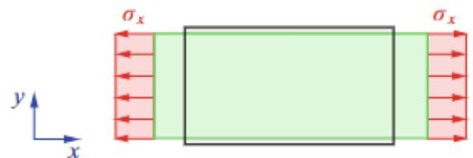  
Einachsige Belastung

$\sigma _ { x }$ verursacht eine Vergrößerung der Länge + Reduktion der Breite

$$
\varepsilon _ { x } = \frac { \sigma _ { x } } { E }
$$

Querkontraktion

$$
\varepsilon _ { y } = - \nu \cdot \varepsilon _ { x } = - \nu \cdot \frac { \sigma _ { x } } { E }
$$

� ≔ Querkontraktions- / Poissonzahl [-]

## 12.2 Elastizitätsgesetz

$$
\sigma _ { x } \Rightarrow \varepsilon _ { x } = \frac { \sigma _ { x } } { E } \& \ \varepsilon _ { y } = - \nu \cdot \frac { \sigma _ { x } } { E }
$$

Superposition

$$
\sigma _ { y } \Rightarrow \varepsilon _ { y } = \frac { \sigma _ { y } } { E } \& \ \varepsilon _ { x } = - \nu \cdot \frac { \sigma _ { y } } { E }
$$

$$
\varepsilon _ { x } = \frac { 1 } { E } \left( \sigma _ { x } - \nu \cdot \sigma _ { y } \right)
$$

$$
\varepsilon _ { y } = { \frac { 1 } { E } } { \big ( } \sigma _ { y } - \nu \cdot \sigma _ { x } { \big ) }
$$

$$
\mathbf { \Sigma } _ { \overset { . } { \varepsilon } _ { Z } } ^ { \overset { . } { \iota } } = - \frac { \nu } { E } \big ( \sigma _ { x } + \sigma _ { y } \big )
$$

Ebener Spannungszustand führt zu einen räumlichen Verzerrungszustand!

## 12.2 Elastizitätsgesetz

▪ Belastung einer Scheibe nur durch Schubspanngen $\tau _ { x y } .$

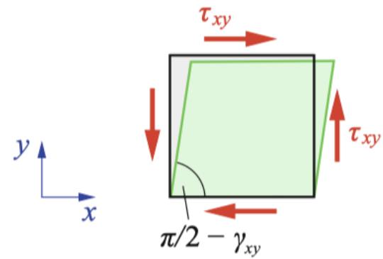

$$
\begin{array} { r l } { \tau _ { x y } = G \cdot \gamma _ { x y } } & { { } ( \mathsf { I i n e a r - e l a s t i s c h e r \ B e r e i c h } ) } \end{array}
$$

$$
G : = \mathsf { S c h u b m o d u l \Gamma } [ \mathsf { N } / \mathsf { m m } ^ { 2 } ]
$$

▪ Schubmodul kann durch Torsionsversuch an dünnwandigem Rohr bestimmt werden.

▪ Für isotrope, elastische Werkstoffe existieren nur zwei unabhängige $( E , \nu )$ Materialkonstanten!

$$
G = \frac { E } { 2 ( 1 + \nu ) }
$$

## 12.2 Elastizitätsgesetz

▪ Herleitung des Zusammenhanges zwischen E-Modul und Schubmodul anhand biaxial belasteter Scheibe.

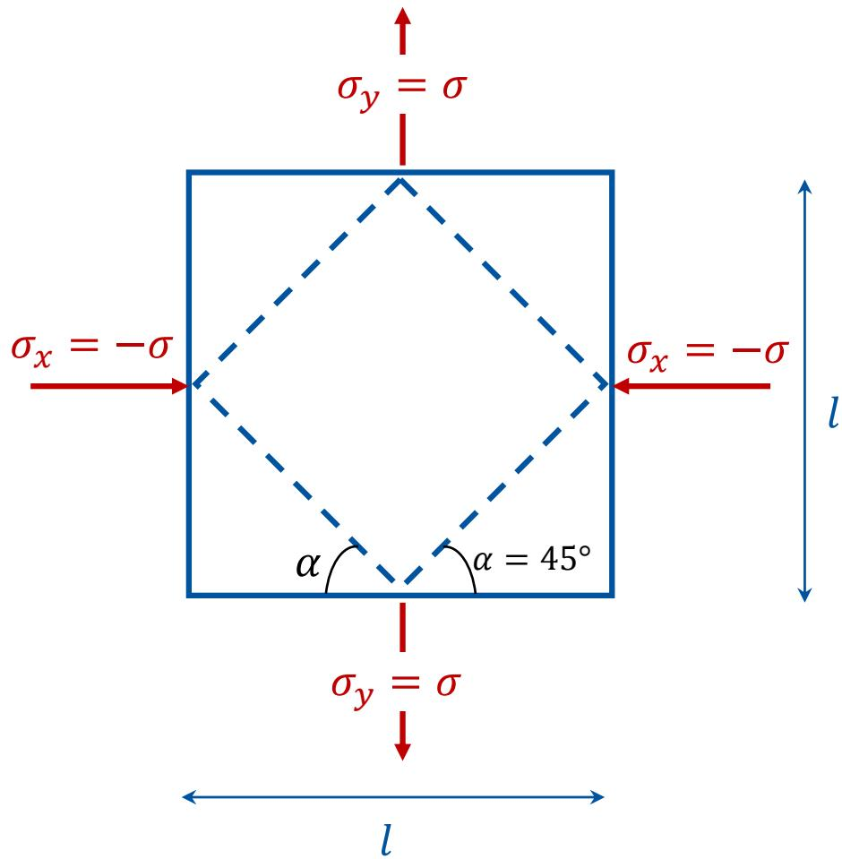

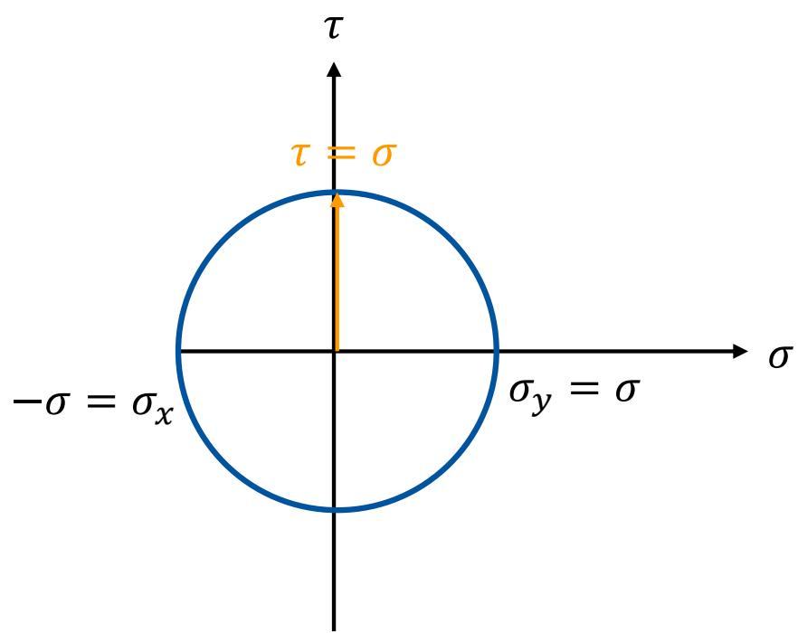

## 12.2 Elastizitätsgesetz

▪ Herleitung des Zusammenhanges zwischen E-Modul und Schubmodul anhand biaxial belasteter Scheibe.

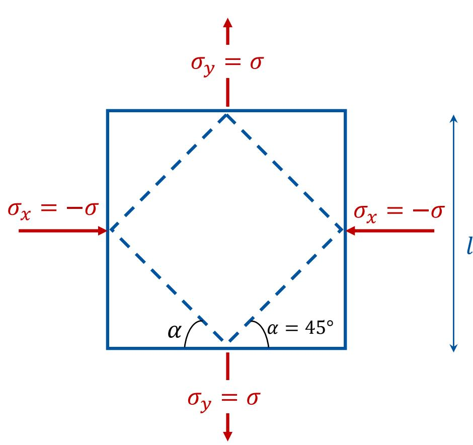

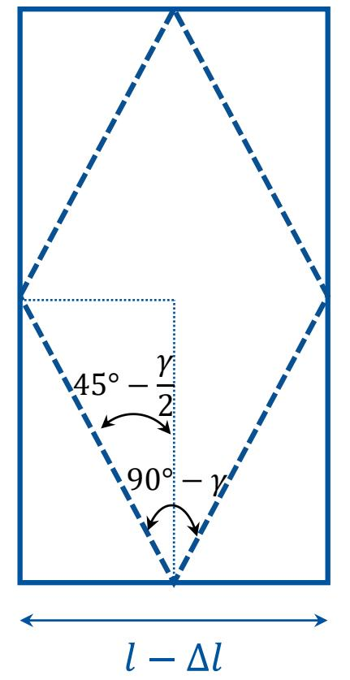

$$
l + \Delta l
$$

$$
\varepsilon _ { x } = \frac { 1 } { E } \left( \sigma _ { x } - \nu \cdot \sigma _ { y } \right)
$$

$$
= { \frac { 1 } { E } } ( - \sigma - \nu \cdot \sigma )
$$

$$
= { \frac { - \sigma } { E } } ( 1 + \nu ) = - \varepsilon
$$

$$
\varepsilon _ { y } = { \frac { 1 } { E } } { \big ( } \sigma _ { y } - \nu \cdot \sigma _ { x } { \big ) }
$$

$$
= { \frac { \sigma } { E } } ( 1 + \nu ) = \varepsilon
$$

$$
\varepsilon = \frac { \Delta l } { l } \Rightarrow \Delta l = \varepsilon l
$$

## 12.2 Elastizitätsgesetz

▪ Herleitung des Zusammenhanges zwischen E-Modul und Schubmodul anhand biaxial belasteter Scheibe.

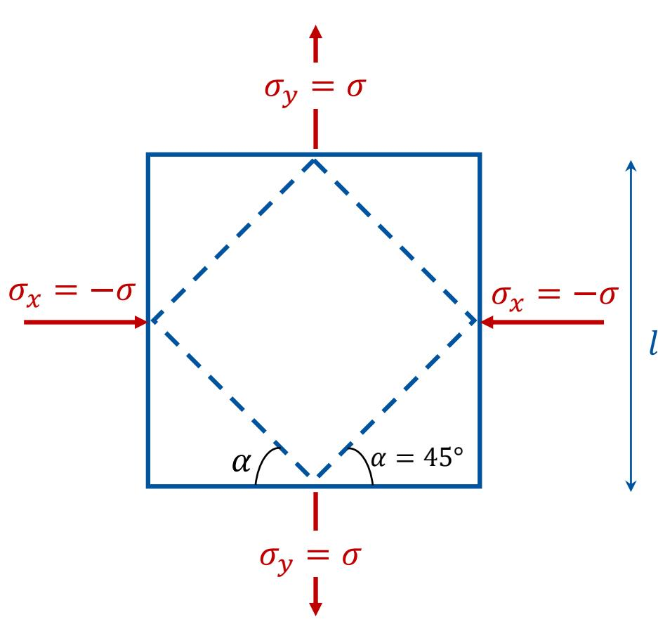

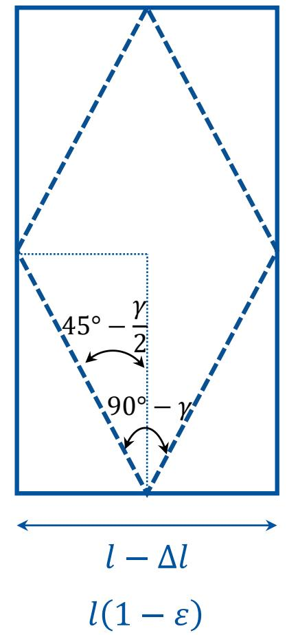

$$
\tan \left( { \frac { \pi } { 4 } } - { \frac { \gamma } { 2 } } \right) = { \frac { 1 - \varepsilon } { 1 + \varepsilon } }
$$

$$
\begin{array} { l } { l + \Delta l } \\ { l ( 1 + \varepsilon ) } \end{array}
$$

$$
\tan \Big ( \frac { \pi } { 4 } - \frac { \gamma } { 2 } \Big ) = \frac { \tan \frac { \pi } { 4 } - \tan \frac { \gamma } { 2 } } { 1 + \tan \frac { \pi } { 4 } \tan \frac { \gamma } { 2 } }
$$

$$
 { \frac { 1 - \tan { \frac { \gamma } { 2 } } } { 1 + \tan { \frac { \gamma } { 2 } } } } = { \frac { 1 - \varepsilon } { 1 + \varepsilon } }
$$

$$
\begin{array} { r } {  \tan { \frac { \gamma } { 2 } } = \varepsilon } \end{array}
$$

$$
\begin{array} { r } { \to \frac { \gamma } { 2 } = \varepsilon } \end{array}
$$

## 12.2 Elastizitätsgesetz

▪ Herleitung des Zusammenhanges zwischen E-Modul und Schubmodul anhand biaxial belasteter Scheibe.

$$
\begin{array}{c} \begin{array} { l } { {  \frac { \gamma } { 2 } = \varepsilon } } \\ { {  \varepsilon = \displaystyle \frac { \sigma } { E } ( 1 + \nu ) ~ [ \begin{array} { c } { { \begin{array} { c } { { \frac { \gamma } { 2 } = \frac { \sigma } { E } ( 1 + \nu ) } \end{array} } } } \end{array} } } \end{array} ] ~   \end{array}
$$

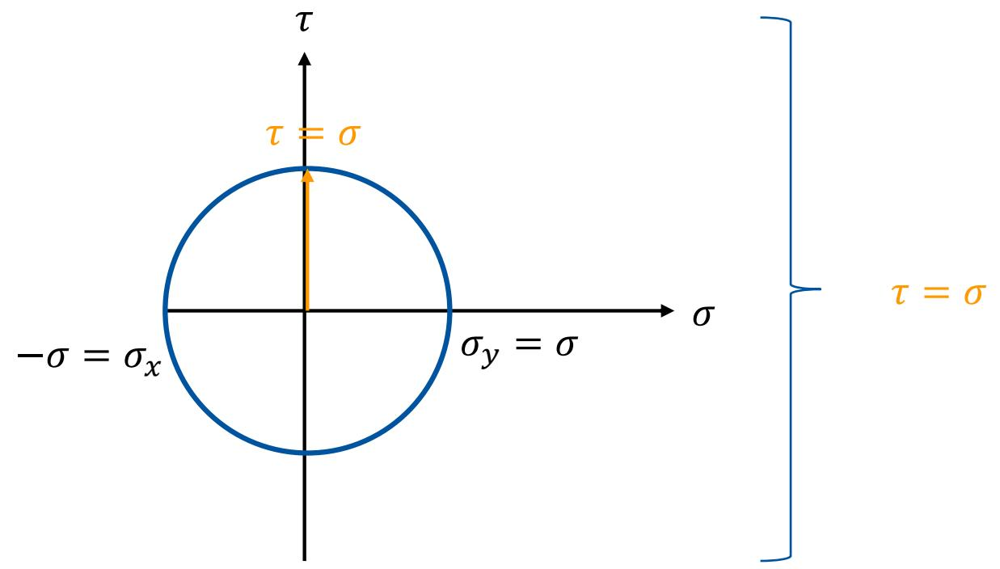

$$
\to \gamma = \tau { \frac { 2 ( 1 + \nu ) } { E } }
$$

$$
 \tau = \frac { E } { 2 ( 1 + \nu ) } \gamma \quad \longrightarrow \quad \tau = G \gamma \quad \qquad \quad G = \frac { E } { 2 ( 1 + \nu ) }
$$

## 12.2 Elastizitätsgesetz

▪ Hookesches Modell:

$$
\begin{array}{c} { \begin{array} { l } { \varepsilon _ { x } = { \cfrac { 1 } { E } } { \big ( } \sigma _ { x } - \nu \cdot \sigma _ { y } { \big ) } } \\ { \varepsilon _ { y } = { \cfrac { 1 } { E } } { \big ( } \sigma _ { y } - \nu \cdot \sigma _ { x } { \big ) } } \\ { \gamma _ { x y } = { \cfrac { 1 } { G } } \cdot \tau _ { x y } } \\ { \qquad \quad } \end{array} } \quad { \left[ \begin{array} { l } { \sigma _ { x } = { \cfrac { E } { 1 - \nu ^ { 2 } } } { \big ( } \varepsilon _ { x } + \nu \cdot \varepsilon _ { y } { \big ) } } \\ { \qquad \sigma _ { x } = { \cfrac { E } { 1 - \nu ^ { 2 } } } { \big ( } \varepsilon _ { y } + \nu \cdot \varepsilon _ { x } { \big ) } } \\ { \qquad \sigma _ { y } = { \cfrac { E } { 1 - \nu ^ { 2 } } } { \big ( } \varepsilon _ { y } + \nu \cdot \varepsilon _ { x } { \big ) } } \\ { \qquad \quad } \\ { \tau _ { x y } = G \cdot \gamma _ { x y } } \end{array} \right] }  \end{array}  \left[ { \begin{array} { l } { { \mathrm { t a n ~ } } \textstyle { 2 \varphi ^ { * } } = { \cfrac { \gamma _ { x y } } { \varepsilon _ { x } - \varepsilon _ { y } } } = { \cfrac { 2 \cdot \tau _ { x y } } { \sigma _ { x } - \sigma _ { y } } } } \\ { \qquad \textstyle { \mathrm { t a n ~ } } \textstyle { 2 \varphi ^ { * } } = { \cfrac { \gamma _ { x y } } { \varepsilon _ { x } - \varepsilon _ { y } } } = { \cfrac { 2 \cdot \tau _ { x y } } { \sigma _ { x } - \sigma _ { y } } } } \\ { \qquad \textstyle { \mathrm { t a n ~ } } \textstyle { 2 \varphi ^ { * } } = { \cfrac { \gamma _ { x y } } { \varepsilon _ { x } - \varepsilon _ { y } } } } \end{array} } \right] .
$$

Gleiche   
Hauptrichtung   
wie beim   
Spannungstensor

▪ Das Hookesche Modell gilt in jedem beliebigen kartesischen Koordinatensystem. Es lautet für das Hauptachsensystem wie folgt:

$$
\varepsilon _ { 1 } = { \frac { 1 } { E } } ( \sigma _ { 1 } - \nu \cdot \sigma _ { 2 } )
$$

$$
\varepsilon _ { 2 } = { \frac { 1 } { E } } ( \sigma _ { 2 } - \nu \cdot \sigma _ { 1 } )
$$

## 12.2 Elastizitätsgesetz

Hookesches Modell in 3d unter Temperaturänderung:

$$
{ { \varepsilon } _ { x } } = \frac { 1 } { E } { { \left( { { \sigma } _ { x } } - \nu \cdot \left[ { { \sigma } _ { y } } + { { \sigma } _ { z } } \right] \right) } } + { { \alpha } _ { T } } \Delta T
$$

$$
{ { \varepsilon } _ { y } } = \frac { 1 } { E } { { \left( { { \sigma } _ { y } } - \nu \cdot [ { { \sigma } _ { z } } + { { \sigma } _ { x } } ] \right) } } + { { \alpha } _ { T } } \Delta T
$$

Eine Temperaturänderung führt bei einem isotropen Material nur zu Dehnungen. Es treten keine Gleitungen auf!

$$
{ { \varepsilon } _ { z } } = \frac { 1 } { E } { { \left( { { \sigma } _ { z } } - \nu \cdot \left[ { { \sigma } _ { x } } + { { \sigma } _ { y } } \right] \right) } } + { { \alpha } _ { T } } \Delta T
$$

$$
\gamma _ { x y } = \frac { 1 } { G } \cdot \tau _ { x y } \gamma _ { x z } = \frac { 1 } { G } \cdot \tau _ { x z } \gamma _ { y z } = \frac { 1 } { G } \cdot \tau _ { y z }
$$

## 12.3 Festigkeitshypothesen

Für einen Stab unter Zugbelastung kann man aus dem Spannungs-Dehnungs-Diagramm entnehmen bei welcher Spannung (oder Dehnung) ein Versagen der Tragfähigkeit des Stabes (z.B. plastisches Fließen oder Bruch) eintritt.

Um ein solches Versagen auszuschließen, wird eine zulässige Spannung $\sigma _ { z u l }$ eingeführt und es wird gefordert, dass die Spannungen im Stab diesen zulässigen Wert nicht überschreiten $\sigma \leq \sigma _ { z u l }$

▪ In einem beibiegen Bauteil herrscht jedoch ein räumlicher Spannungszustand, welcher die Bestimmung der zulässigen Spannung erschwert.

➢ Aufstellung einer Festigkeitshypothese: Reduzierung des räumlichen Spannungszustands in einen skalaren Vergleichsspannungswert $\sigma _ { V }$ , den man mit der einachsigen Belastung des Stabes in Relation setzen kann!

$$
\sigma _ { V } \leq \sigma _ { z u l }
$$

## 12.3 Festigkeitshypothesen

▪ Drei Festigkeitshypothesen unter der Annahme der ESZ:

1. Normalspannungshypothese: Max. Normalspannung ist maßgeblich für die Materialbeanspruchung.

$$
\sigma _ { V } = \sigma _ { 1 }
$$

Gute Übereinstimmung bei sprödem Material

## 12.3 Festigkeitshypothesen

2. Schubspannungshypothese: Materialbeanspruchung wird durch die max. Schubspannung charakterisiert.

����

➢ Betrachtung des einachsigen Zugversuchs:

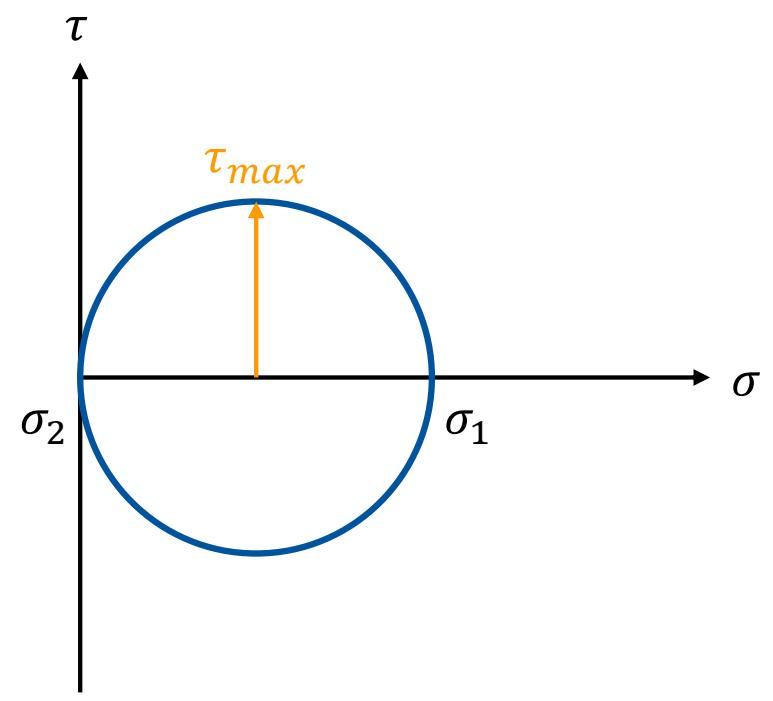

$$
\tau _ { m a x } = \frac { \sigma _ { 1 } - \sigma _ { 2 } } { 2 }
$$

$$
 \sigma _ { 1 } = \sigma _ { V } \& \sigma _ { 2 } = 0
$$

$$
 \tau _ { m a x } = \frac { \sigma _ { V } } { 2 }
$$

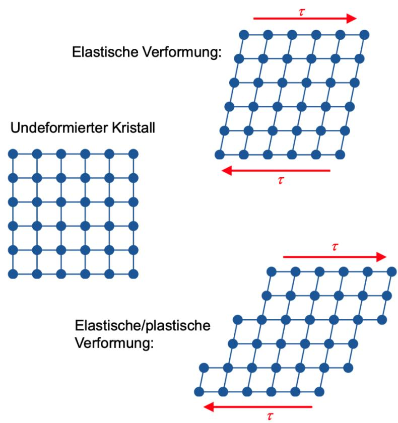  
Quelle: Umformende Fertigungstechnologie/Vorlesung 2/IUL/TU-Dortmund

3. Hypothese der Gestaltänderungsenergie: Materialbeanspruchung wird durch den Energieanteil charakterisiert, der für die $\ddot { \mathsf { A } } \mathsf { r }$ nderung der „Gestalt“ notwendig ist. Quelle: Gross, Hauger, Schröder, Wall (2017), Technische Mechanik 2, Springer Vieweg

▪ Hauptspannungen $\sigma _ { 1 } , \sigma _ { 2 }$ und $\sigma _ { 3 }$

▪ Dehnungen

$$
\begin{array} { r } {  \varepsilon _ { 1 } = \frac { 1 } { E } \cdot [ \sigma _ { 1 } - \nu \cdot ( \sigma _ { 2 } + \sigma _ { 3 } ) ] } \end{array}
$$

$$
\begin{array} { r } { \vec { \bf \nabla } \varepsilon _ { 2 } = \frac { 1 } { E } \cdot \left[ \boldsymbol { \sigma } _ { 2 } - \boldsymbol { \nu } \cdot ( \boldsymbol { \sigma } _ { 1 } + \boldsymbol { \sigma } _ { 3 } ) \right] } \end{array}
$$

Innere Energie U

$$
\begin{array} { r } { \vec { \bf \nabla } \varepsilon _ { 3 } = \frac { 1 } { \varepsilon } \cdot [ \boldsymbol { \sigma } _ { 3 } - \boldsymbol { \nu } \cdot ( \boldsymbol { \sigma } _ { 1 } + \boldsymbol { \sigma } _ { 2 } ) ] } \end{array}
$$

$$
\begin{array} { r } {  U = \frac { 1 } { 2 } \cdot ( \sigma _ { 1 } \cdot \varepsilon _ { 1 } + \sigma _ { 2 } \cdot \varepsilon _ { 2 } + \sigma _ { 3 } \cdot \varepsilon _ { 3 } ) } \end{array}
$$

▪ Substitution von $\varepsilon _ { 1 } , \varepsilon _ { 2 }$ und $\varepsilon _ { 3 }$

$$
\begin{array} { r } {  U = \frac { 1 } { 2 E } \cdot [ { \sigma _ { 1 } } ^ { 2 } + { \sigma _ { 2 } } ^ { 2 } + { \sigma _ { 3 } } ^ { 2 } - 2 \nu ( \sigma _ { 1 } \sigma _ { 2 } + \sigma _ { 1 } \sigma _ { 3 } + \sigma _ { 3 } \sigma _ { 2 } ) ] } \end{array}
$$

▪ Hydrostatischer Spannungszustand

▪ Einsetzen von $\begin{array} { r } { \sigma = \frac { \sigma _ { 1 } + \sigma _ { 2 } + \sigma _ { 3 } } { 3 } } \end{array}$

$$
\begin{array} { r } {  \sigma _ { 1 } = \sigma _ { 2 } = \sigma _ { 3 } = \sigma = \frac { \sigma _ { 1 } + \sigma _ { 2 } + \sigma _ { 3 } } { 3 } } \end{array}
$$

$$
\begin{array} { r } {  U _ { h } = \frac { 1 } { 2 E } [ 3 \sigma ^ { 2 } - 2 \nu ( 3 \sigma ^ { 2 } ) ] = \frac { 1 - 2 \nu } { 2 E } \cdot 3 \sigma ^ { 2 } } \end{array}
$$

$$
\begin{array} { r } {  U _ { h } = \frac { 1 - 2 \nu } { 2 E } \cdot 3 ( \frac { \sigma _ { 1 } + \sigma _ { 2 } + \sigma _ { 3 } } { 3 } ) ^ { 2 } } \end{array}
$$

$$
\begin{array} { r } {  U _ { h } = \frac { 1 - 2 \nu } { 6 E } ( \sigma _ { 1 } + \sigma _ { 2 } + \sigma _ { 3 } ) ^ { 2 } } \end{array}
$$

▪ Substraktion der für die plastische Verformung irrelevanten hydrostatischen Anteile

→ $U _ { f } = U - U _ { h }$

$$
\angle A _ { 1 } = \frac { 1 } { ( 2 ) ^ { 2 } } = ( \angle A _ { 1 } - \angle A _ { 2 } ) \times ( \angle A _ { 1 } - \angle A _ { 2 } ) = ( \angle B _ { 1 } - \angle B _ { 2 } ) = ( \angle B _ { 1 } - \angle A _ { 2 } ) .
$$

▪ Im Zugversuch: Einachsige Vergleichsspannung

→ $\sigma _ { 1 } = \sigma _ { v } , \sigma _ { 2 } = \sigma _ { 3 } = 0$

$$
\Rightarrow \psi _ { i } = \frac { \sqrt { 1 5 } - 1 } { \sqrt { 3 } } \Rightarrow \psi _ { i } \psi _ { i } ^ { 2 }
$$

▪ Gleichsetzen!

$$
 2 { \sigma _ { v } } ^ { 2 } = [ ( \sigma _ { 1 } - \sigma _ { 2 } ) ^ { 2 } + ( \sigma _ { 1 } - \sigma _ { 3 } ) ^ { 2 } + ( \sigma _ { 2 } - \sigma _ { 3 } ) ^ { 2 } ]
$$

$$
\therefore \angle C _ { 1 } = \angle B = \angle C _ { 2 } = \angle C _ { 2 } = \angle C _ { 1 } = \angle C _ { 2 } = \angle C _ { 2 } = \angle C _ { 2 } = \angle C _ { 2 } = \angle C _ { 2 } = \angle C _ { 2 }
$$

## 11.4 Zusammenfassung

▪ Der Deformationszustand in einem Punkt eines Körpers ist durch den Verschiebungsvektor � und durch den Verzerrungstensor � beschrieben. Er hat im räumlichen Fall 3x3 Komponenten (beachte Symmetrie). Im EVZ reduziert er sich auf $\pmb { \varepsilon } = \left[ \begin{array} { l l } { \varepsilon _ { x } } & { \varepsilon _ { x y } } \\ { \varepsilon _ { x y } } & { \varepsilon _ { y } } \end{array} \right]$

■ $\begin{array} { r } { \varepsilon _ { x } = \frac { \partial u } { \partial x } ; \varepsilon _ { y } = \frac { \partial v } { \partial y } ; \gamma _ { x y } = \frac { \partial u } { d y } + \frac { \partial v } { d x } } \end{array}$

Die Transformationsbeziehungen sowie die Gleichungen zur Bestimmung der Hauptdehnungen und Hauptdehnungsrichtungen sind analog zu denen für die Spannungen. Entsprechendes gilt für den Mohrschen Verzerrungskreis.

▪ Die Hauptspannungsrichtungen und Hauptdehnungsrichtungen stimmen beim isotropen elastischen Material überein.

Hookesches Modell: $\begin{array} { r } { \varepsilon _ { x } = \frac { 1 } { E } { \left( \sigma _ { x } - \nu \cdot \left[ \sigma _ { y } + \sigma _ { z } \right] \right) } + \alpha _ { T } \Delta T ; \gamma _ { x y } = \frac { 1 } { G } \cdot \tau _ { x y } } \end{array}$

▪ $\begin{array} { r } { G = \frac { E } { 2 ( 1 + \nu ) } } \end{array}$

▪ Beurteilung der Materialbeanspruchung durch Festigkeitshypothesen

## Vielen Dank für Ihre Aufmerksamkeit!